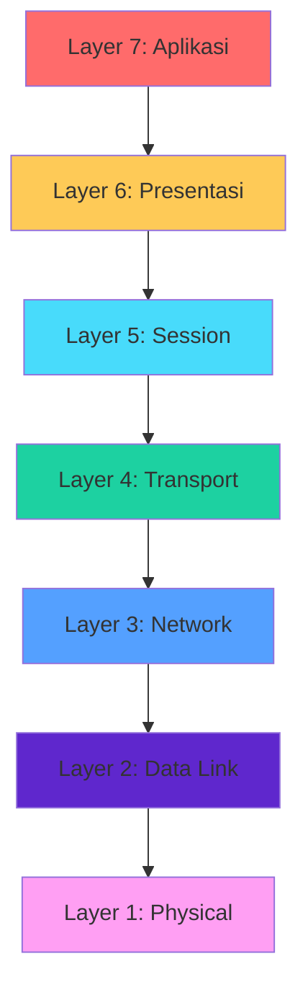
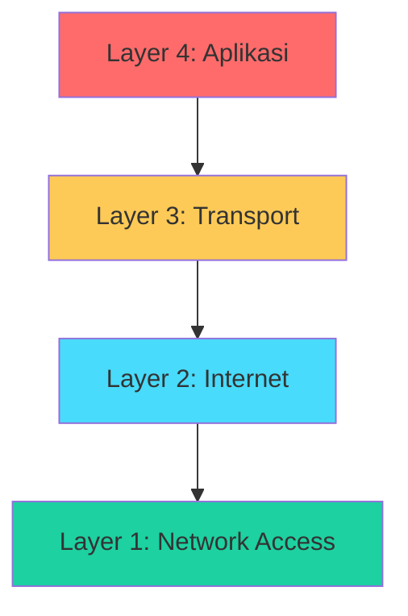
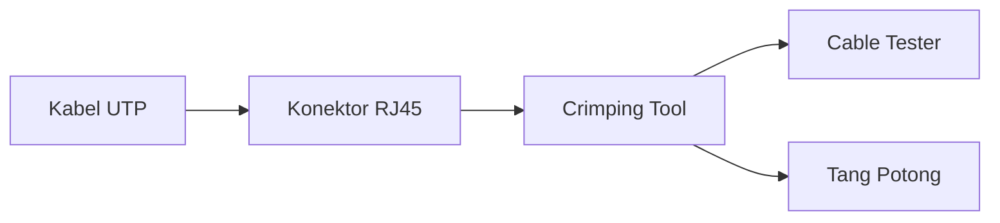
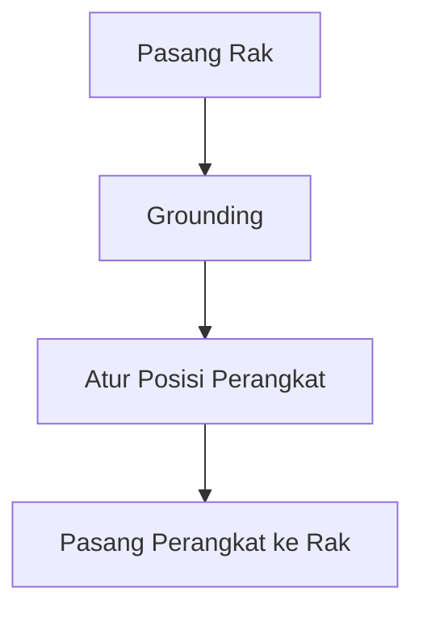
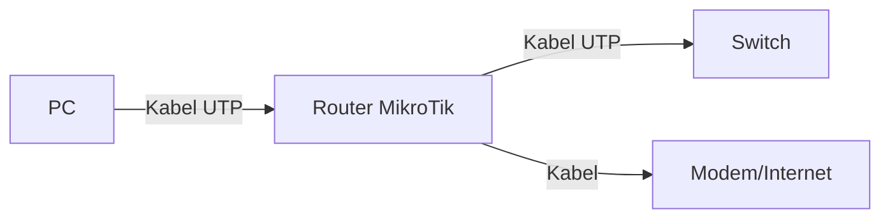
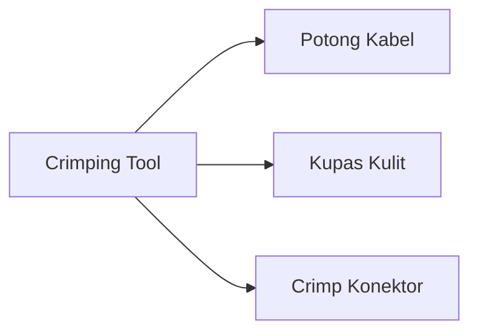
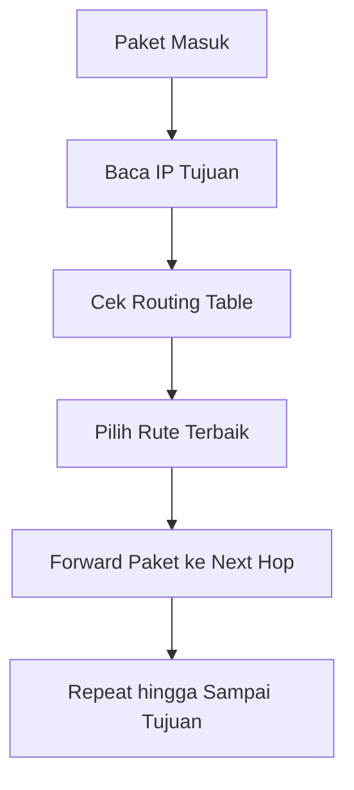

# 📘 PEMASANGAN DAN KONFIGURASI PERANGKAT JARINGAN
## Kelas XI – Semester 1 (Ganjil)

> **Fokus Pembelajaran:** Dasar Jaringan, Instalasi Perangkat, dan Pengantar Routing.

---

# 📑 DAFTAR ISI (Klik untuk Navigasi)

## [BAB 1: Pendahuluan Jaringan Komputer](#bab-1-pendahuluan-jaringan-komputer)
- [1.1 Pengertian Jaringan Komputer](#11-pengertian-jaringan-komputer)
- [1.2 Model OSI Layer](#12-model-osi-layer)
- [1.3 Model TCP/IP](#13-model-tcpip)
- [1.4 Perbedaan OSI dan TCP/IP](#14-perbedaan-osi-dan-tcpip)
- [1.5 Topologi Jaringan](#15-topologi-jaringan)
- [1.6 Alamat IP (IPv4 dan IPv6)](#16-alamat-ip-ipv4-dan-ipv6)
- [1.7 Subnetting](#17-subnetting)
- [1.8 Latihan Soal](#18-latihan-soal)

## [BAB 2: Perangkat Jaringan dan Fungsinya](#bab-2-perangkat-jaringan-dan-fungsinya)
- [2.1 Perangkat Keras Jaringan](#21-perangkat-keras-jaringan)
- [2.2 Media Transmisi](#22-media-transmisi)
- [2.3 Standar Kabel UTP](#23-standar-kabel-utp)
- [2.4 Latihan Praktikum](#24-latihan-praktikum)

## [BAB 3: Pemasangan Perangkat Jaringan (Instalasi)](#bab-3-pemasangan-perangkat-jaringan-instalasi)
- [3.1 Prosedur Pemasangan Perangkat](#31-prosedur-pemasangan-perangkat)
- [3.2 Instalasi Perangkat Jaringan](#32-instalasi-perangkat-jaringan)
- [3.3 Pengkabelan dan Crimping](#33-pengkabelan-dan-crimping)
- [3.4 Konfigurasi Dasar Router dan Switch](#34-konfigurasi-dasar-router-dan-switch)
- [3.5 Praktikum](#35-praktikum)

## [BAB 4: Penggantian Perangkat Jaringan](#bab-4-penggantian-perangkat-jaringan)
- [4.1 Identifikasi Kerusakan Perangkat](#41-identifikasi-kerusakan-perangkat)
- [4.2 Prosedur Penggantian Perangkat](#42-prosedur-penggantian-perangkat)
- [4.3 Migrasi Konfigurasi](#43-migrasi-konfigurasi)
- [4.4 Studi Kasus](#44-studi-kasus)

## [BAB 5: Dasar Routing dan Jenis-jenis Routing](#bab-5-dasar-routing-dan-jenis-jenis-routing)
- [5.1 Konsep Dasar Routing](#51-konsep-dasar-routing)
- [5.2 Routing Statis](#52-routing-statis)
- [5.3 Routing Dinamis](#53-routing-dinamis)
- [5.4 Perbandingan Routing Statis dan Dinamis](#54-perbandingan-routing-statis-dan-dinamis)
- [5.5 Tabel Routing](#55-tabel-routing)

## [BAB 6: Konfigurasi Routing Statis](#bab-6-konfigurasi-routing-statis)
- [6.1 Persiapan Konfigurasi](#61-persiapan-konfigurasi)
- [6.2 Konfigurasi Static Route di Cisco](#62-konfigurasi-static-route-di-cisco)
- [6.3 Konfigurasi Static Route di MikroTik](#63-konfigurasi-static-route-di-mikrotik)
- [6.4 Konfigurasi Default Route](#64-konfigurasi-default-route)
- [6.5 Simulasi Jaringan 3 Router](#65-simulasi-jaringan-3-router)
- [6.6 Troubleshooting Routing Statis](#66-troubleshooting-routing-statis)

## [Ringkasan Materi Semester 1](#-ringkasan-materi-semester-1)
## [Daftar Pustaka](#-daftar-pustaka)
## [Glosarium](#-glosarium)

---

# BAB 1: Pendahuluan Jaringan Komputer

[🔝 Kembali ke Daftar Isi](#-daftar-isi-klik-untuk-navigasi)

## 1.1 Pengertian Jaringan Komputer

### Apa itu Jaringan Komputer?

**Jaringan komputer** adalah sekumpulan perangkat komputer dan perangkat lainnya yang saling terhubung satu sama lain menggunakan media komunikasi sehingga dapat saling berbagi sumber daya (resource) dan berkomunikasi.

### Tujuan Jaringan Komputer

| **No** | **Tujuan** | **Penjelasan** |
|:---:|:---|:---|
| 1 | **Berbagi Sumber Daya** | Printer, file, koneksi internet dapat digunakan bersama |
| 2 | **Komunikasi** | Email, chat, video call antar pengguna |
| 3 | **Akses Informasi** | Mengakses internet, database, dan server |
| 4 | **Keamanan dan Backup** | Penyimpanan data terpusat dan terenkripsi |

### Manfaat Jaringan Komputer

| **Manfaat** | **Penjelasan** |
|:---|:---|
| **Efisiensi Biaya** | Menghemat biaya karena perangkat bisa digunakan bersama |
| **Kecepatan Komunikasi** | Transfer data dalam hitungan detik |
| **Keandalan** | Jika satu komputer rusak, komputer lain tetap bisa bekerja |
| **Skalabilitas** | Mudah menambah perangkat baru tanpa mengganggu yang lama |

### Jenis-jenis Jaringan Berdasarkan Skala

| **Jenis** | **Luas Area** | **Contoh** |
|:---|:---|:---|
| **PAN** (Personal Area Network) | 1-10 meter | Bluetooth, Infrared |
| **LAN** (Local Area Network) | 10-100 meter | Jaringan kantor, sekolah |
| **MAN** (Metropolitan Area Network) | 5-50 km | Jaringan antar gedung dalam kota |
| **WAN** (Wide Area Network) | Antar kota/negara | Internet |

---

## 1.2 Model OSI Layer

### Pengertian OSI Layer

**OSI (Open Systems Interconnection)** adalah model referensi yang dikembangkan oleh ISO (International Organization for Standardization) untuk menstandarisasi komunikasi jaringan. OSI terdiri dari 7 lapisan (layer) yang masing-masing memiliki fungsi spesifik.

### 7 Lapisan OSI Layer (Dari Bawah ke Atas)



### Tabel Lengkap OSI Layer

| **Layer** | **Nama** | **Fungsi Utama** | **Unit Data** | **Contoh Protokol/Perangkat** |
|:---:|:---|:---|:---|:---|
| **7** | **Aplikasi** | Antarmuka pengguna dengan jaringan | Data | HTTP, HTTPS, FTP, SMTP, DNS |
| **6** | **Presentasi** | Enkripsi, kompresi, format data | Data | SSL/TLS, JPEG, MPEG, ASCII |
| **5** | **Session** | Membuat, mengelola, mengakhiri sesi | Data | NetBIOS, RPC, SQL |
| **4** | **Transport** | Mengirim data end-to-end, flow control | Segment | TCP, UDP, SCTP |
| **3** | **Network** | Pengalamatan dan routing paket | Packet | IP, ICMP, Router |
| **2** | **Data Link** | Pengiriman data antar perangkat satu segmen | Frame | Ethernet, MAC Address, Switch |
| **1** | **Physical** | Mengirim bit melalui media fisik | Bit | Kabel, Fiber, Hub, NIC |

### Cara Mengingat 7 Layer OSI (Mudah)

> **Dari Bawah ke Atas (Physical → Aplikasi):**
> 
> **"Please Do Not Throw Sausage Pizza Away"**

| **Kata Kunci** | **Layer** |
|:---|:---|
| **P**lease | **P**hysical |
| **D**o | **D**ata Link |
| **N**ot | **N**etwork |
| **T**hrow | **T**ransport |
| **S**ausage | **S**ession |
| **P**izza | **P**resentation |
| **A**way | **A**pplication |

### Penjelasan Detail Setiap Lapisan

#### 🔹 Layer 1 - Physical (Fisik)
- **Fungsi:** Mengubah data digital menjadi sinyal (listrik, optik, atau gelombang radio) untuk dikirim melalui media fisik
- **Unit Data:** Bit (0 dan 1)
- **Perangkat:** Kabel, Hub, Repeater, NIC, Konektor
- **Contoh:** Kecepatan data 100 Mbps, kabel UTP Cat5e

#### 🔹 Layer 2 - Data Link (Tautan Data)
- **Fungsi:** Mengirim data antar perangkat dalam satu jaringan lokal, mendeteksi dan mengoreksi error
- **Unit Data:** Frame
- **Identifikasi:** MAC Address (48-bit)
- **Perangkat:** Switch, Bridge
- **Sub-layers:** LLC (Logical Link Control) dan MAC (Media Access Control)

#### 🔹 Layer 3 - Network (Jaringan)
- **Fungsi:** Mengirim data antar jaringan yang berbeda (routing), pengalamatan logika
- **Unit Data:** Packet
- **Identifikasi:** IP Address
- **Perangkat:** Router, Layer 3 Switch
- **Protokol:** IP, ICMP, ARP, RIP, OSPF

#### 🔹 Layer 4 - Transport (Transportasi)
- **Fungsi:** Mengirim data dari sumber ke tujuan dengan kontrol aliran (flow control)
- **Unit Data:** Segment
- **Protokol:**
  - **TCP** (Transmission Control Protocol) - Reliable, connection-oriented
  - **UDP** (User Datagram Protocol) - Cepat, connectionless

#### 🔹 Layer 5 - Session (Sesi)
- **Fungsi:** Mengelola sesi komunikasi antar aplikasi (establish, maintain, terminate)
- **Contoh:** Membuat sesi antara client dan server

#### 🔹 Layer 6 - Presentation (Presentasi)
- **Fungsi:** Format data, enkripsi, kompresi, dan translasi data
- **Contoh:** Mengubah karakter ASCII ke EBCDIC, enkripsi SSL

#### 🔹 Layer 7 - Application (Aplikasi)
- **Fungsi:** Antarmuka antara pengguna dan jaringan, layanan aplikasi
- **Protokol:** HTTP/HTTPS (web), FTP (transfer file), SMTP (email), DNS (domain)

---

## 1.3 Model TCP/IP

### Pengertian TCP/IP

**TCP/IP (Transmission Control Protocol/Internet Protocol)** adalah model protokol yang digunakan di internet. Dikembangkan oleh DARPA (Departemen Pertahanan AS) pada tahun 1970-an.

### 4 Lapisan TCP/IP



### Tabel Perbandingan Layer TCP/IP

| **Layer TCP/IP** | **Fungsi** | **Setara OSI** | **Protokol Contoh** |
|:---|:---|:---|:---|
| **Aplikasi** | Antarmuka pengguna, format data, sesi | Layer 5, 6, 7 | HTTP, FTP, DNS, SMTP |
| **Transport** | Mengirim data end-to-end | Layer 4 | TCP, UDP |
| **Internet** | Routing dan pengalamatan IP | Layer 3 | IP, ICMP, ARP |
| **Network Access** | Pengiriman melalui media fisik | Layer 1, 2 | Ethernet, WiFi, PPP |

### Protokol Penting di TCP/IP

#### 1. HTTP/HTTPS (Port 80/443)
- Untuk mengakses website
- HTTPS adalah versi aman (terenkripsi)

#### 2. FTP (Port 20, 21)
- File Transfer Protocol
- Untuk transfer file

#### 3. DNS (Port 53)
- Domain Name System
- Menerjemahkan domain ke IP Address

#### 4. SMTP (Port 25), POP3 (110), IMAP (143)
- Protokol untuk email

#### 5. DHCP (Port 67, 68)
- Dynamic Host Configuration Protocol
- Memberikan IP otomatis

---

## 1.4 Perbedaan OSI dan TCP/IP

| **Aspek** | **OSI** | **TCP/IP** |
|:---|:---|:---|
| **Jumlah Lapisan** | 7 Lapisan | 4 Lapisan |
| **Pengembang** | ISO (Internasional) | DARPA (AS) |
| **Pendekatan** | Teoritis (referensi) | Praktis (implementasi) |
| **Penggunaan** | Sebagai standar referensi | Digunakan di internet |
| **Layer Aplikasi** | Terpisah (5, 6, 7) | Digabung menjadi satu |
| **Layer Network** | Network layer | Internet layer |
| **Koneksi** | Connection-oriented dan connectionless | Sama seperti OSI |
| **Tahun** | 1984 | 1970-an |

### Ilustrasi Perbandingan

```
OSI (7 Layer)          TCP/IP (4 Layer)
+----------------+     +----------------+
|  Aplikasi      |     |                |
|  Presentasi    |     |   Aplikasi     |
|  Session       |     |                |
+----------------+     +----------------+
|  Transport     |     |   Transport    |
+----------------+     +----------------+
|  Network       |     |   Internet     |
+----------------+     +----------------+
|  Data Link     |     |   Network      |
|  Physical      |     |   Access       |
+----------------+     +----------------+
```

---

## 1.5 Topologi Jaringan

### A. Topologi Bus

**Gambar Topologi Bus:**
```
    [PC1]----[PC2]----[PC3]----[PC4]
                |
              [Printer]
```

| **Karakteristik** | **Penjelasan** |
|:---|:---|
| **Keunggulan** | Hemat kabel, mudah dikembangkan |
| **Kelemahan** | Jika kabel utama putus, semua jaringan mati |
| **Perangkat** | Kabel coaxial, Terminator |
| **Penggunaan** | Jaringan kecil sederhana |

### B. Topologi Star

**Gambar Topologi Star:**
```
              [PC1]
                |
    [PC2]----[SWITCH]----[PC3]
                |
              [PC4]
```

| **Karakteristik** | **Penjelasan** |
|:---|:---|
| **Keunggulan** | Jika satu PC mati, yang lain tetap jalan, mudah manajemen |
| **Kelemahan** | Bergantung pada switch/hub sentral |
| **Perangkat** | Switch/Hub sebagai pusat |
| **Penggunaan** | Paling umum di kantor/sekolah |

### C. Topologi Ring

**Gambar Topologi Ring:**
```
    [PC1]----[PC2]
      |         |
    [PC4]----[PC3]
```

| **Karakteristik** | **Penjelasan** |
|:---|:---|
| **Keunggulan** | Tidak ada tabrakan data (collision), performa stabil |
| **Kelemahan** | Jika satu node mati, seluruh jaringan terganggu |
| **Perangkat** | Token Ring, Fiber |

### D. Topologi Mesh

**Gambar Topologi Mesh:**
```
    [PC1]----[PC2]
    /  |   X   |  \
   [PC3]----[PC4]----[PC5]
```

| **Karakteristik** | **Penjelasan** |
|:---|:---|
| **Keunggulan** | Redundansi tinggi, jika satu jalur putus ada jalur lain |
| **Kelemahan** | Biaya kabel sangat mahal, sulit konfigurasi |
| **Penggunaan** | Jaringan militer, data center penting |

### E. Topologi Tree (Pohon)

**Gambar Topologi Tree:**
```
           [ROOT]
         /   |   \
      [SW1] [SW2] [SW3]
       |      |      |
    [PC1]  [PC2]  [PC3]
```

| **Karakteristik** | **Penjelasan** |
|:---|:---|
| **Keunggulan** | Skalabel, mudah dikembangkan secara hierarki |
| **Kelemahan** | Jika root mati, semua di bawahnya mati |
| **Penggunaan** | Jaringan kampus, perusahaan besar |

### F. Topologi Hybrid

**Gambar Topologi Hybrid:**
```
    [SWITCH A]---[SWITCH B]
       |              |
    [PC1,PC2]      [PC3,PC4]
       |              |
    [AP A]         [AP B]
```

| **Karakteristik** | **Penjelasan** |
|:---|:---|
| **Keunggulan** | Menggabungkan keunggulan beberapa topologi |
| **Kelemahan** | Konfigurasi sangat kompleks |
| **Penggunaan** | Jaringan enterprise skala besar |

### G. Topologi Wireless

**Gambar Topologi Wireless:**
```
    [INTERNET]
        |
    [ACCESS POINT]
     /    |    \
  [PC1] [PC2] [PC3]
```

| **Karakteristik** | **Penjelasan** |
|:---|:---|
| **Keunggulan** | Fleksibel, tanpa kabel |
| **Kelemahan** | Interferensi, keamanan lebih rentan |
| **Penggunaan** | Rumah, kafe, ruangan yang sulit dikabel |

---

## 1.6 Alamat IP (IPv4 dan IPv6)

### A. IPv4 (Internet Protocol version 4)

**IPv4** adalah 32-bit yang dibagi menjadi 4 oktet (masing-masing 8 bit).

```
Format: xxx.xxx.xxx.xxx
Contoh: 192.168.1.1
Bit: 32 bit = 4.294.967.296 alamat
```

#### Pembagian IPv4 Berdasarkan Kelas

| **Kelas** | **Rentang IP** | **Subnet Mask Default** | **CIDR** | **Penggunaan** |
|:---:|:---|:---:|:---:|:---|
| **A** | 1.0.0.0 - 126.255.255.255 | 255.0.0.0 | /8 | Jaringan sangat besar |
| **B** | 128.0.0.0 - 191.255.255.255 | 255.255.0.0 | /16 | Jaringan menengah |
| **C** | 192.0.0.0 - 223.255.255.255 | 255.255.255.0 | /24 | Jaringan kecil (LAN) |
| **D** | 224.0.0.0 - 239.255.255.255 | - | - | Multicast |
| **E** | 240.0.0.0 - 255.255.255.255 | - | - | Eksperimen |

#### IP Private (Tidak Bisa Diakses dari Internet)

| **Kelas** | **Rentang IP Private** | **Jumlah Host** |
|:---:|:---|:---:|
| **A** | 10.0.0.0 - 10.255.255.255 | 16.777.216 |
| **B** | 172.16.0.0 - 172.31.255.255 | 1.048.576 |
| **C** | 192.168.0.0 - 192.168.255.255 | 65.536 |

#### IP Public (Bisa Diakses dari Internet)
Semua IP di luar range private di atas.

#### IP Khusus

| **IP** | **Fungsi** |
|:---|:---|
| **127.0.0.1** | Localhost (komputer sendiri) |
| **0.0.0.0** | Semua alamat (default) |
| **255.255.255.255** | Broadcast |

### B. IPv6 (Internet Protocol version 6)

**IPv6** adalah 128-bit yang ditulis dalam heksadesimal untuk mengatasi keterbatasan IPv4.

```
Format: xxxx:xxxx:xxxx:xxxx:xxxx:xxxx:xxxx:xxxx
Contoh: 2001:0db8:85a3:0000:0000:8a2e:0370:7334
Bit: 128 bit = 340.282.366.920.938.463.463.374.607.431.768.211.456 alamat
```

#### Jenis IPv6

| **Jenis** | **Deskripsi** | **Contoh** |
|:---|:---|:---|
| **Unicast** | 1 pengirim ke 1 penerima | Global Unicast, Unique Local |
| **Multicast** | 1 pengirim ke banyak penerima | FF02::1 |
| **Anycast** | 1 pengirim ke salah satu dari banyak penerima | - |

#### Kelebihan IPv6 Dibanding IPv4

| **Kelebihan** | **Penjelasan** |
|:---|:---|
| **Alamat Lebih Banyak** | 128-bit vs 32-bit |
| **Keamanan** | IPsec wajib |
| **Auto-configuration** | Stateless address autoconfiguration (SLAAC) |
| **Efisiensi** | No NAT diperlukan |
| **QoS** | Flow label untuk quality of service |

---

## 1.7 Subnetting

### Pengertian Subnetting

**Subnetting** adalah teknik membagi satu jaringan besar menjadi beberapa jaringan kecil (subnet) untuk meningkatkan efisiensi dan keamanan.

### Tujuan Subnetting

1. **Mengurangi lalu lintas broadcast** - Broadcast tidak menyebar ke seluruh jaringan
2. **Meningkatkan keamanan** - Isolasi antar departemen
3. **Memudahkan manajemen** - Lebih mudah dikelola
4. **Efisiensi IP** - Tidak membuang-buang IP

### Cara Subnetting (Langkah demi Langkah)

#### Contoh 1: Subnetting Kelas C

```
Network: 192.168.1.0/24
Kita ingin membagi menjadi 4 subnet
```

**Langkah 1:** Tentukan jumlah subnet
```
Rumus: 2^n ≥ jumlah subnet
2^n ≥ 4
n = 2 (karena 2^2 = 4)
```

**Langkah 2:** Tentukan subnet mask baru
```
Subnet mask default: /24 (255.255.255.0)
Tambahkan n bit: /24 + 2 = /26
Subnet mask baru: 255.255.255.192
```

**Langkah 3:** Hitung jumlah host per subnet
```
Rumus: 2^(32 - subnet_mask) - 2
2^(32 - 26) - 2 = 2^6 - 2 = 64 - 2 = 62 host
```

**Langkah 4:** Tentukan range subnet

| **Subnet** | **Network** | **Host Range** | **Broadcast** |
|:---:|:---|:---|:---|
| 0 | 192.168.1.0 | 1 - 62 | 192.168.1.63 |
| 1 | 192.168.1.64 | 65 - 126 | 192.168.1.127 |
| 2 | 192.168.1.128 | 129 - 190 | 192.168.1.191 |
| 3 | 192.168.1.192 | 193 - 254 | 192.168.1.255 |

#### Contoh 2: Subnetting Kelas B

```
Network: 172.16.0.0/16
Kita ingin membagi menjadi 8 subnet
```

```
2^n ≥ 8
n = 3 (2^3 = 8)

Subnet mask baru: /16 + 3 = /19
Subnet mask: 255.255.224.0
Jumlah host: 2^(32-19) - 2 = 8190 host
```

#### Contoh 3: Subnetting Kelas A

```
Network: 10.0.0.0/8
Kita ingin membagi menjadi 16 subnet
```

```
2^n ≥ 16
n = 4 (2^4 = 16)

Subnet mask baru: /8 + 4 = /12
Subnet mask: 255.240.0.0
Jumlah host: 2^(32-12) - 2 = 1.048.574 host
```

### Tabel CIDR dan Subnet Mask

| **CIDR** | **Subnet Mask** | **Jumlah Host** | **Penggunaan** |
|:---:|:---|:---:|:---|
| /8 | 255.0.0.0 | 16.777.214 | Jaringan besar |
| /16 | 255.255.0.0 | 65.534 | Jaringan menengah |
| /24 | 255.255.255.0 | 254 | Jaringan kecil |
| /25 | 255.255.255.128 | 126 | Subnet kecil |
| /26 | 255.255.255.192 | 62 | Subnet kecil |
| /27 | 255.255.255.224 | 30 | Subnet kecil |
| /28 | 255.255.255.240 | 14 | Subnet kecil |
| /29 | 255.255.255.248 | 6 | Subnet kecil |
| /30 | 255.255.255.252 | 2 | Link point-to-point |

### Rumus-rumus Subnetting

| **Rumus** | **Keterangan** |
|:---|:---|
| **2^n ≥ Jumlah Subnet** | n = jumlah bit yang dipinjam |
| **2^(32 - Subnet_Mask) - 2** | Jumlah host per subnet |
| **256 - Blok_Subnet** | Increment per subnet |
| **Network = kelipatan blok** | Alamat awal subnet |
| **Broadcast = Network + Host - 1** | Alamat broadcast |

---

## 1.8 Latihan Soal

### A. Soal Pilihan Ganda

**1. Apa fungsi dari layer Network pada OSI?**
- A. Mengirim bit melalui media fisik
- B. Melakukan routing dan pengalamatan ✅
- C. Mengelola sesi komunikasi
- D. Enkripsi data

**2. Berapa bit yang digunakan untuk IPv4?**
- A. 16 bit
- B. 32 bit ✅
- C. 64 bit
- D. 128 bit

**3. IP 192.168.1.1 termasuk dalam kelas apa?**
- A. Kelas A
- B. Kelas B
- C. Kelas C ✅
- D. Kelas D

**4. Protokol apa yang digunakan untuk transfer file?**
- A. HTTP
- B. FTP ✅
- C. SMTP
- D. DNS

**5. Topologi yang paling umum digunakan di kantor adalah?**
- A. Bus
- B. Star ✅
- C. Ring
- D. Mesh

### B. Soal Essay

**1. Sebutkan dan jelaskan 7 lapisan OSI!**

**2. Diketahui network 10.0.0.0/8, buatlah 16 subnet!**
- Tentukan subnet mask baru!
- Tentukan range IP setiap subnet!

**3. Jelaskan perbedaan antara Switch dan Router!**

**4. Apa perbedaan antara IP Private dan IP Public? Berikan contoh masing-masing!**

**5. Sebutkan 5 media transmisi dan keunggulannya!**

### C. Soal Praktikum Subnetting

**1. Buat subnetting untuk network berikut:**

| **Network** | **Jumlah Subnet** | **Subnet Mask** | **Host per Subnet** |
|:---|:---:|:---:|:---:|
| 192.168.10.0/24 | 8 | ? | ? |
| 172.16.0.0/16 | 64 | ? | ? |
| 10.0.0.0/8 | 256 | ? | ? |

**2. Diketahui IP 172.16.10.5/20, tentukan:**
- Network Address
- Broadcast Address
- Range IP yang valid

---

# BAB 2: Perangkat Jaringan dan Fungsinya

[🔝 Kembali ke Daftar Isi](#-daftar-isi-klik-untuk-navigasi)

## 2.1 Perangkat Keras Jaringan

### A. NIC (Network Interface Card)

**NIC** adalah perangkat yang menghubungkan komputer ke jaringan.


#### Jenis NIC

| **Jenis** | **Media** | **Kecepatan** | **Kegunaan** |
|:---|:---|:---|:---|
| **Ethernet** | Kabel UTP/STP | 10/100/1000 Mbps | PC, Server, Laptop |
| **Wireless** | Gelombang Radio | 54-1200 Mbps | Laptop, Smartphone |
| **Fiber** | Fiber Optic | 1-100 Gbps | Server, Data Center |

#### Fungsi NIC
1. Mengubah data paralel menjadi serial
2. Memberikan alamat MAC unik
3. Mengirim dan menerima data
4. Mengontrol aliran data

### B. Switch

**Switch** adalah perangkat yang menghubungkan perangkat dalam satu jaringan lokal (LAN).

#### Cara Kerja Switch


1. Menerima frame data dari port tertentu
2. Membaca MAC Address tujuan
3. Mencocokkan dengan tabel MAC Address
4. Mengirimkan frame ke port tujuan yang sesuai

#### Kelebihan Switch
- Mengurangi collision (tabrakan data)
- Koneksi full-duplex (bisa kirim dan terima bersamaan)
- Efisien dan cepat
- Dapat dibuat VLAN

### C. Router

**Router** adalah perangkat yang menghubungkan jaringan yang berbeda.

#### Fungsi Router

| **Fungsi** | **Penjelasan** |
|:---|:---|
| **Routing** | Memilih jalur terbaik untuk paket data |
| **NAT** | Menerjemahkan alamat IP private ke public |
| **Firewall** | Keamanan jaringan (filtering) |
| **DHCP Server** | Memberikan IP otomatis ke client |
| **VPN** | Koneksi aman antar jaringan |

### D. Access Point (AP)

**Access Point** adalah perangkat yang menyediakan akses wireless ke jaringan kabel.

#### Mode Access Point

| **Mode** | **Fungsi** |
|:---|:---|
| **AP Mode** | Menyambungkan client wireless ke jaringan kabel |
| **Repeater** | Memperluas jangkauan sinyal |
| **Bridge** | Menghubungkan dua jaringan wireless |
| **Client** | Menghubungkan AP ke jaringan lain |

### E. Firewall

**Firewall** adalah perangkat yang mengatur lalu lintas data masuk dan keluar berdasarkan aturan keamanan.

#### Jenis Firewall

| **Jenis** | **Fungsi** | **Contoh** |
|:---|:---|:---|
| **Packet Filter** | Filter berdasarkan IP dan Port | iptables, MikroTik |
| **Stateful** | Melacak koneksi (state) | Cisco ASA |
| **Application** | Filter berdasarkan aplikasi | Fortigate, PAN |

### F. Modem

**Modem** adalah perangkat yang mengubah sinyal digital menjadi analog (modulasi) dan analog menjadi digital (demodulasi).

#### Jenis Modem

| **Jenis** | **Media** | **Kecepatan** | **Penggunaan** |
|:---|:---|:---|:---|
| **DSL** | Kabel Telepon | 10-100 Mbps | Rumah, Kantor |
| **Cable** | TV Kabel | 100-1000 Mbps | Rumah, Kantor |
| **Wireless** | 3G/4G/5G | 20-1000 Mbps | Mobile |
| **Fiber** | Fiber Optic | 100-1000 Mbps | Kantor, Enterprise |

### G. Repeater dan Bridge

| **Perangkat** | **Fungsi** | **Layer** |
|:---|:---|:---|
| **Repeater** | Memperkuat sinyal agar jarak lebih jauh | Physical (Layer 1) |
| **Bridge** | Menghubungkan 2 segmen jaringan yang sama | Data Link (Layer 2) |

---

## 2.2 Media Transmisi

### A. Kabel Tembaga

#### 1. UTP (Unshielded Twisted Pair)

**UTP** adalah kabel yang terdiri dari 4 pasang kabel yang dipilin (twisted).

```
     [PC] --- Kabel UTP --- [Switch]
```

| **Karakteristik** | **Penjelasan** |
|:---|:---|
| **Keunggulan** | Murah, mudah dipasang, fleksibel |
| **Kelemahan** | Terbatas jarak (100m), rentan interferensi |
| **Jenis Konektor** | RJ45 |

**Kategori Kabel UTP:**

| **Kategori** | **Kecepatan** | **Frekuensi** | **Fungsi** |
|:---|:---|:---|:---|
| **Cat 3** | 10 Mbps | 16 MHz | Telepon |
| **Cat 5** | 100 Mbps | 100 MHz | Fast Ethernet |
| **Cat 5e** | 1 Gbps | 100 MHz | Gigabit Ethernet |
| **Cat 6** | 10 Gbps | 250 MHz | 10G Ethernet (≤55m) |
| **Cat 6a** | 10 Gbps | 500 MHz | 10G Ethernet (≤100m) |
| **Cat 7** | 10 Gbps | 600 MHz | Shielded (STP) |

#### 2. STP (Shielded Twisted Pair)

**STP** sama seperti UTP tapi ada pelindung tambahan untuk mengurangi interferensi.

| **Karakteristik** | **Penjelasan** |
|:---|:---|
| **Keunggulan** | Lebih tahan interferensi |
| **Kelemahan** | Lebih mahal, kurang fleksibel |
| **Penggunaan** | Lingkungan dengan banyak interferensi |

#### 3. Koaksial (Coaxial)

**Koaksial** memiliki inti tembaga di dalam isolator dan pelindung.

```
    [Penghantar] --- [Isolator] --- [Pelindung] --- [Lapisan Luar]
```

| **Karakteristik** | **Penjelasan** |
|:---|:---|
| **Kecepatan** | 10-100 Mbps |
| **Jenis Konektor** | BNC, F-type |
| **Penggunaan** | TV kabel, CCTV, internet kabel |

### B. Fiber Optic

**Fiber Optic** menggunakan cahaya untuk mengirim data.

#### Jenis Fiber Optic

| **Jenis** | **Karakteristik** | **Kecepatan** | **Jarak** | **Biaya** |
|:---|:---|:---|:---|:---|
| **Single Mode** | Satu jalur cahaya (9 μm) | > 100 Gbps | 100+ km | Mahal |
| **Multi Mode** | Banyak jalur cahaya (50-62.5 μm) | 10 Gbps | 500 m - 2 km | Lebih murah |

#### Komponen Fiber Optic


#### Kelebihan Fiber Optic
1. **Kecepatan sangat tinggi** - >100 Gbps
2. **Jarak jauh** - Puluhan kilometer
3. **Tahan interferensi** - Tidak terpengaruh listrik
4. **Keamanan** - Sulit disadap

#### Kekurangan Fiber Optic
1. **Mahal** - Biaya instalasi tinggi
2. **Instalasi sulit** - Memerlukan alat khusus
3. **Fragile** - Mudah patah

### C. Wireless (Nirkabel)

**Wireless** menggunakan gelombang radio untuk komunikasi.

#### Standar WiFi

| **Standar** | **Frekuensi** | **Kecepatan Maksimal** | **Jarak** | **Tahun** |
|:---|:---|:---|:---|:---:|
| **802.11b** | 2.4 GHz | 11 Mbps | 30-50 m | 1999 |
| **802.11g** | 2.4 GHz | 54 Mbps | 30-50 m | 2003 |
| **802.11n** | 2.4/5 GHz | 300-600 Mbps | 50-70 m | 2009 |
| **802.11ac** | 5 GHz | 1.3 Gbps | 30-50 m | 2013 |
| **802.11ax** | 2.4/5 GHz | 10 Gbps | 30-50 m | 2019 |

#### Kelebihan Wireless
- Tanpa kabel (fleksibel)
- Mudah dipasang
- Mobile (bisa bergerak)

#### Kekurangan Wireless
- Interferensi (gangguan sinyal)
- Keamanan lebih rentan
- Kecepatan lebih lambat dari kabel

### D. Perbandingan Media Transmisi

| **Media** | **Kecepatan** | **Jarak** | **Biaya** | **Ketahanan Interferensi** |
|:---|:---:|:---:|:---:|:---:|
| **UTP** | 10 Gbps | 100 m | Murah | Rendah |
| **STP** | 10 Gbps | 100 m | Sedang | Sedang |
| **Coaxial** | 100 Mbps | 500 m | Murah | Sedang |
| **Fiber Single Mode** | >100 Gbps | 100+ km | Mahal | Tinggi |
| **Fiber Multi Mode** | 10 Gbps | 2 km | Sedang | Tinggi |
| **Wireless** | 10 Gbps | 50 m | Sedang | Rendah |

---

## 2.3 Standar Kabel UTP

### A. Urutan Kabel UTP

#### 1. Standar T568A

```
Warna Kabel UTP T568A:
┌─────────────────────────────┐
│ Pin 1: Putih Hijau          │
│ Pin 2: Hijau                │
│ Pin 3: Putih Oranye         │
│ Pin 4: Biru                 │
│ Pin 5: Putih Biru           │
│ Pin 6: Oranye               │
│ Pin 7: Putih Coklat         │
│ Pin 8: Coklat               │
└─────────────────────────────┘
```

#### 2. Standar T568B

```
Warna Kabel UTP T568B:
┌─────────────────────────────┐
│ Pin 1: Putih Oranye         │
│ Pin 2: Oranye               │
│ Pin 3: Putih Hijau          │
│ Pin 4: Biru                 │
│ Pin 5: Putih Biru           │
│ Pin 6: Hijau                │
│ Pin 7: Putih Coklat         │
│ Pin 8: Coklat               │
└─────────────────────────────┘
```

#### 3. Perbedaan T568A dan T568B

| **Perbedaan** | **T568A** | **T568B** |
|:---|:---|:---|
| **Pin 1** | Putih Hijau | Putih Oranye |
| **Pin 2** | Hijau | Oranye |
| **Pin 3** | Putih Oranye | Putih Hijau |
| **Pin 6** | Oranye | Hijau |

### B. Jenis Kabel Berdasarkan Penggunaan

| **Jenis** | **Ujung 1** | **Ujung 2** | **Fungsi** |
|:---|:---|:---|:---|
| **Straight** | T568B | T568B | PC ke Switch, PC ke Router |
| **Cross** | T568A | T568B | PC ke PC, Switch ke Switch |
| **Rollover** | Khusus (terbalik) | Khusus | Console Router/Switch |

### C. Cara Crimping Kabel UTP

#### Alat yang Dibutuhkan



#### Langkah-langkah Crimping

```
Langkah 1: Kupas kulit kabel ± 2 cm
     ↓
Langkah 2: Rapikan dan urutkan kabel sesuai standar (T568B)
     ↓
Langkah 3: Potong ujung kabel agar rata
     ↓
Langkah 4: Masukkan ke konektor RJ45 (posisi pin menghadap ke atas)
     ↓
Langkah 5: Crimp dengan crimping tool
     ↓
Langkah 6: Tes dengan cable tester
```

#### Tips Crimping yang Benar

| **Tips** | **Penjelasan** |
|:---|:---|
| **Potong rata** | Potong ujung kabel dengan rata agar masuk sempurna |
| **Tidak terlalu panjang** | Kulit luar harus masuk ke dalam konektor |
| **Urutan tepat** | Periksa urutan warna dengan seksama |
| **Tekanan pas** | Crimp dengan tekanan yang cukup (tidak terlalu pelan/keras) |
| **Tes kabel** | Selalu tes dengan cable tester setelah crimping |

### D. Cable Tester

#### Cara Tes dengan Cable Tester

1. Masukkan ujung 1 ke tester
2. Masukkan ujung 2 ke remote
3. Nyalakan tester
4. Perhatikan indikator LED

#### Hasil Tes

| **Indikator LED** | **Status** | **Arti** |
|:---|:---|:---|
| 1-8 menyala berurutan | ✅ OK | Kabel bagus |
| Ada yang tidak menyala | ❌ Gagal | Kabel putus atau kontak jelek |
| Urutan salah | ❌ Gagal | Urutan warna tidak sesuai |
| Menyala tidak berurutan | ❌ Gagal | Ada short circuit |

---

## 2.4 Latihan Praktikum

### Praktikum 1: Membuat Kabel Straight

**Tujuan:** Membuat kabel straight untuk menghubungkan PC ke Switch.

**Alat dan Bahan:**
- Kabel UTP Cat 5e
- Konektor RJ45 (2 buah)
- Crimping Tool
- Cable Tester

**Langkah-langkah:**

1. Potong kabel UTP sesuai panjang yang dibutuhkan
2. Kupas kulit kabel ± 2 cm di kedua ujung
3. Urutkan kabel dengan standar T568B di kedua ujung:
   ```
   Putih Oranye | Oranye | Putih Hijau | Biru | Putih Biru | Hijau | Putih Coklat | Coklat
   ```
4. Potong ujung kabel rata
5. Masukkan ke konektor RJ45 (pin menghadap ke atas)
6. Crimp dengan crimping tool
7. Lakukan hal yang sama di ujung lainnya
8. Tes dengan cable tester

**Hasil yang Diharapkan:**
- LED 1-8 pada cable tester menyala berurutan
- Kabel dapat digunakan untuk koneksi PC ke Switch

### Praktikum 2: Membuat Kabel Cross

**Tujuan:** Membuat kabel cross untuk PC ke PC atau Switch ke Switch.

**Langkah-langkah:**

1. Ujung 1: Menggunakan standar T568B
   ```
   Putih Oranye | Oranye | Putih Hijau | Biru | Putih Biru | Hijau | Putih Coklat | Coklat
   ```

2. Ujung 2: Menggunakan standar T568A
   ```
   Putih Hijau | Hijau | Putih Oranye | Biru | Putih Biru | Oranye | Putih Coklat | Coklat
   ```

3. Crimp dan tes dengan cable tester

### Praktikum 3: Menggunakan Cable Tester

**Tujuan:** Belajar mendiagnosis kabel dengan cable tester.

**Langkah-langkah:**

1. Masukkan kedua ujung kabel ke tester
2. Nyalakan tester
3. Amati LED yang menyala
4. Jika ada LED yang tidak menyala, berarti ada masalah:
   - LED 1 tidak menyala: Kabel Pin 1 putus
   - LED 2-3 tidak berurutan: Urutan kabel salah
   - Semua LED menyala tapi lambat: Kabel panjang

---

# BAB 3: Pemasangan Perangkat Jaringan (Instalasi)

[🔝 Kembali ke Daftar Isi](#-daftar-isi-klik-untuk-navigasi)

## 3.1 Prosedur Pemasangan Perangkat

### A. Persiapan Instalasi

#### 1. Perencanaan

| **Langkah** | **Aktivitas** | **Output** |
|:---|:---|:---|
| **1** | Membuat gambar topologi jaringan | Diagram topologi |
| **2** | Menentukan alamat IP | Tabel IP Address |
| **3** | Menghitung kebutuhan perangkat | Daftar hardware |
| **4** | Menghitung kebutuhan kabel | Jumlah dan jenis kabel |
| **5** | Menyiapkan dokumentasi | Checklist instalasi |

#### 2. Alat dan Bahan

| **Kategori** | **Alat/Bahan** | **Jumlah** |
|:---|:---|:---:|
| **Perangkat** | Router | 1 unit |
| | Switch | 1 unit |
| | Access Point | 1 unit |
| | Modem | 1 unit |
| **Kabel** | Kabel UTP Cat 5e | 10 meter |
| | Konektor RJ45 | 10 buah |
| | Kabel Power | 5 buah |
| **Tool** | Crimping Tool | 1 buah |
| | Cable Tester | 1 buah |
| | Tang Potong | 1 buah |
| **Lainnya** | Rack/Cabinet | 1 unit |
| | Cable Tie | 1 pack |
| | Label Kabel | 1 pack |

#### 3. Keselamatan Kerja

| **Peraturan** | **Penjelasan** |
|:---|:---|
| Gunakan alas kaki karet | Menghindari sengatan listrik |
| Matikan listrik saat memasang | Mencegah korsleting |
| Jangan menarik kabel terlalu keras | Mencegah kerusakan konektor |
| Hindari kabel yang tertekuk | Mencegah putus di dalam |
| Gunakan ESD strap | Melindungi dari listrik statis |

### B. Langkah Pemasangan

#### 1. Persiapan Rak (Rack)



**Langkah-langkah:**
1. Tentukan lokasi rak yang strategis (dekat dengan sumber listrik dan kabel)
2. Pasang rak dengan baut yang kuat
3. Lakukan grounding untuk keamanan
4. Atur urutan perangkat dari atas ke bawah

#### 2. Pemasangan Hardware

```
Urutan Pemasangan dari Atas ke Bawah:
┌─────────────────────────────┐
│  Patch Panel (untuk kabel)  │
├─────────────────────────────┤
│  Switch 1                   │
├─────────────────────────────┤
│  Switch 2                   │
├─────────────────────────────┤
│  Router                     │
├─────────────────────────────┤
│  Firewall                   │
├─────────────────────────────┤
│  Modem                      │
├─────────────────────────────┤
│  UPS (Power Backup)         │
└─────────────────────────────┘
```

#### 3. Pengkabelan

| **Langkah** | **Penjelasan** |
|:---|:---|
| **1** | Hubungkan perangkat dengan kabel yang sesuai |
| **2** | Gunakan kabel straight untuk PC ke Switch |
| **3** | Gunakan kabel cross untuk Switch ke Switch |
| **4** | Label setiap kabel (contoh: "PC1-SW1") |
| **5** | Rapikan kabel dengan cable tie |
| **6** | Hindari kabel yang tertekuk atau terlalu panjang |

#### 4. Power On

```
Urutan Menyalakan Perangkat:
1. UPS (Power Backup)
2. Modem
3. Router
4. Switch
5. Access Point
6. PC/Client
```

### C. Checklist Instalasi

| **No** | **Item Pemeriksaan** | **Status** |
|:---:|:---|:---:|
| 1 | Rak terpasang dengan kuat | ☐ |
| 2 | Grounding terpasang | ☐ |
| 3 | Semua perangkat terpasang di rak | ☐ |
| 4 | Kabel power terhubung | ☐ |
| 5 | Kabel jaringan terhubung dengan benar | ☐ |
| 6 | Semua kabel sudah dilabel | ☐ |
| 7 | Perangkat menyala dengan normal | ☐ |
| 8 | LED indikator menyala normal | ☐ |
| 9 | Tidak ada kabel yang tertekuk | ☐ |
| 10 | Dokumentasi sudah dibuat | ☐ |

---

## 3.2 Instalasi Perangkat Jaringan

### A. Instalasi Router MikroTik

#### 1. Koneksi Fisik



#### 2. Setting IP PC untuk Akses Router

| **Setting** | **Nilai** |
|:---|:---|
| **IP Address** | 192.168.88.2 |
| **Subnet Mask** | 255.255.255.0 |
| **Default Gateway** | 192.168.88.1 |

#### 3. Akses Router via WinBox

```
Langkah Akses:
1. Buka WinBox
2. Pilih MAC Address router
3. Login: admin (password kosong)
4. Klik Connect
```

#### 4. Konfigurasi Dasar Router MikroTik

```bash
# 1. Ubah password untuk keamanan
/user set admin password=Admin@123

# 2. Beri nama router
/system identity set name=RTR_UTAMA

# 3. Rename interface
/interface ethernet set ether1 name=WAN
/interface ethernet set ether2 name=LAN

# 4. Setting IP Address
/ip address add address=192.168.1.1/24 interface=LAN
/ip address add address=10.0.0.2/24 interface=WAN

# 5. Setting DNS
/ip dns set primary-dns=8.8.8.8 secondary-dns=1.1.1.1

# 6. Setting Default Route
/ip route add gateway=10.0.0.1

# 7. Setting NAT (untuk sharing internet)
/ip firewall nat add chain=srcnat out-interface=WAN action=masquerade

# 8. Setting DHCP Server
/ip pool add name=dhcp-pool ranges=192.168.1.100-192.168.1.200
/ip dhcp-server add interface=LAN address-pool=dhcp-pool
/ip dhcp-server network add address=192.168.1.0/24 gateway=192.168.1.1 dns-server=8.8.8.8

# 9. Enable DHCP Server
/ip dhcp-server enable [find]
```

### B. Instalasi Switch Cisco

#### 1. Koneksi Console

```
[PC] --- [Kabel Console] --- [Console Port Switch]
```

#### 2. Akses via Terminal

```bash
# Gunakan software: PuTTY / HyperTerminal
# Setting: 9600 baud, 8 data bits, 1 stop bit, no parity
```

#### 3. Konfigurasi Dasar Switch Cisco

```bash
# Masuk ke mode privileged
Switch> enable

# Masuk ke mode global configuration
Switch# configure terminal

# 1. Set Hostname
Switch(config)# hostname SW-1

# 2. Set Password Enable
SW-1(config)# enable secret cisco@123

# 3. Set Password Console
SW-1(config)# line console 0
SW-1(config-line)# password console@123
SW-1(config-line)# login
SW-1(config-line)# exit

# 4. Set Password VTY (Remote Access)
SW-1(config)# line vty 0 4
SW-1(config-line)# password remote@123
SW-1(config-line)# login
SW-1(config-line)# exit

# 5. Set Banner
SW-1(config)# banner motd #Hanya Staff Yang Boleh Akses#

# 6. Set VLAN
SW-1(config)# vlan 10
SW-1(config-vlan)# name IT_Dept
SW-1(config-vlan)# exit

SW-1(config)# vlan 20
SW-1(config-vlan)# name HR_Dept
SW-1(config-vlan)# exit

# 7. Set Port Access VLAN 10
SW-1(config)# interface fastEthernet 0/1
SW-1(config-if)# switchport mode access
SW-1(config-if)# switchport access vlan 10
SW-1(config-if)# no shutdown
SW-1(config-if)# exit

# 8. Set Port Access VLAN 20
SW-1(config)# interface fastEthernet 0/2
SW-1(config-if)# switchport mode access
SW-1(config-if)# switchport access vlan 20
SW-1(config-if)# no shutdown
SW-1(config-if)# exit

# 9. Set Trunk
SW-1(config)# interface fastEthernet 0/24
SW-1(config-if)# switchport mode trunk
SW-1(config-if)# no shutdown
SW-1(config-if)# exit

# 10. Set Management IP
SW-1(config)# interface vlan 1
SW-1(config-if)# ip address 192.168.1.10 255.255.255.0
SW-1(config-if)# no shutdown
SW-1(config-if)# exit

# 11. Set Default Gateway
SW-1(config)# ip default-gateway 192.168.1.1

# 12. Simpan Konfigurasi
SW-1# copy running-config startup-config
```

### C. Instalasi Access Point TP-Link

#### 1. Koneksi Fisik

```
[Router] --- [Switch] --- [Access Point]
                           |
                        [Antenna]
```

#### 2. Konfigurasi Access Point

**Langkah 1:** Hubungkan AP ke Switch
**Langkah 2:** Cari IP AP via DHCP (lihat di DHCP Server)
**Langkah 3:** Akses Web Interface

```
Buka browser → Masukkan IP AP (contoh: 192.168.1.100)
Login: admin / admin
```

**Langkah 4:** Konfigurasi WiFi

```
SSID (Nama WiFi): LAB_JARINGAN
Security: WPA2-PSK
Password: kelas@2026
Channel: Auto (pilih 1, 6, atau 11)
Mode: 802.11n/g/b
```

**Langkah 5:** Setting IP Static (opsional)

```
IP Address: 192.168.1.100
Subnet Mask: 255.255.255.0
Default Gateway: 192.168.1.1
DNS Server: 8.8.8.8
```

---

## 3.3 Pengkabelan dan Crimping

### A. Teknik Crimping yang Benar

#### Alat Crimping



#### Langkah-langkah Detail

```
┌─────────────────────────────────────────────────────────┐
│ Langkah 1: Kupas kulit kabel ± 2 cm                    │
│           Gunakan pengupas atau pisau dengan hati-hati  │
├─────────────────────────────────────────────────────────┤
│ Langkah 2: Urutkan kabel sesuai standar                │
│           T568B: Putih Oranye | Oranye | Putih Hijau   │
│           | Biru | Putih Biru | Hijau | Putih Coklat   │
│           | Coklat                                     │
├─────────────────────────────────────────────────────────┤
│ Langkah 3: Rapikan kabel dengan jari                   │
│           Pastikan semua kabel lurus dan tidak kusut    │
├─────────────────────────────────────────────────────────┤
│ Langkah 4: Potong ujung kabel rata                     │
│           Gunakan bagian potong di crimping tool       │
├─────────────────────────────────────────────────────────┤
│ Langkah 5: Masukkan ke konektor RJ45                   │
│           Pastikan kabel masuk sampai ujung konektor   │
│           Kulit luar harus masuk ke dalam konektor     │
├─────────────────────────────────────────────────────────┤
│ Langkah 6: Crimp dengan crimping tool                 │
│           Tekan dengan kuat sampai berbunyi "klik"     │
├─────────────────────────────────────────────────────────┤
│ Langkah 7: Tes dengan cable tester                    │
│           Pastikan LED 1-8 menyala berurutan           │
└─────────────────────────────────────────────────────────┘
```

### B. Troubleshooting Crimping

| **Masalah** | **Penyebab** | **Solusi** |
|:---|:---|:---|
| **Kabel tidak terdeteksi** | Kabel tidak masuk sempurna | Ulangi crimping, pastikan kabel masuk ujung |
| **LED tester tidak menyala** | Kabel putus | Potong dan crimp ulang |
| **Urutan LED salah** | Urutan warna salah | Potong dan urutkan dengan benar |
| **Kabel longgar** | Crimp kurang keras | Crimp ulang dengan tekanan lebih kuat |
| **Kulit luar masuk konektor** | Kupas terlalu panjang | Potong lebih pendek |

### C. Perawatan Kabel

| **Tips Perawatan** | **Penjelasan** |
|:---|:---|
| **Jangan menarik kabel** | Tarik dari konektor, bukan dari kabel |
| **Hindari tekukan tajam** | Radius tekukan minimal 4x diameter kabel |
| **Jauhkan dari panas** | Panas merusak isolasi kabel |
| **Beri label** | Memudahkan identifikasi |
| **Rapikan dengan cable tie** | Mencegah kabel kusut |
| **Jangan menindih kabel** | Beban berat merusak kabel |

---

## 3.4 Konfigurasi Dasar Router dan Switch

### A. Konfigurasi Dasar Router MikroTik (Lengkap)

#### 1. Reset Konfigurasi

```bash
# Reset ke default pabrik
/system reset-configuration
# Pilih: yes
```

#### 2. Konfigurasi Awal

```bash
# 1. Ubah password admin
/user set admin password=Admin@123

# 2. Set identitas router
/system identity set name=RTR_UTAMA

# 3. Rename interface
/interface ethernet set ether1 name=WAN
/interface ethernet set ether2 name=LAN1
/interface ethernet set ether3 name=LAN2

# 4. Set IP Address
/ip address add address=192.168.100.1/24 interface=LAN1
/ip address add address=192.168.200.1/24 interface=LAN2
/ip address add address=10.0.0.2/24 interface=WAN

# 5. Set DNS Server
/ip dns set primary-dns=8.8.8.8 secondary-dns=1.1.1.1

# 6. Set Default Route
/ip route add gateway=10.0.0.1

# 7. Set NAT Masquerade
/ip firewall nat add chain=srcnat out-interface=WAN action=masquerade

# 8. Set DHCP Server LAN1
/ip pool add name=pool-LAN1 ranges=192.168.100.50-192.168.100.200
/ip dhcp-server add interface=LAN1 address-pool=pool-LAN1
/ip dhcp-server network add address=192.168.100.0/24 gateway=192.168.100.1 dns-server=8.8.8.8
/ip dhcp-server enable [find]

# 9. Set DHCP Server LAN2
/ip pool add name=pool-LAN2 ranges=192.168.200.50-192.168.200.200
/ip dhcp-server add interface=LAN2 address-pool=pool-LAN2
/ip dhcp-server network add address=192.168.200.0/24 gateway=192.168.200.1 dns-server=8.8.8.8
/ip dhcp-server enable [find]

# 10. Set Firewall (Block ping dari WAN)
/ip firewall filter add chain=input in-interface=WAN protocol=icmp action=drop

# 11. Set Time Zone
/system clock set time-zone-name=Asia/Jakarta

# 12. Save konfigurasi
/system backup save name=config-akhir
```

### B. Konfigurasi Dasar Switch Cisco (Lengkap)

#### 1. Reset Switch ke Default

```bash
Switch> enable
Switch# write erase
Switch# reload
# Pilih: no
```

#### 2. Konfigurasi Awal

```bash
Switch> enable
Switch# configure terminal

# 1. Set Hostname
Switch(config)# hostname SW-1

# 2. Set Password Enable
SW-1(config)# enable secret cisco@123

# 3. Set Password Console
SW-1(config)# line console 0
SW-1(config-line)# password console@123
SW-1(config-line)# login
SW-1(config-line)# exit

# 4. Set Password VTY
SW-1(config)# line vty 0 4
SW-1(config-line)# password remote@123
SW-1(config-line)# login
SW-1(config-line)# exit

# 5. Set Banner
SW-1(config)# banner motd #Hanya Staff Yang Boleh Akses#

# 6. Set VLAN
SW-1(config)# vlan 10
SW-1(config-vlan)# name IT_Dept
SW-1(config-vlan)# exit

SW-1(config)# vlan 20
SW-1(config-vlan)# name HR_Dept
SW-1(config-vlan)# exit

# 7. Set Port Access
SW-1(config)# interface fastEthernet 0/1
SW-1(config-if)# switchport mode access
SW-1(config-if)# switchport access vlan 10
SW-1(config-if)# no shutdown
SW-1(config-if)# exit

SW-1(config)# interface fastEthernet 0/2
SW-1(config-if)# switchport mode access
SW-1(config-if)# switchport access vlan 20
SW-1(config-if)# no shutdown
SW-1(config-if)# exit

# 8. Set Trunk Port
SW-1(config)# interface fastEthernet 0/24
SW-1(config-if)# switchport mode trunk
SW-1(config-if)# no shutdown
SW-1(config-if)# exit

# 9. Set Management VLAN
SW-1(config)# interface vlan 1
SW-1(config-if)# ip address 192.168.1.10 255.255.255.0
SW-1(config-if)# no shutdown
SW-1(config-if)# exit

# 10. Set Default Gateway
SW-1(config)# ip default-gateway 192.168.1.1

# 11. Set SSH (Optional)
SW-1(config)# hostname SW-1
SW-1(config)# ip domain-name network.local
SW-1(config)# crypto key generate rsa
# Masukkan 2048 bit

# 12. Simpan Konfigurasi
SW-1# copy running-config startup-config
```

---

## 3.5 Praktikum

### Praktikum 1: Instalasi Jaringan Sederhana

**Topologi:**
```
[PC1] --- [Switch] --- [Router] --- [Internet]
[PC2] --- [Switch] --- [Router] --- [Internet]
```

**Tujuan:** Membangun jaringan sederhana dengan 1 router, 1 switch, dan 2 PC.

**Langkah:**

#### 1. Persiapan Hardware
- Pasang router, switch, dan PC
- Hubungkan PC ke switch dengan kabel straight
- Hubungkan switch ke router dengan kabel straight
- Hubungkan router ke modem

#### 2. Konfigurasi Router (MikroTik)
```bash
# Set IP WAN
/ip address add address=10.0.0.2/24 interface=ether1
# Set IP LAN
/ip address add address=192.168.1.1/24 interface=ether2
# Set DNS
/ip dns set primary-dns=8.8.8.8
# Set NAT
/ip firewall nat add chain=srcnat out-interface=ether1 action=masquerade
# Set DHCP
/ip pool add name=pool ranges=192.168.1.100-192.168.1.200
/ip dhcp-server add interface=ether2 address-pool=pool
/ip dhcp-server network add address=192.168.1.0/24 gateway=192.168.1.1
```

#### 3. Konfigurasi PC
- Set IP ke DHCP (otomatis)
- Atau setting manual:
  - PC1: 192.168.1.10/24, Gateway: 192.168.1.1
  - PC2: 192.168.1.11/24, Gateway: 192.168.1.1

#### 4. Pengujian
```bash
# Dari PC1:
ping 192.168.1.1    # Ke Router
ping 192.168.1.11   # Ke PC2
ping 8.8.8.8        # Ke Internet
```

### Praktikum 2: Instalasi Jaringan dengan 2 Router

**Topologi:**
```
[PC1] --- [Switch] --- [Router1] --- [Router2] --- [PC2]
```

**Tujuan:** Menghubungkan 2 jaringan dengan 2 router.

**Langkah:**

#### 1. Konfigurasi Router1
```bash
# Interface LAN
/ip address add address=192.168.1.1/24 interface=eth0
# Interface WAN
/ip address add address=10.0.0.1/30 interface=eth1
# Route ke jaringan Router2
/ip route add dst-address=192.168.2.0/24 gateway=10.0.0.2
```

#### 2. Konfigurasi Router2
```bash
# Interface LAN
/ip address add address=192.168.2.1/24 interface=eth0
# Interface WAN
/ip address add address=10.0.0.2/30 interface=eth1
# Route ke jaringan Router1
/ip route add dst-address=192.168.1.0/24 gateway=10.0.0.1
```

#### 3. Pengujian
```bash
# Dari PC1 (192.168.1.10):
ping 192.168.2.10   # Ke PC2
traceroute 192.168.2.10   # Lihat jalur
```

---

# BAB 4: Penggantian Perangkat Jaringan

[🔝 Kembali ke Daftar Isi](#-daftar-isi-klik-untuk-navigasi)

## 4.1 Identifikasi Kerusakan Perangkat

### A. Tanda-tanda Kerusakan Hardware

| **Gejala** | **Kemungkinan Penyebab** | **Tindakan Awal** |
|:---|:---|:---|
| **LED tidak menyala sama sekali** | Power supply rusak, kabel power putus | Cek kabel power, coba stopkontak lain |
| **LED berkedip tidak normal** | Power supply tidak stabil | Cek dengan multimeter |
| **Overheat (panas berlebih)** | Kipas rusak, ventilasi tersumbat | Bersihkan debu, ganti kipas |
| **Bunyi beep terus-menerus** | Komponen internal rusak | Segera matikan, periksa hardware |
| **Performance menurun drastis** | RAM penuh, CPU tinggi | Restart, cek resource usage |
| **Port tidak terdeteksi** | Port NIC rusak | Coba di port lain, ganti NIC |
| **Restart berulang (crash)** | Power supply tidak stabil, overheating | Cek power supply, suhu |

### B. Tanda-tanda Kerusakan Software/Config

| **Gejala** | **Kemungkinan Penyebab** | **Tindakan Awal** |
|:---|:---|:---|
| **Tidak bisa akses web** | IP conflict, DNS salah | Cek IP, cek DNS |
| **Ping tidak berhasil** | Routing salah, firewall block | Cek routing table, nonaktifkan firewall |
| **Config hilang** | Battery CMOS habis | Ganti battery CMOS |
| **Network slow** | Bandwidth penuh, loop | Cek traffic, cek STP |
| **VLAN tidak berfungsi** | Trunk salah config | Cek konfigurasi trunk |

### C. Alat Diagnostik

#### 1. Physical Layer Tools

| **Alat** | **Fungsi** | **Cara Penggunaan** |
|:---|:---|:---|
| **Cable Tester** | Cek kabel dan konektor | Masukkan kedua ujung, lihat LED |
| **Multimeter** | Cek tegangan dan kontinuitas | Ukur tegangan power supply |
| **Loopback Adapter** | Cek port NIC | Pasang di NIC, cek indikator |
| **Thermal Gun** | Cek suhu perangkat | Arahkan ke perangkat, baca suhu |

#### 2. Software Tools

| **Tool** | **Fungsi** | **Command** |
|:---|:---|:---|
| **Ping** | Cek koneksi dasar | `ping 8.8.8.8` |
| **Traceroute** | Cek jalur routing | `tracert 8.8.8.8` |
| **Wireshark** | Analisis paket | (GUI) |
| **ipconfig/ifconfig** | Cek konfigurasi IP | `ipconfig /all` |
| **netstat** | Cek koneksi aktif | `netstat -an` |
| **MTR** | Kombinasi ping + traceroute | `mtr 8.8.8.8` |

---

## 4.2 Prosedur Penggantian Perangkat

### A. Prosedur Standar Penggantian

#### 1. Persiapan


#### 2. Eksekusi Penggantian

##### A. Hot Swap (Tanpa Matikan Listrik)
- Hanya untuk perangkat yang mendukung (HDD, PSU, NIC)
- Pastikan perangkat support
- Lakukan dengan hati-hati

##### B. Cold Swap (Matikan Listrik)

| **Langkah** | **Penjelasan** |
|:---|:---|
| **1** | Matikan perangkat dengan benar (graceful shutdown) |
| **2** | Cabut semua kabel dengan aman |
| **3** | Lepaskan perangkat dari rak |
| **4** | Pasang perangkat baru di posisi yang sama |
| **5** | Hubungkan semua kabel |
| **6** | Nyalakan perangkat |
| **7** | Restore konfigurasi |

#### 3. Pasca Penggantian

```
[Restore Config] → [Testing] → [Verifikasi] → [Dokumentasi]
```

### B. Penggantian Router

**Langkah-langkah:**

| **No** | **Tahap** | **Aktivitas** | **Command/Output** |
|:---:|:---|:---|:---|
| 1 | **Backup** | Backup config router lama | `/export file=backup-router` |
| 2 | **Shutdown** | Matikan router dengan benar | `/system shutdown` |
| 3 | **Lepas** | Cabut kabel dari router lama | - |
| 4 | **Pasang** | Pasang router baru | - |
| 5 | **Konek** | Hubungkan kabel ke router baru | - |
| 6 | **Power On** | Nyalakan router baru | - |
| 7 | **Restore** | Restore config dari backup | `/import file=backup-router.rsc` |
| 8 | **Tes** | Tes koneksi | `ping 8.8.8.8` |

### C. Penggantian Switch

**Langkah-langkah:**

| **No** | **Tahap** | **Aktivitas** |
|:---:|:---|:---|
| 1 | **Dokumentasi** | Catat mapping port (PC1 → Port 1, dll) |
| 2 | **Backup** | Backup config switch |
| 3 | **Shutdown** | Matikan switch |
| 4 | **Lepas** | Cabut semua kabel |
| 5 | **Pasang** | Pasang switch baru |
| 6 | **Konek** | Hubungkan kabel sesuai mapping |
| 7 | **Power On** | Nyalakan switch |
| 8 | **Restore** | Setting ulang config |
| 9 | **Tes** | Tes semua port |

### D. Penggantian Kabel

**Langkah-langkah:**

1. Identifikasi kabel yang rusak (tester menunjukkan error)
2. Catat posisi kabel (dari port mana ke port mana)
3. Matikan port di switch (`shutdown`)
4. Cabut kabel lama
5. Pasang kabel baru (pastikan sama panjangnya)
6. Nyalakan port di switch (`no shutdown`)
7. Tes dengan cable tester dan ping

---

## 4.3 Migrasi Konfigurasi

### A. Backup dan Restore MikroTik

#### 1. Backup via WinBox
```
Files → Backup → Isi nama file → OK
```

#### 2. Backup via CLI
```bash
# Backup full system
/system backup save name=backup-2026

# Export config
/export file=config-2026

# Export dengan detail
/export terse file=config-2026-terse
```

#### 3. Restore via WinBox
```
Files → Pilih file backup → Restore → Yes
```

#### 4. Restore via CLI
```bash
# Restore backup
/system backup load name=backup-2026

# Import config
/import file=config-2026.rsc
```

### B. Backup dan Restore Cisco

#### 1. Backup via TFTP
```bash
# Backup running-config
copy running-config tftp:
Address or name of remote host? 192.168.1.100
Destination filename [running-config]? backup-switch.txt

# Backup startup-config
copy startup-config tftp:
```

#### 2. Backup via Console
```bash
# Show running config
show running-config

# Copy output ke file text
```

#### 3. Restore via TFTP
```bash
# Restore config
copy tftp: running-config
Address or name of remote host? 192.168.1.100
Source filename? backup-switch.txt
```

#### 4. Restore via Console
```bash
configure terminal
# Paste konfigurasi yang sudah disimpan
```

### C. Checklist Migrasi

| **No** | **Item** | **Status** | **Keterangan** |
|:---:|:---|:---:|:---|
| 1 | Backup config lama | ☐ | MikroTik: /export, Cisco: copy running-config |
| 2 | Catat IP Address | ☐ | IP WAN, LAN, Management |
| 3 | Catat VLAN | ☐ | VLAN ID dan Name |
| 4 | Catat Routing | ☐ | Static route, Default route |
| 5 | Catat DHCP Pool | ☐ | Range IP, Gateway, DNS |
| 6 | Catat Firewall Rule | ☐ | NAT, Filter, Mangle |
| 7 | Catat DNS | ☐ | Primary, Secondary |
| 8 | Catat User | ☐ | Username dan privilege |
| 9 | Catat Port Mapping | ☐ | Switch port ke perangkat |
| 10 | Restore config baru | ☐ | /import atau copy |
| 11 | Testing koneksi | ☐ | Ping, Traceroute |
| 12 | Testing service | ☐ | Internet, DNS, DHCP |

---

## 4.4 Studi Kasus

### Kasus 1: Router Mati Total

**Gejala:**
- Router tidak menyala
- LED indikator mati semua
- Tidak ada aktivitas di console

**Analisis:**
1. Cek kabel power
2. Cek stopkontak
3. Cek power supply (gunakan multimeter)

**Diagnosis:** Power supply router rusak

**Solusi:**
1. Ganti power supply router
2. Jika tetap mati, ganti router
3. Restore config dari backup

**Langkah Detil:**
```bash
# 1. Backup config (sebelum mati)
/export file=backup-before-dead

# 2. Matikan router
/system shutdown

# 3. Ganti power supply atau router
# 4. Nyalakan router
# 5. Restore config
/import file=backup-before-dead.rsc
```

### Kasus 2: Switch Port Tidak Berfungsi

**Gejala:**
- Port 5 tidak bisa konek
- LED port tidak menyala
- PC tidak dapat IP

**Analisis:**
1. Cek kabel di port 5 dengan cable tester
2. Tes PC di port lain
3. Cek konfigurasi port

**Diagnosis:** Port 5 fisik rusak

**Solusi:**
1. Jika kabel rusak → ganti kabel
2. Jika port rusak → pindahkan kabel ke port lain
3. Jika switch banyak port rusak → ganti switch

**Langkah Detil:**
```bash
# 1. Matikan port rusak
interface fastEthernet 0/5
shutdown

# 2. Pindahkan kabel ke port 6
interface fastEthernet 0/6
no shutdown

# 3. Setting port baru sama dengan port lama
switchport mode access
switchport access vlan 10
```

### Kasus 3: Koneksi Internet Lambat

**Gejala:**
- Browsing sangat lambat
- Download pelan (100 KB/s padahal bandwidth 10 Mbps)
- Video streaming buffering terus

**Analisis:**
1. Cek bandwidth dengan speedtest
2. Cek jumlah pengguna (10 user)
3. Cek traffic dengan tools monitoring

**Diagnosis:** Bandwidth habis karena banyak user streaming video

**Solusi:**
1. Terapkan QoS/Manajemen Bandwidth
2. Block streaming jika perlu
3. Upgrade bandwidth jika budget memungkinkan

**Implementasi MikroTik:**
```bash
# Limit bandwidth per user 1 Mbps
/queue simple add name=user1 target=192.168.1.10 max-limit=1M/1M
/queue simple add name=user2 target=192.168.1.11 max-limit=1M/1M

# Prioritaskan browsing (port 80/443)
/queue tree add name=web parent=global packet-mark=web priority=1
```

### Kasus 4: IP Conflict

**Gejala:**
- PC tidak bisa online
- Error "IP Address Conflict"
- LED network aktif tapi tidak bisa ping

**Analisis:**
1. Ada 2 perangkat dengan IP yang sama
2. IP di DHCP dan Static overlap

**Diagnosis:** IP 192.168.1.10 digunakan oleh 2 perangkat

**Solusi:**
1. Ubah salah satu IP
2. Atur DHCP agar tidak overlap dengan static
3. Atur DHCP reservation

**Langkah Detil:**
```bash
# MikroTik - Cek DHCP Lease
/ip dhcp-server lease print

# MikroTik - Buat DHCP Reservation
/ip dhcp-server lease add address=192.168.1.10 mac-address=AA:BB:CC:DD:EE:FF
```

---

# BAB 5: Dasar Routing dan Jenis-jenis Routing

[🔝 Kembali ke Daftar Isi](#-daftar-isi-klik-untuk-navigasi)

## 5.1 Konsep Dasar Routing

### A. Pengertian Routing

**Routing** adalah proses memilih jalur (path) terbaik untuk mengirim paket data dari satu jaringan ke jaringan lain.

```
[Pengirim] → [Router 1] → [Router 2] → [Router 3] → [Penerima]
```

### B. Komponen Routing

| **Komponen** | **Penjelasan** | **Contoh** |
|:---|:---|:---|
| **Router** | Perangkat yang melakukan routing | Cisco 1900, MikroTik 750 |
| **Routing Table** | Tabel berisi daftar rute yang diketahui | Tabel di memory router |
| **Metrik** | Nilai untuk menentukan jalur terbaik | Hop count, Bandwidth, Delay |
| **Next Hop** | IP router selanjutnya | 10.0.0.2 |
| **Interface** | Port keluar untuk mengirim paket | eth0, GigabitEthernet0/1 |

### C. Cara Kerja Routing



### D. Algoritma Routing

| **Algoritma** | **Penjelasan** | **Protokol Contoh** |
|:---|:---|:---|
| **Distance Vector** | Mengirim full routing table ke tetangga | RIP, IGRP |
| **Link State** | Mengirim informasi tentang link ke semua router | OSPF, IS-IS |
| **Path Vector** | Menyimpan semua path | BGP |

#### 1. Distance Vector

```
Prinsip: "Aku tahu jalur ke tujuan karena tetanggaku bilang"
Keunggulan: Sederhana, resource ringan
Kelemahan: Konvergensi lambat, loop rawan
```

#### 2. Link State

```
Prinsip: "Aku tahu seluruh topologi karena aku menghitung sendiri"
Keunggulan: Konvergensi cepat, loop-free
Kelemahan: Resource berat, kompleks
```

---

## 5.2 Routing Statis

### A. Pengertian Routing Statis

**Routing Statis** adalah routing yang dikonfigurasi secara manual oleh administrator.

### B. Karakteristik Routing Statis

| **Keunggulan** | **Kelemahan** |
|:---|:---|
| Tidak ada overhead bandwidth | Konfigurasi manual |
| Lebih aman (tidak ada broadcast) | Tidak adaptif (tidak otomatis) |
| Mudah dikonfigurasi | Tidak scalable |
| Resource router kecil | Error-prone (rentan salah) |
| Prediksi jalur pasti | Perubahan topologi harus manual |

### C. Kapan Menggunakan Routing Statis?

1. **Jaringan Kecil** (kurang dari 5 router)
2. **Jaringan dengan topologi sederhana**
3. **Jaringan yang stabil** (jarang berubah)
4. **Hubungan dengan ISP** (default route)
5. **Jaringan dengan security tinggi**

### D. Type Routing Statis

| **Type** | **Deskripsi** | **Contoh** |
|:---|:---|:---|
| **Standard Static Route** | Rute ke network tertentu | 192.168.10.0/24 via 10.0.0.1 |
| **Default Route** | Rute ke semua network | 0.0.0.0/0 via 10.0.0.1 |
| **Floating Static Route** | Backup route (AD lebih tinggi) | AD 5 untuk backup OSPF |
| **Summary Route** | Rute gabungan beberapa network | 192.168.0.0/16 |

### E. Contoh Routing Statis

**Cisco:**
```bash
# Rute ke network 192.168.10.0/24
ip route 192.168.10.0 255.255.255.0 10.0.0.2

# Default Route
ip route 0.0.0.0 0.0.0.0 10.0.0.1

# Floating Static Route
ip route 192.168.10.0 255.255.255.0 10.0.0.3 200
```

**MikroTik:**
```bash
# Rute ke network 192.168.10.0/24
/ip route add dst-address=192.168.10.0/24 gateway=10.0.0.2

# Default Route
/ip route add dst-address=0.0.0.0/0 gateway=10.0.0.1

# Floating Static Route
/ip route add dst-address=192.168.10.0/24 gateway=10.0.0.3 distance=200
```

---

## 5.3 Routing Dinamis

### A. Pengertian Routing Dinamis

**Routing Dinamis** adalah routing yang diatur secara otomatis oleh protokol routing.

### B. Karakteristik Routing Dinamis

| **Keunggulan** | **Kelemahan** |
|:---|:---|
| Otomatis (adaptif) | Membutuhkan bandwidth |
| Scalable (mudah dikembangkan) | Overhead CPU/Memory |
| Otomatis failover | Konfigurasi kompleks |
| Mudah dikelola jaringan besar | Security risk |

### C. Protokol Routing Dinamis

#### 1. RIP (Routing Information Protocol)

| **Karakteristik** | **Detail** |
|:---|:---|
| **Algoritma** | Distance Vector |
| **Metrik** | Hop Count (max 15) |
| **Update** | Setiap 30 detik |
| **Konvergensi** | Lambat (30-60 detik) |
| **Penggunaan** | Jaringan kecil |
| **Versi** | RIPv1 (classful), RIPv2 (classless) |

**Contoh Konfigurasi RIP Cisco:**
```bash
router rip
version 2
network 192.168.1.0
network 10.0.0.0
```

#### 2. OSPF (Open Shortest Path First)

| **Karakteristik** | **Detail** |
|:---|:---|
| **Algoritma** | Link State (Dijkstra) |
| **Metrik** | Cost (bandwidth-based) |
| **Update** | Event-triggered |
| **Konvergensi** | Cepat (< 1 detik) |
| **Penggunaan** | Jaringan besar (enterprise) |
| **Area** | Dapat dibagi menjadi area |

**Contoh Konfigurasi OSPF Cisco:**
```bash
router ospf 1
network 192.168.1.0 0.0.0.255 area 0
network 10.0.0.0 0.0.0.3 area 0
```

#### 3. EIGRP (Enhanced Interior Gateway Routing Protocol)

| **Karakteristik** | **Detail** |
|:---|:---|
| **Algoritma** | Advanced Distance Vector |
| **Metrik** | Composite (bandwidth, delay, load, reliability) |
| **Update** | Partial & bounded |
| **Konvergensi** | Sangat cepat |
| **Penggunaan** | Jaringan Cisco enterprise |

**Contoh Konfigurasi EIGRP Cisco:**
```bash
router eigrp 100
network 192.168.1.0 0.0.0.255
network 10.0.0.0 0.0.0.3
```

#### 4. BGP (Border Gateway Protocol)

| **Karakteristik** | **Detail** |
|:---|:---|
| **Algoritma** | Path Vector |
| **Metrik** | Path attributes |
| **Update** | Incremental |
| **Konvergensi** | Lambat |
| **Penggunaan** | Antar AS (internet) |

### D. Perbandingan Protokol Routing

| **Protokol** | **Type** | **Metrik** | **Konvergensi** | **Scalability** | **Resource** |
|:---|:---|:---|:---|:---|:---|
| **RIP** | Distance Vector | Hop Count | 30-60 detik | Kecil | Ringan |
| **OSPF** | Link State | Cost | < 1 detik | Besar | Berat |
| **EIGRP** | Advanced DV | Composite | Cepat | Besar | Sedang |
| **BGP** | Path Vector | Path Attributes | Lambat | Sangat Besar | Berat |

---

## 5.4 Perbandingan Routing Statis dan Dinamis

### Tabel Perbandingan

| **Aspek** | **Routing Statis** | **Routing Dinamis** |
|:---|:---|:---|
| **Konfigurasi** | Manual oleh admin | Otomatis oleh protokol |
| **Pengetahuan Admin** | Harus menguasai topologi | Tidak perlu tahu detail |
| **Overhead Jaringan** | Tidak ada | Ada (update routing) |
| **Keamanan** | Lebih aman | Kurang aman (broadcast) |
| **Skalabilitas** | Tidak scalable | Scalable |
| **Kecepatan Belajar** | Instan (sudah di-set) | Memerlukan waktu belajar |
| **Failover** | Harus manual | Otomatis |
| **Resource Router** | Ringan | Berat (CPU/Memory) |
| **Error** | Rentan human error | Automasi |
| **Topologi** | Hanya cocok sederhana | Cocok semua topologi |

### Kapan Menggunakan?

#### Gunakan Routing Statis jika:

✅ Jaringan kecil (1-5 router)  
✅ Topologi jarang berubah  
✅ Security tinggi  
✅ Resource router terbatas  
✅ Admin ingin kontrol penuh  

#### Gunakan Routing Dinamis jika:

✅ Jaringan besar (> 5 router)  
✅ Topologi sering berubah  
✅ Perlu failover otomatis  
✅ Jaringan enterprise/kompleks  
✅ Admin tidak tahu detail topologi  

---

## 5.5 Tabel Routing

### A. Struktur Tabel Routing

```
[Destination Network] → [Next Hop] → [Interface] → [Metric] → [AD]
```

### B. Contoh Tabel Routing

#### MikroTik:
```
Flags: D - dynamic, S - static, C - connected
#     DST-ADDRESS      GATEWAY      INTERFACE   DISTANCE
DS    0.0.0.0/0        10.0.0.1     WAN         1
S     192.168.10.0/24  172.16.1.2   LAN1        1
DC    192.168.1.0/24   bridge       bridge      0
```

#### Cisco:
```
Gateway of last resort is 10.0.0.1 to network 0.0.0.0

Codes: C - connected, S - static, O - OSPF, R - RIP

S*   0.0.0.0/0 [1/0] via 10.0.0.1
S    192.168.10.0/24 [1/0] via 172.16.1.2
C    192.168.1.0/24 is directly connected, FastEthernet0/0
O    192.168.20.0/24 [110/65] via 192.168.1.2
```

### C. Kolom Tabel Routing

| **Kolom** | **Penjelasan** | **Contoh** |
|:---|:---|:---|
| **Flags/Source** | Sumber rute | C=Connected, S=Static, O=OSPF |
| **Destination** | Network tujuan | 192.168.10.0/24 |
| **Gateway** | IP router selanjutnya | 10.0.0.2 |
| **Interface** | Port keluar | eth0, Fa0/1 |
| **Metric** | Nilai prioritas (semakin kecil lebih baik) | 1, 65 |
| **AD (Distance)** | Tingkat kepercayaan protokol | 1, 110 |

### D. Administrative Distance (AD)

**AD** adalah nilai kepercayaan terhadap sumber rute (semakin kecil semakin dipercaya).

| **Sumber Rute** | **AD** |
|:---|:---:|
| Connected Interface | 0 |
| Static Route | 1 |
| EIGRP | 90 |
| OSPF | 110 |
| RIP | 120 |
| External EIGRP | 170 |
| Unknown/Unreachable | 255 |

### E. Cara Membaca Tabel Routing

1. **Cari rute yang paling cocok** (longest prefix match)
2. **Jika sama, pilih metric terkecil**
3. **Jika sama, pilih AD terkecil**
4. **Jika sama, load balancing**

#### Contoh Longest Prefix Match:
```
Rute 1: 192.168.1.0/24 via 10.0.0.1
Rute 2: 192.168.1.0/25 via 10.0.0.2

Paket ke 192.168.1.10 → Pilih Rute 2 (/25 lebih spesifik)
Paket ke 192.168.1.200 → Pilih Rute 1 (/24)
```

---

# BAB 6: Konfigurasi Routing Statis

[🔝 Kembali ke Daftar Isi](#-daftar-isi-klik-untuk-navigasi)

## 6.1 Persiapan Konfigurasi

### A. Topologi Jaringan

```
          10.0.0.0/30                    10.0.1.0/30
    [R1]━━━━━━━━━━━━━[R2]━━━━━━━━━━━━━[R3]
     |               |                 |
 192.168.1.0/24  172.16.1.0/24   192.168.2.0/24
     |               |                 |
   [PC1]           [PC2]             [PC3]
```

### B. Perencanaan IP

| **Perangkat** | **Interface** | **IP Address** | **Mask** | **Gateway** |
|:---|:---|:---|:---|:---|
| **R1** | eth0 (LAN) | 192.168.1.1 | /24 | - |
| **R1** | eth1 (WAN) | 10.0.0.1 | /30 | - |
| **R2** | eth0 (LAN) | 172.16.1.1 | /24 | - |
| **R2** | eth1 (WAN) | 10.0.0.2 | /30 | - |
| **R2** | eth2 (WAN2) | 10.0.1.1 | /30 | - |
| **R3** | eth0 (LAN) | 192.168.2.1 | /24 | - |
| **R3** | eth1 (WAN) | 10.0.1.2 | /30 | - |

### C. Tabel Routing Statis yang Dibutuhkan

| **Router** | **Destination** | **Next Hop** | **Interface** |
|:---|:---|:---|:---|
| **R1** | 172.16.1.0/24 | 10.0.0.2 | eth1 |
| **R1** | 192.168.2.0/24 | 10.0.0.2 | eth1 |
| **R1** | 0.0.0.0/0 | 10.0.0.2 | eth1 |
| **R2** | 192.168.1.0/24 | 10.0.0.1 | eth1 |
| **R2** | 192.168.2.0/24 | 10.0.1.2 | eth2 |
| **R3** | 192.168.1.0/24 | 10.0.1.1 | eth1 |
| **R3** | 172.16.1.0/24 | 10.0.1.1 | eth1 |

### D. Alat yang Dibutuhkan

| **Software** | **Fungsi** |
|:---|:---|
| **Cisco Packet Tracer** | Simulasi jaringan Cisco |
| **GNS3** | Simulasi jaringan (real router) |
| **EVE-NG** | Simulasi jaringan profesional |
| **PuTTY** | Terminal untuk akses console |

---

## 6.2 Konfigurasi Static Route di Cisco

### A. Konfigurasi Router 1 (R1)

```bash
# Enable dan masuk ke mode config
Router> enable
Router# configure terminal

# Set hostname
Router(config)# hostname R1

# Konfigurasi Interface LAN
R1(config)# interface gigabitEthernet 0/0
R1(config-if)# ip address 192.168.1.1 255.255.255.0
R1(config-if)# no shutdown
R1(config-if)# exit

# Konfigurasi Interface WAN
R1(config)# interface gigabitEthernet 0/1
R1(config-if)# ip address 10.0.0.1 255.255.255.252
R1(config-if)# no shutdown
R1(config-if)# exit

# Konfigurasi Routing Statis
# Rute ke network 172.16.1.0/24 melalui R2
R1(config)# ip route 172.16.1.0 255.255.255.0 10.0.0.2

# Rute ke network 192.168.2.0/24 melalui R2
R1(config)# ip route 192.168.2.0 255.255.255.0 10.0.0.2

# Default route ke R2 (untuk internet)
R1(config)# ip route 0.0.0.0 0.0.0.0 10.0.0.2

# Simpan konfigurasi
R1# copy running-config startup-config
```

### B. Konfigurasi Router 2 (R2)

```bash
Router> enable
Router# configure terminal
Router(config)# hostname R2

# Interface LAN
R2(config)# interface gigabitEthernet 0/0
R2(config-if)# ip address 172.16.1.1 255.255.255.0
R2(config-if)# no shutdown
R2(config-if)# exit

# Interface WAN ke R1
R2(config)# interface gigabitEthernet 0/1
R2(config-if)# ip address 10.0.0.2 255.255.255.252
R2(config-if)# no shutdown
R2(config-if)# exit

# Interface WAN ke R3
R2(config)# interface gigabitEthernet 0/2
R2(config-if)# ip address 10.0.1.1 255.255.255.252
R2(config-if)# no shutdown
R2(config-if)# exit

# Routing Statis
# Rute ke 192.168.1.0/24 melalui R1
R2(config)# ip route 192.168.1.0 255.255.255.0 10.0.0.1

# Rute ke 192.168.2.0/24 melalui R3
R2(config)# ip route 192.168.2.0 255.255.255.0 10.0.1.2

# Default route ke R1 (untuk internet)
R2(config)# ip route 0.0.0.0 0.0.0.0 10.0.0.1

R2# copy running-config startup-config
```

### C. Konfigurasi Router 3 (R3)

```bash
Router> enable
Router# configure terminal
Router(config)# hostname R3

# Interface LAN
R3(config)# interface gigabitEthernet 0/0
R3(config-if)# ip address 192.168.2.1 255.255.255.0
R3(config-if)# no shutdown
R3(config-if)# exit

# Interface WAN ke R2
R3(config)# interface gigabitEthernet 0/1
R3(config-if)# ip address 10.0.1.2 255.255.255.252
R3(config-if)# no shutdown
R3(config-if)# exit

# Routing Statis
# Rute ke 192.168.1.0/24 melalui R2
R3(config)# ip route 192.168.1.0 255.255.255.0 10.0.1.1

# Rute ke 172.16.1.0/24 melalui R2
R3(config)# ip route 172.16.1.0 255.255.255.0 10.0.1.1

# Default route ke R2
R3(config)# ip route 0.0.0.0 0.0.0.0 10.0.1.1

R3# copy running-config startup-config
```

### D. Konfigurasi PC

**PC1 (192.168.1.0/24)**
```
IP Address    : 192.168.1.10
Subnet Mask   : 255.255.255.0
Default Gateway: 192.168.1.1
```

**PC2 (172.16.1.0/24)**
```
IP Address    : 172.16.1.10
Subnet Mask   : 255.255.255.0
Default Gateway: 172.16.1.1
```

**PC3 (192.168.2.0/24)**
```
IP Address    : 192.168.2.10
Subnet Mask   : 255.255.255.0
Default Gateway: 192.168.2.1
```

### E. Verifikasi Cisco

```bash
# Cek IP Address
R1# show ip interface brief

# Cek Routing Table
R1# show ip route

# Cek Koneksi
R1# ping 10.0.0.2

# Cek Jalur
R1# traceroute 192.168.2.10
```

---

## 6.3 Konfigurasi Static Route di MikroTik

### A. Konfigurasi Router 1

```bash
# Reset config
/system reset-configuration

# Identitas
/system identity set name=R1

# Interface naming
/interface ethernet set ether1 name=WAN
/interface ethernet set ether2 name=LAN

# IP Address
/ip address add address=10.0.0.1/30 interface=WAN
/ip address add address=192.168.1.1/24 interface=LAN

# Static Route ke R2
/ip route add dst-address=172.16.1.0/24 gateway=10.0.0.2
/ip route add dst-address=192.168.2.0/24 gateway=10.0.0.2

# Default Route ke R2
/ip route add dst-address=0.0.0.0/0 gateway=10.0.0.2
```

### B. Konfigurasi Router 2

```bash
/system reset-configuration
/system identity set name=R2

/interface ethernet set ether1 name=LAN
/interface ethernet set ether2 name=TO-R1
/interface ethernet set ether3 name=TO-R3

/ip address add address=172.16.1.1/24 interface=LAN
/ip address add address=10.0.0.2/30 interface=TO-R1
/ip address add address=10.0.1.1/30 interface=TO-R3

# Static Route ke R1
/ip route add dst-address=192.168.1.0/24 gateway=10.0.0.1

# Static Route ke R3
/ip route add dst-address=192.168.2.0/24 gateway=10.0.1.2

# Default Route ke R1
/ip route add dst-address=0.0.0.0/0 gateway=10.0.0.1
```

### C. Konfigurasi Router 3

```bash
/system reset-configuration
/system identity set name=R3

/interface ethernet set ether1 name=LAN
/interface ethernet set ether2 name=WAN

/ip address add address=192.168.2.1/24 interface=LAN
/ip address add address=10.0.1.2/30 interface=WAN

# Static Route ke R2
/ip route add dst-address=192.168.1.0/24 gateway=10.0.1.1
/ip route add dst-address=172.16.1.0/24 gateway=10.0.1.1

# Default Route ke R2
/ip route add dst-address=0.0.0.0/0 gateway=10.0.1.1
```

### D. Verifikasi MikroTik

```bash
# Cek IP Address
/ip address print

# Cek Interface
/interface print

# Cek Routing Table
/ip route print

# Cek Koneksi
/ping 10.0.0.2

# Cek Jalur
/tool traceroute 192.168.2.10
```

---

## 6.4 Konfigurasi Default Route

### A. Pengertian Default Route

**Default Route** adalah rute yang digunakan jika tidak ada rute spesifik yang cocok di routing table.

### B. Fungsi Default Route

1. **Koneksi ke Internet** - Semua traffic internet melalui default route
2. **Gateway terakhir** - Paket tanpa rute spesifik dikirim ke sini
3. **Menyederhanakan routing table** - Tidak perlu rute ke semua network

### C. Format Default Route

**Cisco:**
```bash
ip route 0.0.0.0 0.0.0.0 [next-hop-ip]
```

**MikroTik:**
```bash
/ip route add dst-address=0.0.0.0/0 gateway=[next-hop-ip]
```

### D. Contoh Default Route

```
# Cisco - R1
R1(config)# ip route 0.0.0.0 0.0.0.0 10.0.0.2

# MikroTik - R1
/ip route add dst-address=0.0.0.0/0 gateway=10.0.0.2
```

### E. Menampilkan Default Route

**Cisco:**
```bash
R1# show ip route
# Output akan menampilkan:
S*   0.0.0.0/0 [1/0] via 10.0.0.2
```

**MikroTik:**
```bash
/ip route print
# Output akan menampilkan:
# DST-ADDRESS=0.0.0.0/0 GATEWAY=10.0.0.2
```

### F. Floating Default Route (Backup)

**Cisco:**
```bash
# Primary default route (AD 1)
ip route 0.0.0.0 0.0.0.0 10.0.0.1

# Backup default route (AD 200)
ip route 0.0.0.0 0.0.0.0 10.0.0.2 200
```

**MikroTik:**
```bash
# Primary default route
/ip route add dst-address=0.0.0.0/0 gateway=10.0.0.1 distance=1

# Backup default route
/ip route add dst-address=0.0.0.0/0 gateway=10.0.0.2 distance=200
```

---

## 6.5 Simulasi Jaringan 3 Router

### A. Topologi Lengkap dengan IP

```
                     +---------+
                     |   R2    |
                     |10.0.0.2/30|
                     |10.0.1.1/30|
                     |172.16.1.1/24|
                     +----+----+
                    /           \
                   /             \
          +-------+               +-------+
          |   R1  |               |   R3  |
          |10.0.0.1/30|           |10.0.1.2/30|
          |192.168.1.1/24|        |192.168.2.1/24|
          +---+---+               +---+---+
              |                       |
        +-----+----+             +----+-----+
        |   PC1    |             |   PC3    |
        |192.168.1.10/24|        |192.168.2.10/24|
        +----------+             +----------+
```

### B. Langkah Pengujian

#### 1. Tes Ping dari PC1 ke PC3
```
PC1> ping 192.168.2.10

Reply from 192.168.2.10: bytes=32 time=1ms TTL=126
Reply from 192.168.2.10: bytes=32 time=1ms TTL=126
Reply from 192.168.2.10: bytes=32 time=1ms TTL=126
Reply from 192.168.2.10: bytes=32 time=1ms TTL=126

Ping statistics for 192.168.2.10:
    Packets: Sent = 4, Received = 4, Lost = 0 (0% loss),
Approximate round trip times in milli-seconds:
    Minimum = 1ms, Maximum = 1ms, Average = 1ms
```

#### 2. Traceroute dari PC1 ke PC3
```
PC1> tracert 192.168.2.10

Tracing route to 192.168.2.10
  1     1ms     1ms     1ms  192.168.1.1
  2     1ms     1ms     1ms  10.0.0.2
  3     1ms     2ms     1ms  10.0.1.2
  4     2ms     1ms     1ms  192.168.2.10

Trace complete.
```

#### 3. Cek Routing Table

**R1:**
```
R1# show ip route
Codes: C - connected, S - static, R - RIP, O - OSPF

C    192.168.1.0/24 is directly connected, GigabitEthernet0/0
C    10.0.0.0/30 is directly connected, GigabitEthernet0/1
S    172.16.1.0/24 [1/0] via 10.0.0.2
S    192.168.2.0/24 [1/0] via 10.0.0.2
S*   0.0.0.0/0 [1/0] via 10.0.0.2
```

**R2:**
```
R2# show ip route
C    172.16.1.0/24 is directly connected, GigabitEthernet0/0
C    10.0.0.0/30 is directly connected, GigabitEthernet0/1
C    10.0.1.0/30 is directly connected, GigabitEthernet0/2
S    192.168.1.0/24 [1/0] via 10.0.0.1
S    192.168.2.0/24 [1/0] via 10.0.1.2
S*   0.0.0.0/0 [1/0] via 10.0.0.1
```

**R3:**
```
R3# show ip route
C    192.168.2.0/24 is directly connected, GigabitEthernet0/0
C    10.0.1.0/30 is directly connected, GigabitEthernet0/1
S    192.168.1.0/24 [1/0] via 10.0.1.1
S    172.16.1.0/24 [1/0] via 10.0.1.1
S*   0.0.0.0/0 [1/0] via 10.0.1.1
```

---

## 6.6 Troubleshooting Routing Statis

### A. Masalah Umum dan Solusi

| **Masalah** | **Penyebab** | **Solusi** |
|:---|:---|:---|
| **Ping gagal** | Next-hop tidak reachable | Cek interface, ping next-hop |
| **Route tidak muncul** | Syntax salah | Periksa format command |
| **Packet loss** | Link bermasalah | Cek kabel, interface |
| **Tidak ada default route** | Lupa konfigurasi | Tambahkan default route |
| **IP conflict** | IP sama di 2 perangkat | Ubah IP address |
| **Gateway tidak terdefinisi** | PC tidak punya gateway | Set default gateway PC |
| **Firewall block** | Firewall menolak ICMP | Nonaktifkan firewall / buat rule izin |
| **ARP table kosong** | ARP tidak teresolve | Cek koneksi fisik |

### B. Perintah Troubleshooting

#### Cisco
| **Perintah** | **Fungsi** |
|:---|:---|
| `show ip route` | Cek routing table |
| `show ip interface brief` | Cek status interface |
| `show interfaces` | Cek detail interface |
| `show running-config` | Cek konfigurasi |
| `ping [ip-tujuan]` | Cek koneksi |
| `traceroute [ip-tujuan]` | Cek jalur |
| `show ip arp` | Cek tabel ARP |
| `debug ip routing` | Debug routing |

#### MikroTik
| **Perintah** | **Fungsi** |
|:---|:---|
| `/ip route print` | Cek routing table |
| `/interface print` | Cek interface |
| `/ip address print` | Cek IP Address |
| `/ping [ip-tujuan]` | Cek koneksi |
| `/tool traceroute [ip-tujuan]` | Cek jalur |
| `/ip arp print` | Cek tabel ARP |
| `/log print` | Cek log error |

### C. Studi Kasus Troubleshooting

#### Kasus 1: PC1 Tidak Bisa Ping ke PC3

**Analisis:** Step-by-step

| **Langkah** | **Tindakan** | **Hasil** |
|:---|:---|:---|
| 1 | Cek IP PC1 | 192.168.1.10/24 ✅ |
| 2 | Cek default gateway PC1 | 192.168.1.1 ✅ |
| 3 | Ping ke R1 (192.168.1.1) | Reply ✅ |
| 4 | Ping ke R2 (10.0.0.2) | Timeout ❌ |
| 5 | Cek IP R1 eth1 | 10.0.0.1/30 ✅ |
| 6 | Cek IP R2 eth1 | 10.0.0.2/30 ✅ |
| 7 | Cek kabel | Terhubung ✅ |
| 8 | Cek status interface | Up ✅ |
| 9 | Ping dari R1 ke 10.0.0.2 | Timeout ❌ |

**Diagnosis:** Koneksi fisik antara R1 dan R2 bermasalah

**Solusi:**
```bash
# Restart interface R1
R1(config)# interface gigabitEthernet 0/1
R1(config-if)# shutdown
R1(config-if)# no shutdown

# Restart interface R2
R2(config)# interface gigabitEthernet 0/1
R2(config-if)# shutdown
R2(config-if)# no shutdown

# Tes ulang
R1# ping 10.0.0.2
# Reply 10.0.0.2 ✅
```

#### Kasus 2: Routing Table Tidak Ada Rute

**Analisis:**
```
R1# show ip route
Codes: C - connected, S - static
C    10.0.0.0/30 is directly connected
C    192.168.1.0/24 is directly connected
# Tidak ada rute ke 192.168.2.0/24
```

**Diagnosis:** Static route belum dikonfigurasi

**Solusi:**
```bash
R1(config)# ip route 192.168.2.0 255.255.255.0 10.0.0.2
R1# show ip route
# Sekarang ada S 192.168.2.0/24 [1/0] via 10.0.0.2 ✅
```

#### Kasus 3: Route Tidak Work Karena Next-Hop Salah

**Analisis:**
```bash
R1(config)# ip route 192.168.2.0 255.255.255.0 10.0.1.2
# Error: Invalid next-hop address
```

**Diagnosis:** Next-hop tidak reachable (R1 tidak terhubung langsung ke 10.0.1.2)

**Solusi:**
```bash
R1(config)# ip route 192.168.2.0 255.255.255.0 10.0.0.2
# Sekarang R1 mengirim ke R2 (10.0.0.2), R2 yang akan meneruskan
```

#### Kasus 4: Default Route Hilang Setelah Restart

**Analisis:** Setelah restart router, default route hilang

**Diagnosis:** Default route tidak tersimpan di startup-config

**Solusi:**
```bash
# Cisco
R1(config)# ip route 0.0.0.0 0.0.0.0 10.0.0.2
R1# copy running-config startup-config

# MikroTik
/ip route add dst-address=0.0.0.0/0 gateway=10.0.0.2
/system backup save name=config-save
```

### D. Troubleshooting Checklist

| **No** | **Langkah** | **Command/Tools** | **Status** |
|:---:|:---|:---|:---:|
| 1 | Cek fisik kabel | Inspeksi visual | ☐ |
| 2 | Cek LED interface | Indikator LED | ☐ |
| 3 | Cek IP Address | `ip address print` | ☐ |
| 4 | Cek interface status | `interface print` | ☐ |
| 5 | Cek routing table | `ip route print` | ☐ |
| 6 | Cek ping ke next-hop | `ping [ip]` | ☐ |
| 7 | Cek default route | `ip route 0.0.0.0/0` | ☐ |
| 8 | Cek firewall rule | `/ip firewall filter` | ☐ |
| 9 | Cek ARP table | `/ip arp print` | ☐ |
| 10 | Traceroute | `/tool traceroute` | ☐ |
| 11 | Cek DNS | `/ip dns print` | ☐ |
| 12 | Cek log error | `/log print` | ☐ |

---

# 📝 RINGKASAN MATERI SEMESTER 1

[🔝 Kembali ke Daftar Isi](#-daftar-isi-klik-untuk-navigasi)

## Poin-poin Penting

### 1. Dasar Jaringan

| **Konsep** | **Penjelasan** |
|:---|:---|
| **OSI Layer** | 7 lapisan: Physical → Data Link → Network → Transport → Session → Presentation → Application |
| **TCP/IP** | 4 lapisan: Network Access → Internet → Transport → Application |
| **IPv4** | 32-bit, 4 oktet (192.168.1.1) |
| **IPv6** | 128-bit, 8 grup heksadesimal |
| **Subnetting** | Membagi jaringan besar menjadi kecil |
| **Topologi** | Bus, Star, Ring, Mesh, Tree, Hybrid, Wireless |

### 2. Perangkat Jaringan

| **Perangkat** | **Fungsi** |
|:---|:---|
| **NIC** | Menghubungkan komputer ke jaringan |
| **Switch** | Menghubungkan perangkat dalam satu LAN |
| **Router** | Menghubungkan jaringan yang berbeda |
| **Access Point** | Menyediakan akses wireless |
| **Firewall** | Mengatur lalu lintas data |
| **Modem** | Mengubah sinyal digital/analog |

### 3. Media Transmisi

| **Media** | **Kecepatan** | **Jarak** |
|:---|:---:|:---:|
| **UTP Cat 5e** | 1 Gbps | 100 m |
| **UTP Cat 6** | 10 Gbps | 55 m |
| **Fiber Single Mode** | 100 Gbps+ | 100+ km |
| **Fiber Multi Mode** | 10 Gbps | 2 km |
| **Wireless 802.11ac** | 1.3 Gbps | 50 m |

### 4. Instalasi

| **Tahap** | **Aktivitas** |
|:---|:---|
| **Persiapan** | Perencanaan, alat, bahan |
| **Pemasangan** | Pasang perangkat ke rak, kabel |
| **Konfigurasi** | IP, routing, NAT, DHCP |
| **Pengujian** | Ping, traceroute |

### 5. Penggantian Perangkat

| **Tahap** | **Aktivitas** |
|:---|:---|
| **Backup** | Backup config |
| **Shutdown** | Matikan perangkat |
| **Ganti** | Pasang perangkat baru |
| **Restore** | Restore config |
| **Tes** | Verifikasi |

### 6. Routing

| **Konsep** | **Penjelasan** |
|:---|:---|
| **Routing** | Memilih jalur terbaik |
| **Routing Statis** | Manual, aman, tidak scalable |
| **Routing Dinamis** | Otomatis, adaptif, scalable |
| **Default Route** | 0.0.0.0/0 |
| **Tabel Routing** | Destination → Next Hop → Interface |

### 7. Konfigurasi Routing Statis

**Cisco:**
```bash
ip route [network] [mask] [next-hop]
ip route 192.168.10.0 255.255.255.0 10.0.0.2
```

**MikroTik:**
```bash
/ip route add dst-address=[network] gateway=[next-hop]
/ip route add dst-address=192.168.10.0/24 gateway=10.0.0.2
```

### 8. Troubleshooting

| **Tool** | **Fungsi** |
|:---|:---|
| **Ping** | Cek koneksi |
| **Traceroute** | Cek jalur |
| **Show ip route** | Cek routing table |
| **Cable Tester** | Cek kabel |

---

# 📚 DAFTAR PUSTAKA

[🔝 Kembali ke Daftar Isi](#-daftar-isi-klik-untuk-navigasi)

1. Cisco Systems. (2020). *CCNA 200-301 Official Cert Guide*. Cisco Press.
2. MikroTik. (2021). *MikroTik RouterOS v7 Documentation*. MikroTik.
3. Tanenbaum, A.S. (2019). *Computer Networks (5th Edition)*. Pearson.
4. Kurose, J.F. & Ross, K.W. (2017). *Computer Networking: A Top-Down Approach (7th Edition)*. Pearson.
5. Forouzan, B.A. (2018). *Data Communications and Networking (5th Edition)*. McGraw-Hill.
6. Hidayat, R. (2022). *Jaringan Komputer untuk SMK*. Penerbit Informatika.
7. Cisco Networking Academy. (2021). *Introduction to Networks v7.0*.

---

# 📝 GLOSARIUM

[🔝 Kembali ke Daftar Isi](#-daftar-isi-klik-untuk-navigasi)

| **Istilah** | **Arti** |
|:---|:---|
| **AD (Administrative Distance)** | Nilai kepercayaan terhadap sumber rute (1 = paling dipercaya) |
| **AP (Access Point)** | Perangkat penyedia akses WiFi |
| **ARP (Address Resolution Protocol)** | Protokol untuk mendapatkan MAC Address dari IP |
| **Bandwidth** | Kapasitas maksimum transfer data |
| **CIDR (Classless Inter-Domain Routing)** | Notasi subnet (/24) |
| **Crimping** | Proses pemasangan konektor RJ45 ke kabel UTP |
| **DHCP (Dynamic Host Configuration Protocol)** | Protokol pemberian IP otomatis |
| **DNS (Domain Name System)** | Protokol penerjemah domain ke IP |
| **Fiber Optic** | Media transmisi menggunakan cahaya |
| **Gateway** | Pintu keluar dari jaringan lokal ke jaringan lain |
| **Hot Swap** | Penggantian perangkat tanpa matikan listrik |
| **IP (Internet Protocol)** | Alamat logika di jaringan |
| **LAN (Local Area Network)** | Jaringan lokal (kantor/sekolah) |
| **MAC Address (Media Access Control)** | Alamat fisik unik perangkat (48-bit) |
| **Metric** | Nilai untuk menentukan jalur terbaik routing |
| **NAT (Network Address Translation)** | Terjemahan IP private ke public |
| **NIC (Network Interface Card)** | Kartu jaringan |
| **OSI (Open Systems Interconnection)** | Model referensi 7 layer |
| **QoS (Quality of Service)** | Manajemen kualitas layanan jaringan |
| **RJ45** | Konektor untuk kabel UTP |
| **Routing** | Proses memilih jalur paket data |
| **STP (Spanning Tree Protocol)** | Protokol mencegah loop di jaringan |
| **Subnetting** | Membagi jaringan menjadi lebih kecil |
| **TCP/IP (Transmission Control Protocol/Internet Protocol)** | Protokol utama internet |
| **Traceroute** | Melihat jalur paket dari sumber ke tujuan |
| **UTP (Unshielded Twisted Pair)** | Kabel jaringan standar tanpa pelindung |
| **VLAN (Virtual Local Area Network)** | Jaringan virtual dalam satu switch |
| **WAN (Wide Area Network)** | Jaringan luas (internet) |

---

> **📌 Catatan:** Materi ini adalah panduan belajar untuk semester 1. Praktikum langsung di laboratorium sangat disarankan untuk memahami konsep secara mendalam.

---

**Selamat Belajar! 💻📡**

---

*Dokumen ini dapat diunduh dan digunakan untuk keperluan pembelajaran. Jika ada kesalahan atau saran perbaikan, silakan hubungi pengajar.*
