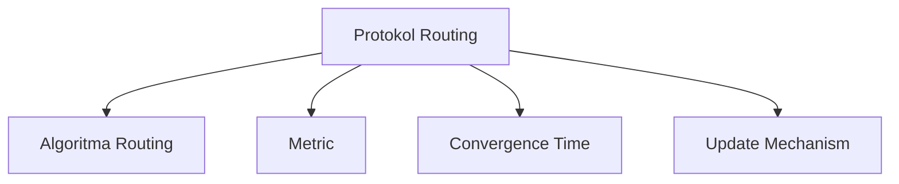
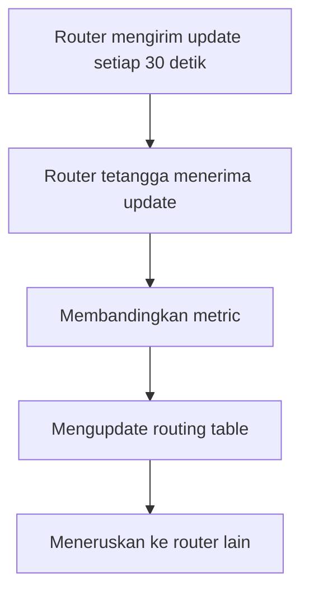
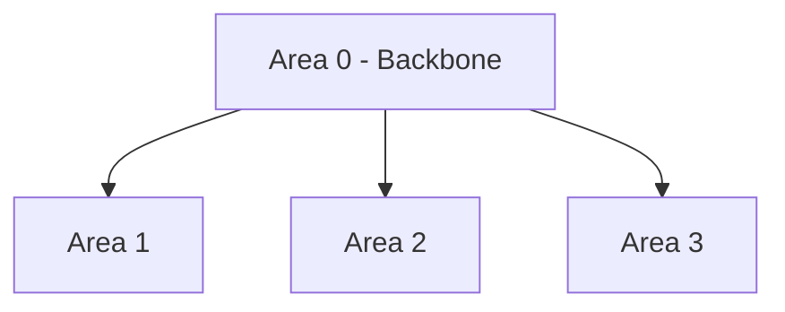
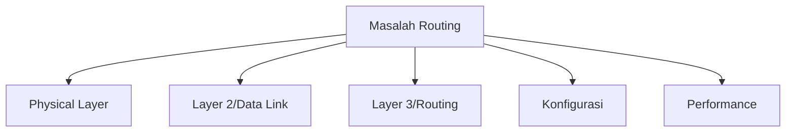
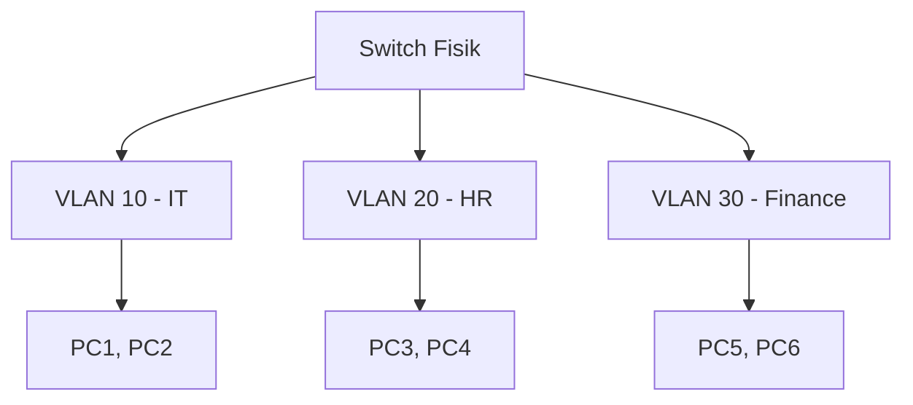
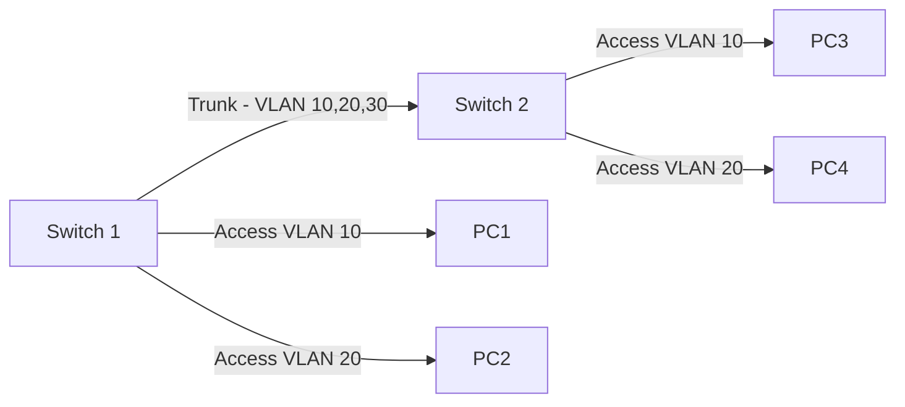
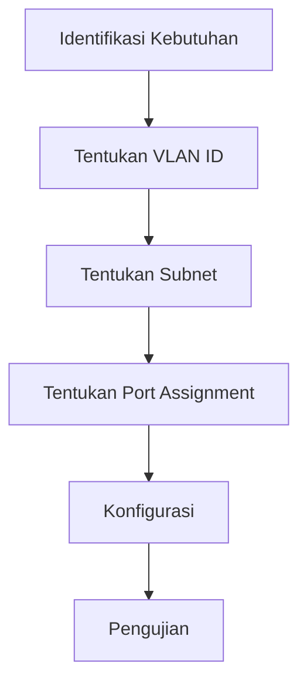
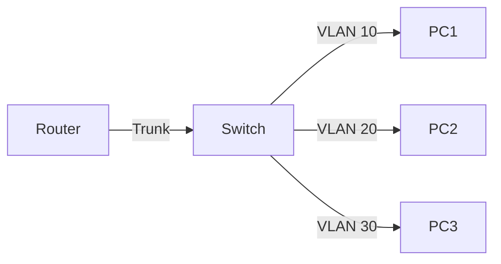
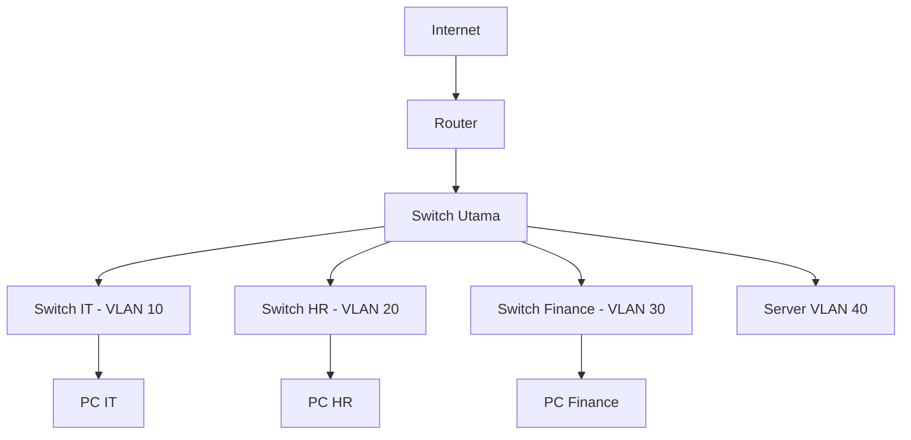

# 📘 PEMASANGAN DAN KONFIGURASI PERANGKAT JARINGAN
## Kelas XI – Semester 2 (Genap)

> **Fokus Pembelajaran:** Routing Dinamis, VLAN, dan Troubleshooting Routing.

---

# 📑 DAFTAR ISI (Klik untuk Navigasi)

## [BAB 7: Konfigurasi Routing Dinamis (RIP & OSPF)](#bab-7-konfigurasi-routing-dinamis-rip--ospf)
- [7.1 Pengertian Routing Dinamis](#71-pengertian-routing-dinamis)
- [7.2 Protokol RIP (Routing Information Protocol)](#72-protokol-rip-routing-information-protocol)
- [7.3 Konfigurasi RIP di Cisco](#73-konfigurasi-rip-di-cisco)
- [7.4 Konfigurasi RIP di MikroTik](#74-konfigurasi-rip-di-mikrotik)
- [7.5 Protokol OSPF (Open Shortest Path First)](#75-protokol-ospf-open-shortest-path-first)
- [7.6 Konfigurasi OSPF di Cisco](#76-konfigurasi-ospf-di-cisco)
- [7.7 Konfigurasi OSPF di MikroTik](#77-konfigurasi-ospf-di-mikrotik)
- [7.8 Perbandingan RIP dan OSPF](#78-perbandingan-rip-dan-ospf)
- [7.9 Latihan Praktikum](#79-latihan-praktikum)

## [BAB 8: Analisis & Perbaikan Routing Statis dan Dinamis](#bab-8-analisis--perbaikan-routing-statis-dan-dinamis)
- [8.1 Masalah Umum pada Routing](#81-masalah-umum-pada-routing)
- [8.2 Troubleshooting Routing Statis](#82-troubleshooting-routing-statis)
- [8.3 Troubleshooting Routing Dinamis](#83-troubleshooting-routing-dinamis)
- [8.4 Studi Kasus Troubleshooting Routing](#84-studi-kasus-troubleshooting-routing)
- [8.5 Praktikum Troubleshooting](#85-praktikum-troubleshooting)

## [BAB 9: Konsep dan Implementasi VLAN](#bab-9-konsep-dan-implementasi-vlan)
- [9.1 Pengertian VLAN](#91-pengertian-vlan)
- [9.2 Keuntungan dan Tujuan VLAN](#92-keuntungan-dan-tujuan-vlan)
- [9.3 Jenis-jenis VLAN](#93-jenis-jenis-vlan)
- [9.4 Standar IEEE 802.1Q](#94-standar-ieee-8021q)
- [9.5 VLAN Tagging dan Trunking](#95-vlan-tagging-dan-trunking)
- [9.6 Perencanaan VLAN](#96-perencanaan-vlan)
- [9.7 Latihan Praktikum](#97-latihan-praktikum)

## [BAB 10: Konfigurasi dan Pengujian VLAN](#bab-10-konfigurasi-dan-pengujian-vlan)
- [10.1 Konfigurasi VLAN di Switch Cisco](#101-konfigurasi-vlan-di-switch-cisco)
- [10.2 Konfigurasi Trunking](#102-konfigurasi-trunking)
- [10.3 Inter-VLAN Routing (Router on a Stick)](#103-inter-vlan-routing-router-on-a-stick)
- [10.4 Inter-VLAN Routing dengan Layer 3 Switch](#104-inter-vlan-routing-dengan-layer-3-switch)
- [10.5 Konfigurasi VLAN di Switch MikroTik](#105-konfigurasi-vlan-di-switch-mikrotik)
- [10.6 Pengujian VLAN](#106-pengujian-vlan)
- [10.7 Troubleshooting VLAN](#107-troubleshooting-vlan)
- [10.8 Praktikum Komprehensif](#108-praktikum-komprehensif)

## [BAB 11: Evaluasi Tengah Tahun & Simulasi](#bab-11-evaluasi-tengah-tahun--simulasi)
- [11.1 Review Materi Semester 2](#111-review-materi-semester-2)
- [11.2 Simulasi Jaringan Skala Kecil](#112-simulasi-jaringan-skala-kecil)
- [11.3 Ujian Praktik](#113-ujian-praktik)

## [Ringkasan Materi Semester 2](#-ringkasan-materi-semester-2)
## [Daftar Pustaka](#-daftar-pustaka)
## [Glosarium](#-glosarium)

---

# BAB 7: Konfigurasi Routing Dinamis (RIP & OSPF)

[🔝 Kembali ke Daftar Isi](#-daftar-isi-klik-untuk-navigasi)

## 7.1 Pengertian Routing Dinamis

### A. Definisi Routing Dinamis

**Routing Dinamis** adalah proses routing yang dilakukan secara otomatis oleh router menggunakan protokol routing. Router akan saling bertukar informasi routing secara periodik atau saat terjadi perubahan topologi.

### B. Karakteristik Routing Dinamis

| **Karakteristik** | **Penjelasan** |
|:---|:---|
| **Otomatis** | Router belajar rute secara otomatis dari router lain |
| **Adaptif** | Jika terjadi perubahan topologi, router otomatis menyesuaikan |
| **Scalable** | Cocok untuk jaringan besar dengan banyak router |
| **Overhead** | Membutuhkan bandwidth dan resource CPU/Memory |

### C. Komponen Routing Dinamis



| **Komponen** | **Penjelasan** | **Contoh** |
|:---|:---|:---|
| **Protokol Routing** | Aturan komunikasi antar router | RIP, OSPF, EIGRP, BGP |
| **Algoritma** | Metode perhitungan jalur terbaik | Distance Vector, Link State |
| **Metric** | Nilai penentu jalur terbaik | Hop Count, Cost, Bandwidth |
| **Convergence** | Waktu sinkronisasi routing table | Cepat (OSPF) vs Lambat (RIP) |
| **Update** | Frekuensi pertukaran informasi | Periodik (RIP) vs Triggered (OSPF) |

### D. Jenis-jenis Routing Dinamis Berdasarkan Algoritma

| **Algoritma** | **Prinsip** | **Protokol** | **Keunggulan** | **Kelemahan** |
|:---|:---|:---|:---|:---|
| **Distance Vector** | "Aku tahu dari tetanggaku" | RIP, IGRP | Sederhana, ringan | Konvergensi lambat |
| **Link State** | "Aku tahu seluruh topologi" | OSPF, IS-IS | Konvergensi cepat, loop-free | Resource berat |
| **Path Vector** | "Aku tahu semua path" | BGP | Bisa filter path | Kompleks |

---

## 7.2 Protokol RIP (Routing Information Protocol)

### A. Pengertian RIP

**RIP (Routing Information Protocol)** adalah protokol routing dinamis yang termasuk dalam **Distance Vector Routing Protocol**. RIP menggunakan **hop count** sebagai metric dan memiliki maksimum 15 hop.

### B. Karakteristik RIP

| **Karakteristik** | **Detail** |
|:---|:---|
| **Algoritma** | Distance Vector (Bellman-Ford) |
| **Metric** | Hop Count (max 15, 16 = unreachable) |
| **Update Interval** | Setiap 30 detik |
| **Hold Down Timer** | 180 detik |
| **Flush Timer** | 240 detik |
| **Konvergensi** | Lambat (30-60 detik) |
| **Administrative Distance** | 120 |
| **Port** | UDP 520 |

### C. Versi RIP

| **Versi** | **Karakteristik** | **Kelebihan** | **Kekurangan** |
|:---|:---|:---|:---|
| **RIPv1 (1988)** | Classful routing | Sederhana | Tidak support subnet mask |
| **RIPv2 (1993)** | Classless routing | Support VLSM, auth | Masih lambat konvergensi |
| **RIPng (1997)** | Untuk IPv6 | Support IPv6 | - |

### D. Kelebihan dan Kekurangan RIP

| **Kelebihan** | **Kekurangan** |
|:---|:---|
| Konfigurasi sangat sederhana | Konvergensi lambat |
| Resource router ringan | Hop count terbatas (15) |
| Mudah dipahami | Tidak support jaringan besar |
| Cocok untuk jaringan kecil | Update broadcast (boros bandwidth) |
| Stabil untuk topologi sederhana | Rentan routing loop |

### E. Cara Kerja RIP



**Contoh Perhitungan RIP:**

```
R1 ─── R2 ─── R3 ─── R4
     1 hop   1 hop   1 hop

Network 192.168.4.0/24:
- R1 tahu lewat R2 = 3 hop
- R1 tahu lewat R3 = 4 hop (tidak dipilih)
- R1 memilih R2 karena hop count lebih kecil
```

### F. Split Horizon dan Poison Reverse

| **Mekanisme** | **Penjelasan** | **Tujuan** |
|:---|:---|:---|
| **Split Horizon** | Tidak mengirim rute kembali ke sumber | Mencegah loop |
| **Poison Reverse** | Mengirim rute dengan metric 16 (unreachable) | Mencegah loop |
| **Hold Down Timer** | Menunggu sebelum update route | Stabilisasi |

---

## 7.3 Konfigurasi RIP di Cisco

### A. Topologi Jaringan

```
          10.0.0.0/30                    10.0.1.0/30
    [R1]━━━━━━━━━━━━━[R2]━━━━━━━━━━━━━[R3]
     |               |                 |
 192.168.1.0/24  172.16.1.0/24   192.168.2.0/24
     |               |                 |
   [PC1]           [PC2]             [PC3]
```

### B. Konfigurasi Router 1 (R1)

```bash
# Enable dan masuk ke mode config
Router> enable
Router# configure terminal

# Set hostname
Router(config)# hostname R1

# Konfigurasi Interface
R1(config)# interface gigabitEthernet 0/0
R1(config-if)# ip address 192.168.1.1 255.255.255.0
R1(config-if)# no shutdown
R1(config-if)# exit

R1(config)# interface gigabitEthernet 0/1
R1(config-if)# ip address 10.0.0.1 255.255.255.252
R1(config-if)# no shutdown
R1(config-if)# exit

# Konfigurasi RIP
R1(config)# router rip
R1(config-router)# version 2
R1(config-router)# network 192.168.1.0
R1(config-router)# network 10.0.0.0
R1(config-router)# no auto-summary
R1(config-router)# exit

# Simpan konfigurasi
R1# copy running-config startup-config
```

### C. Konfigurasi Router 2 (R2)

```bash
Router> enable
Router# configure terminal
Router(config)# hostname R2

# Interface LAN
R2(config)# interface gigabitEthernet 0/0
R2(config-if)# ip address 172.16.1.1 255.255.255.0
R2(config-if)# no shutdown
R2(config-if)# exit

# Interface WAN ke R1
R2(config)# interface gigabitEthernet 0/1
R2(config-if)# ip address 10.0.0.2 255.255.255.252
R2(config-if)# no shutdown
R2(config-if)# exit

# Interface WAN ke R3
R2(config)# interface gigabitEthernet 0/2
R2(config-if)# ip address 10.0.1.1 255.255.255.252
R2(config-if)# no shutdown
R2(config-if)# exit

# Konfigurasi RIP
R2(config)# router rip
R2(config-router)# version 2
R2(config-router)# network 172.16.1.0
R2(config-router)# network 10.0.0.0
R2(config-router)# network 10.0.1.0
R2(config-router)# no auto-summary
R2(config-router)# exit

R2# copy running-config startup-config
```

### D. Konfigurasi Router 3 (R3)

```bash
Router> enable
Router# configure terminal
Router(config)# hostname R3

# Interface LAN
R3(config)# interface gigabitEthernet 0/0
R3(config-if)# ip address 192.168.2.1 255.255.255.0
R3(config-if)# no shutdown
R3(config-if)# exit

# Interface WAN ke R2
R3(config)# interface gigabitEthernet 0/1
R3(config-if)# ip address 10.0.1.2 255.255.255.252
R3(config-if)# no shutdown
R3(config-if)# exit

# Konfigurasi RIP
R3(config)# router rip
R3(config-router)# version 2
R3(config-router)# network 192.168.2.0
R3(config-router)# network 10.0.1.0
R3(config-router)# no auto-summary
R3(config-router)# exit

R3# copy running-config startup-config
```

### E. Verifikasi RIP di Cisco

```bash
# Cek routing table
R1# show ip route

# Output:
# C    192.168.1.0/24 is directly connected, GigabitEthernet0/0
# C    10.0.0.0/30 is directly connected, GigabitEthernet0/1
# R    172.16.1.0/24 [120/1] via 10.0.0.2
# R    192.168.2.0/24 [120/2] via 10.0.0.2

# Cek protokol RIP
R1# show ip protocols

# Cek neighbor RIP
R1# show ip rip neighbors

# Debug RIP
R1# debug ip rip
```

### F. Konfigurasi RIP dengan Authentication

```bash
# Konfigurasi di R1
R1(config)# key chain RIP-KEY
R1(config-keychain)# key 1
R1(config-keychain-key)# key-string cisco123
R1(config-keychain-key)# exit
R1(config-keychain)# exit

R1(config)# interface gigabitEthernet 0/1
R1(config-if)# ip rip authentication key-chain RIP-KEY
R1(config-if)# ip rip authentication mode md5
R1(config-if)# exit

# Lakukan hal yang sama di R2 untuk interface yang terhubung
```

---

## 7.4 Konfigurasi RIP di MikroTik

### A. Konfigurasi Router 1 (R1)

```bash
# Reset config
/system reset-configuration

# Identitas
/system identity set name=R1

# Interface naming
/interface ethernet set ether1 name=WAN
/interface ethernet set ether2 name=LAN

# IP Address
/ip address add address=10.0.0.1/30 interface=WAN
/ip address add address=192.168.1.1/24 interface=LAN

# Konfigurasi RIP
/routing rip set redistribute-connected=yes

# Tambahkan network yang akan di-RIP-kan
/routing rip network add network=10.0.0.0/30
/routing rip network add network=192.168.1.0/24

# Atau tambahkan interface
/routing rip interface add interface=WAN
/routing rip interface add interface=LAN

# Setting RIP version
/routing rip set version=2
```

### B. Konfigurasi Router 2 (R2)

```bash
/system reset-configuration
/system identity set name=R2

/interface ethernet set ether1 name=LAN
/interface ethernet set ether2 name=TO-R1
/interface ethernet set ether3 name=TO-R3

/ip address add address=172.16.1.1/24 interface=LAN
/ip address add address=10.0.0.2/30 interface=TO-R1
/ip address add address=10.0.1.1/30 interface=TO-R3

/routing rip set redistribute-connected=yes
/routing rip network add network=10.0.0.0/30
/routing rip network add network=10.0.1.0/30
/routing rip network add network=172.16.1.0/24
/routing rip set version=2
```

### C. Konfigurasi Router 3 (R3)

```bash
/system reset-configuration
/system identity set name=R3

/interface ethernet set ether1 name=LAN
/interface ethernet set ether2 name=WAN

/ip address add address=192.168.2.1/24 interface=LAN
/ip address add address=10.0.1.2/30 interface=WAN

/routing rip set redistribute-connected=yes
/routing rip network add network=10.0.1.0/30
/routing rip network add network=192.168.2.0/24
/routing rip set version=2
```

### D. Verifikasi RIP di MikroTik

```bash
# Cek routing table
/ip route print

# Cek neighbor RIP
/routing rip neighbor print

# Cek interface RIP
/routing rip interface print

# Cek RIP status
/routing rip print

# Monitoring RIP
/routing rip monitor
```

### E. Troubleshooting RIP di MikroTik

```bash
# Cek apakah RIP aktif
/routing rip print

# Cek apakah network sudah ditambahkan
/routing rip network print

# Cek apakah interface sudah ditambahkan
/routing rip interface print

# Cek log untuk error
/log print where topics~"rip"

# Jika ada masalah, restart RIP
/routing rip disable
/routing rip enable
```

---

## 7.5 Protokol OSPF (Open Shortest Path First)

### A. Pengertian OSPF

**OSPF (Open Shortest Path First)** adalah protokol routing dinamis yang termasuk dalam **Link State Routing Protocol**. OSPF menggunakan algoritma **Dijkstra (SPF)** untuk menghitung jalur terpendek.

### B. Karakteristik OSPF

| **Karakteristik** | **Detail** |
|:---|:---|
| **Algoritma** | Link State (Dijkstra/SPF) |
| **Metric** | Cost (10^8 / Bandwidth) |
| **Update** | Event-triggered (tidak periodik) |
| **Konvergensi** | Sangat cepat (< 1 detik) |
| **Administrative Distance** | 110 |
| **Port** | Protocol 89 (IP) |
| **Area** | Dapat dibagi menjadi area |

### C. Konsep Area di OSPF



| **Area** | **Fungsi** | **Karakteristik** |
|:---|:---|:---|
| **Area 0 (Backbone)** | Area pusat | Wajib ada, menghubungkan semua area |
| **Area Normal** | Area standar | Dapat memiliki semua tipe LSA |
| **Stub Area** | Area dengan rute default | Tidak menerima rute dari luar |
| **Totally Stub** | Stub yang lebih ketat | Hanya default route |
| **NSSA** | Not-So-Stubby Area | Bisa import rute eksternal |

### D. Komponen OSPF

| **Komponen** | **Penjelasan** | **Contoh** |
|:---|:---|:---|
| **Router ID** | ID unik router | 1.1.1.1 |
| **Neighbor** | Router tetangga OSPF | 10.0.0.2 |
| **Adjacency** | Hubungan OSPF yang sudah full | State: FULL |
| **LSA (Link State Advertisement)** | Informasi topologi | Router LSA, Network LSA |
| **LSDB (Link State Database)** | Database topologi | Semua LSA |
| **SPF Tree** | Pohon perhitungan jalur terbaik | Hasil Dijkstra |

### E. Tipe-tipe Router OSPF

| **Tipe Router** | **Fungsi** |
|:---|:---|
| **IR (Internal Router)** | Semua interface di satu area |
| **ABR (Area Border Router)** | Menghubungkan 2 area atau lebih |
| **ASBR (Autonomous System Border Router)** | Menghubungkan OSPF dengan routing lain |
| **Backbone Router** | Router di area 0 |

### F. Kelebihan dan Kekurangan OSPF

| **Kelebihan** | **Kekurangan** |
|:---|:---|
| Konvergensi sangat cepat | Konfigurasi kompleks |
| Loop-free | Resource berat (CPU/Memory) |
| Scalable (support area) | Memerlukan perencanaan yang matang |
| Support VLSM dan CIDR | Butuh bandwidth untuk flooding |
| Stabil untuk jaringan besar | Troubleshooting sulit |

---

## 7.6 Konfigurasi OSPF di Cisco

### A. Topologi yang Sama

Gunakan topologi yang sama seperti pada RIP.

### B. Konfigurasi Router 1 (R1)

```bash
Router> enable
Router# configure terminal
Router(config)# hostname R1

# Konfigurasi Interface
R1(config)# interface gigabitEthernet 0/0
R1(config-if)# ip address 192.168.1.1 255.255.255.0
R1(config-if)# no shutdown
R1(config-if)# exit

R1(config)# interface gigabitEthernet 0/1
R1(config-if)# ip address 10.0.0.1 255.255.255.252
R1(config-if)# no shutdown
R1(config-if)# exit

# Konfigurasi OSPF
R1(config)# router ospf 1
R1(config-router)# network 192.168.1.0 0.0.0.255 area 0
R1(config-router)# network 10.0.0.0 0.0.0.3 area 0
R1(config-router)# exit

# Simpan konfigurasi
R1# copy running-config startup-config
```

### C. Konfigurasi Router 2 (R2)

```bash
Router> enable
Router# configure terminal
Router(config)# hostname R2

# Interface LAN
R2(config)# interface gigabitEthernet 0/0
R2(config-if)# ip address 172.16.1.1 255.255.255.0
R2(config-if)# no shutdown
R2(config-if)# exit

# Interface WAN ke R1
R2(config)# interface gigabitEthernet 0/1
R2(config-if)# ip address 10.0.0.2 255.255.255.252
R2(config-if)# no shutdown
R2(config-if)# exit

# Interface WAN ke R3
R2(config)# interface gigabitEthernet 0/2
R2(config-if)# ip address 10.0.1.1 255.255.255.252
R2(config-if)# no shutdown
R2(config-if)# exit

# Konfigurasi OSPF
R2(config)# router ospf 1
R2(config-router)# network 172.16.1.0 0.0.0.255 area 0
R2(config-router)# network 10.0.0.0 0.0.0.3 area 0
R2(config-router)# network 10.0.1.0 0.0.0.3 area 0
R2(config-router)# exit

R2# copy running-config startup-config
```

### D. Konfigurasi Router 3 (R3)

```bash
Router> enable
Router# configure terminal
Router(config)# hostname R3

# Interface LAN
R3(config)# interface gigabitEthernet 0/0
R3(config-if)# ip address 192.168.2.1 255.255.255.0
R3(config-if)# no shutdown
R3(config-if)# exit

# Interface WAN ke R2
R3(config)# interface gigabitEthernet 0/1
R3(config-if)# ip address 10.0.1.2 255.255.255.252
R3(config-if)# no shutdown
R3(config-if)# exit

# Konfigurasi OSPF
R3(config)# router ospf 1
R3(config-router)# network 192.168.2.0 0.0.0.255 area 0
R3(config-router)# network 10.0.1.0 0.0.0.3 area 0
R3(config-router)# exit

R3# copy running-config startup-config
```

### E. Verifikasi OSPF di Cisco

```bash
# Cek routing table
R1# show ip route

# Output:
# C    192.168.1.0/24 is directly connected, GigabitEthernet0/0
# C    10.0.0.0/30 is directly connected, GigabitEthernet0/1
# O    172.16.1.0/24 [110/2] via 10.0.0.2
# O    192.168.2.0/24 [110/3] via 10.0.0.2

# Cek OSPF neighbors
R1# show ip ospf neighbor

# Cek OSPF database
R1# show ip ospf database

# Cek OSPF interface
R1# show ip ospf interface

# Cek OSPF status
R1# show ip protocols

# Debug OSPF
R1# debug ip ospf adj
R1# debug ip ospf events
```

### F. Konfigurasi OSPF dengan Multiple Area

**Topologi dengan Multiple Area:**

```
    Area 0 (Backbone)      Area 1
    [R1]━━━━━[R2]━━━━━[R3]━━━━━[R4]
              |                  |
           [R5]                [R6]
         Area 2              Area 3
```

**Konfigurasi ABR (R2):**

```bash
R2(config)# router ospf 1
R2(config-router)# network 10.0.0.0 0.0.0.3 area 0
R2(config-router)# network 10.0.1.0 0.0.0.3 area 1
R2(config-router)# network 10.0.2.0 0.0.0.3 area 2
R2(config-router)# exit
```

### G. OSPF Authentication

```bash
# MD5 Authentication
R1(config)# interface gigabitEthernet 0/1
R1(config-if)# ip ospf authentication message-digest
R1(config-if)# ip ospf message-digest-key 1 md5 cisco123
R1(config-if)# exit

# Lakukan hal yang sama di R2
```

---

## 7.7 Konfigurasi OSPF di MikroTik

### A. Konfigurasi Router 1 (R1)

```bash
/system reset-configuration
/system identity set name=R1

/interface ethernet set ether1 name=WAN
/interface ethernet set ether2 name=LAN

/ip address add address=10.0.0.1/30 interface=WAN
/ip address add address=192.168.1.1/24 interface=LAN

# Konfigurasi OSPF
/routing ospf instance set [find] redistribute-connected=as-type-1

# Tambahkan network
/routing ospf area add name=backbone areaid=0.0.0.0
/routing ospf network add area=backbone network=10.0.0.0/30
/routing ospf network add area=backbone network=192.168.1.0/24
```

### B. Konfigurasi Router 2 (R2)

```bash
/system reset-configuration
/system identity set name=R2

/interface ethernet set ether1 name=LAN
/interface ethernet set ether2 name=TO-R1
/interface ethernet set ether3 name=TO-R3

/ip address add address=172.16.1.1/24 interface=LAN
/ip address add address=10.0.0.2/30 interface=TO-R1
/ip address add address=10.0.1.1/30 interface=TO-R3

/routing ospf instance set [find] redistribute-connected=as-type-1
/routing ospf area add name=backbone areaid=0.0.0.0
/routing ospf network add area=backbone network=10.0.0.0/30
/routing ospf network add area=backbone network=10.0.1.0/30
/routing ospf network add area=backbone network=172.16.1.0/24
```

### C. Konfigurasi Router 3 (R3)

```bash
/system reset-configuration
/system identity set name=R3

/interface ethernet set ether1 name=LAN
/interface ethernet set ether2 name=WAN

/ip address add address=192.168.2.1/24 interface=LAN
/ip address add address=10.0.1.2/30 interface=WAN

/routing ospf instance set [find] redistribute-connected=as-type-1
/routing ospf area add name=backbone areaid=0.0.0.0
/routing ospf network add area=backbone network=10.0.1.0/30
/routing ospf network add area=backbone network=192.168.2.0/24
```

### D. Verifikasi OSPF di MikroTik

```bash
# Cek routing table
/ip route print

# Cek OSPF neighbors
/routing ospf neighbor print

# Cek OSPF interface
/routing ospf interface print

# Cek OSPF area
/routing ospf area print

# Cek OSPF status
/routing ospf instance print

# Cek OSPF database
/routing ospf lsa print

# Monitoring OSPF
/routing ospf monitor
```

### E. OSPF dengan Multiple Area di MikroTik

```bash
# Buat area baru
/routing ospf area add name=area1 areaid=0.0.0.1
/routing ospf area add name=area2 areaid=0.0.0.2

# Tambahkan network ke area
/routing ospf network add area=area1 network=10.0.2.0/30
/routing ospf network add area=area2 network=10.0.3.0/30
```

---

## 7.8 Perbandingan RIP dan OSPF

### Tabel Perbandingan Lengkap

| **Aspek** | **RIP** | **OSPF** |
|:---|:---|:---|
| **Algoritma** | Distance Vector | Link State |
| **Metric** | Hop Count | Cost (Bandwidth-based) |
| **Max Hops** | 15 | Tidak terbatas |
| **Update** | Periodik (30 detik) | Event-triggered |
| **Konvergensi** | Lambat (30-60 detik) | Cepat (< 1 detik) |
| **Scalability** | Kecil | Besar |
| **Resource** | Ringan | Berat |
| **Konfigurasi** | Sederhana | Kompleks |
| **VLSM Support** | RIPv2 support | Support |
| **Authentication** | RIPv2 support | MD5, SHA |
| **Administrative Distance** | 120 | 110 |
| **Area** | Tidak ada | Support multiple area |
| **Loop-free** | Hati-hati | Loop-free |
| **Broadcast** | Broadcast | Multicast (224.0.0.5/6) |
| **Port** | UDP 520 | IP Protocol 89 |

### Kapan Menggunakan RIP?

| **Kriteria** | **Kondisi** |
|:---|:---|
| Jaringan | Kecil (< 15 hop) |
| Jumlah Router | ≤ 10 router |
| Topologi | Sederhana |
| Resource | Terbatas |
| Admin Skill | Pemula |
| Budget | Rendah |

### Kapan Menggunakan OSPF?

| **Kriteria** | **Kondisi** |
|:---|:---|
| Jaringan | Besar (enterprise) |
| Jumlah Router | > 10 router |
| Topologi | Kompleks |
| Resource | Cukup |
| Admin Skill | Mahir |
| Budget | Cukup |

### Ilustrasi Perbandingan

```
RIP:
  - "Hei tetangga, aku tahu 5 jalur. Ini daftarnya..."
  - Update: Setiap 30 detik
  - Metrik: Hop Count
  - Lambat tapi sederhana

OSPF:
  - "Aku tahu semua topologi. Aku akan hitung sendiri jalur terbaik..."
  - Update: Saat ada perubahan
  - Metrik: Cost
  - Cepat tapi kompleks
```

---

## 7.9 Latihan Praktikum

### Praktikum 1: Konfigurasi RIP

**Tujuan:** Mengimplementasikan RIP pada 3 router.

**Topologi:**
```
[PC1]---[R1]---[R2]---[R3]---[PC3]
         |          |
       [PC2]      [Switch]
```

**Langkah-langkah:**
1. Konfigurasi IP address semua perangkat
2. Konfigurasi RIP di semua router
3. Verifikasi routing table
4. Tes ping antar PC

**Soal:** 
- Konfigurasikan RIP v2 pada topologi di atas
- Pastikan semua PC dapat saling ping

### Praktikum 2: Konfigurasi OSPF

**Tujuan:** Mengimplementasikan OSPF single area.

**Langkah-langkah:**
1. Gunakan topologi yang sama
2. Konfigurasi OSPF area 0
3. Verifikasi dengan `show ip route`
4. Tes ping dan traceroute

**Soal:**
- Konfigurasikan OSPF area 0
- Bandingkan routing table dengan RIP

### Praktikum 3: Perbandingan RIP dan OSPF

**Tujuan:** Membandingkan kinerja RIP dan OSPF.

**Langkah-langkah:**
1. Konfigurasi RIP, amati waktu konvergensi
2. Hapus RIP, konfigurasi OSPF
3. Bandingkan:
   - Waktu konvergensi
   - Jumlah rute di routing table
   - Metric yang digunakan

**Soal:**
- Buat laporan perbandingan RIP dan OSPF
- Jelaskan kelebihan dan kekurangan masing-masing

### Praktikum 4: OSPF Multiple Area

**Tujuan:** Mengimplementasikan OSPF dengan 3 area.

**Topologi:**
```
Area 0: R1, R2
Area 1: R2, R3
Area 2: R2, R4
```

**Langkah-langkah:**
1. R2 sebagai ABR (Area Border Router)
2. R2 terhubung ke area 0, 1, dan 2
3. Verifikasi routing

**Soal:**
- Konfigurasikan OSPF dengan 3 area
- Pastikan semua area dapat berkomunikasi

### Praktikum 5: Troubleshooting Routing

**Tujuan:** Menemukan dan memperbaiki masalah routing.

**Skenario Masalah:**
1. Salah satu router tidak memiliki rute
2. Metric terlalu tinggi
3. Network tidak di-advertise

**Soal:**
- Identifikasi masalah
- Perbaiki konfigurasi
- Verifikasi hasil

---

# BAB 8: Analisis & Perbaikan Routing Statis dan Dinamis

[🔝 Kembali ke Daftar Isi](#-daftar-isi-klik-untuk-navigasi)

## 8.1 Masalah Umum pada Routing

### A. Kategori Masalah Routing



### B. Tabel Masalah dan Penyebab

| **Kategori** | **Masalah** | **Penyebab** |
|:---|:---|:---|
| **Physical** | Kabel putus | Kabel tertekuk, konektor lepas |
| **Physical** | LED mati | Power supply mati |
| **Layer 2** | Tidak ada ARP | IP tidak sesuai subnet |
| **Layer 2** | VLAN mismatch | VLAN berbeda di trunk |
| **Layer 3** | Routing tidak ada | Static route hilang |
| **Layer 3** | Routing loop | Routing konflik |
| **Konfigurasi** | IP conflict | 2 perangkat IP sama |
| **Konfigurasi** | Syntax error | Command salah |
| **Performance** | Routing lambat | Convergence issue |
| **Performance** | Packet loss | Bandwidth penuh |

### C. Langkah-langkah Troubleshooting

```
Langkah 1: Identifikasi Masalah
    ↓
Langkah 2: Kumpulkan Data
    ↓
Langkah 3: Analisis Data
    ↓
Langkah 4: Cari Solusi
    ↓
Langkah 5: Implementasi Solusi
    ↓
Langkah 6: Verifikasi
    ↓
Langkah 7: Dokumentasi
```

---

## 8.2 Troubleshooting Routing Statis

### A. Masalah pada Routing Statis

| **Masalah** | **Gejala** | **Penyebab** | **Solusi** |
|:---|:---|:---|:---|
| **Next-hop unreachable** | Ping ke next-hop timeout | Interface down, IP salah | Cek interface, cek IP |
| **Route tidak muncul** | `show ip route` tidak ada | Syntax salah | Perbaiki command |
| **Wrong next-hop** | Paket ke jalur salah | Next-hop tidak tepat | Perbaiki gateway |
| **Lupa default route** | Tidak bisa ke internet | Default route hilang | Tambahkan default route |
| **AD conflict** | Rute tidak dipilih | AD lebih tinggi | Ubah AD |

### B. Troubleshooting Procedure

#### Step 1: Verifikasi Interface

**Cisco:**
```bash
# Cek status interface
R1# show ip interface brief

# Output yang diharapkan:
# Interface    IP-Address      OK? Status
# Gig0/0       192.168.1.1     YES   up/up
# Gig0/1       10.0.0.1        YES   up/up
```

**MikroTik:**
```bash
# Cek interface
/interface print

# Cek IP address
/ip address print
```

#### Step 2: Verifikasi Routing Table

**Cisco:**
```bash
# Cek routing table
R1# show ip route

# Cek static route spesifik
R1# show ip route 192.168.2.0
```

**MikroTik:**
```bash
# Cek routing table
/ip route print

# Cek route spesifik
/ip route print where dst-address="192.168.2.0/24"
```

#### Step 3: Verifikasi Konektivitas

```bash
# Ping ke next-hop
R1# ping 10.0.0.2

# Ping ke tujuan
R1# ping 192.168.2.1

# Traceroute
R1# traceroute 192.168.2.10
```

### C. Contoh Kasus dan Solusi

#### Kasus 1: Static Route Tidak Muncul

**Masalah:** Setelah menambahkan static route, rute tidak muncul di routing table.

**Analisis:**
```bash
R1(config)# ip route 192.168.2.0 255.255.255.0 10.0.0.2
R1# show ip route
# Tidak ada S 192.168.2.0/24
```

**Diagnosis:** Next-hop (10.0.0.2) tidak reachable

**Cek:**
```bash
R1# show ip interface brief
# Gig0/1: 10.0.0.1/30, status up/up
R1# ping 10.0.0.2
# .....
# Success rate is 0 percent
```

**Solusi:**
1. Cek koneksi fisik ke R2
2. Cek IP R2 di interface yang terhubung
3. Restart interface R1:
```bash
R1(config)# interface gigabitEthernet 0/1
R1(config-if)# shutdown
R1(config-if)# no shutdown
```

#### Kasus 2: Rute Salah

**Masalah:** Paket ke 192.168.2.0/24 dikirim ke jalur yang salah.

**Analisis:**
```bash
R1# show ip route 192.168.2.0
# S 192.168.2.0/24 [1/0] via 10.0.1.2
```

**Diagnosis:** Next-hop seharusnya 10.0.0.2 (ke R2), tapi terkonfigurasi 10.0.1.2 (ke R3)

**Solusi:**
```bash
R1(config)# no ip route 192.168.2.0 255.255.255.0 10.0.1.2
R1(config)# ip route 192.168.2.0 255.255.255.0 10.0.0.2
```

#### Kasus 3: Default Route Hilang Setelah Restart

**Masalah:** Setelah restart router, default route hilang.

**Diagnosis:** Default route tidak tersimpan di startup-config

**Solusi:**
```bash
R1(config)# ip route 0.0.0.0 0.0.0.0 10.0.0.2
R1# copy running-config startup-config
```

---

## 8.3 Troubleshooting Routing Dinamis

### A. Masalah pada Routing Dinamis

| **Masalah** | **Gejala** | **Penyebab** | **Solusi** |
|:---|:---|:---|:---|
| **Neighbor tidak terbentuk** | `show ip ospf neighbor` kosong | Network tidak sesuai | Cek network statement |
| **Area mismatch** | Neighbor stuck di state "Exstart" | Area berbeda | Samakan area |
| **Hello interval mismatch** | Neighbor tidak terbentuk | Hello interval beda | Samakan hello interval |
| **Authentication failed** | Neighbor stuck di "Down" | Password salah | Perbaiki password |
| **Rute tidak di-advertise** | Rute tidak muncul | Network tidak di-include | Tambahkan network |
| **RIP split horizon** | Rute tidak tersebar | Split horizon aktif | Nonaktifkan jika perlu |
| **RIP poison reverse** | Rute dianggap unreachable | Poison reverse aktif | Cek topologi |

### B. Troubleshooting RIP

#### Step 1: Cek RIP Status

**Cisco:**
```bash
# Cek protokol RIP
R1# show ip protocols

# Cek neighbor RIP
R1# show ip rip neighbors

# Debug RIP
R1# debug ip rip
```

**MikroTik:**
```bash
# Cek RIP status
/routing rip print

# Cek neighbor
/routing rip neighbor print

# Cek interface
/routing rip interface print
```

#### Step 2: Cek Routing Table

```bash
R1# show ip route rip
# Hanya menampilkan rute RIP
```

#### Step 3: Cek Update RIP

```bash
R1# debug ip rip events
R1# debug ip rip packet
```

### C. Troubleshooting OSPF

#### Step 1: Cek OSPF Neighbor

**Cisco:**
```bash
# Cek neighbor
R1# show ip ospf neighbor

# Output yang diharapkan:
# Neighbor ID     Pri   State           Dead Time   Address
# 2.2.2.2           1   FULL/DR         00:00:35    10.0.0.2
```

**MikroTik:**
```bash
# Cek neighbor
/routing ospf neighbor print

# Output yang diharapkan:
# ADDRESS    STATE    PRIORITY   DEAD-TIME
# 10.0.0.2   Full     1          00:00:37
```

#### Step 2: Cek OSPF Interface

```bash
# Cisco
R1# show ip ospf interface

# MikroTik
/routing ospf interface print
```

#### Step 3: Cek OSPF Database

```bash
# Cisco
R1# show ip ospf database

# MikroTik
/routing ospf lsa print
```

#### Step 4: Debug OSPF

```bash
# Cisco
R1# debug ip ospf adj
R1# debug ip ospf events

# MikroTik
/routing ospf monitor
```

### D. Masalah Umum OSPF dan Solusi

#### Masalah 1: Neighbor Tidak Terbentuk

**Gejala:**
```
R1# show ip ospf neighbor
# Tidak ada output
```

**Penyebab dan Solusi:**

| **Penyebab** | **Solusi** |
|:---|:---|
| Network tidak di-OSPF-kan | Tambahkan network statement |
| Interface down | `no shutdown` |
| IP subnet berbeda | Samakan subnet |
| Area berbeda | Samakan area |
| Hello interval berbeda | Samakan hello interval |
| Dead interval berbeda | Samakan dead interval |
| Authentication mismatch | Samakan autentikasi |

**Contoh:**
```bash
# Cek area yang digunakan
R1# show ip ospf interface gigabitEthernet 0/1
# Area: 0.0.0.0

# Cek di R2
R2# show ip ospf interface gigabitEthernet 0/1
# Area: 0.0.0.1
# ❌ Area mismatch!
```

**Solusi:**
```bash
# Perbaiki area R2
R2(config)# router ospf 1
R2(config-router)# network 10.0.0.0 0.0.0.3 area 0
```

#### Masalah 2: Rute Tidak Di-advertise

**Gejala:**
```
R1# show ip route
# Tidak ada rute ke 192.168.3.0/24
```

**Penyebab:** Network 192.168.3.0/24 tidak di-advertise

**Solusi:**
```bash
R3(config)# router ospf 1
R3(config-router)# network 192.168.3.0 0.0.0.255 area 0
```

#### Masalah 3: OSPF Stuck di "Exstart"

**Gejala:**
```
R1# show ip ospf neighbor
# Neighbor ID  State: Exstart/Exchange
```

**Penyebab:** MTU mismatch

**Solusi:**
```bash
R1(config)# interface gigabitEthernet 0/1
R1(config-if)# ip ospf mtu-ignore
```

---

## 8.4 Studi Kasus Troubleshooting Routing

### Kasus 1: Routing Tidak Bekerja di Jaringan 3 Router

**Topologi:**
```
[PC1]---[R1]---[R2]---[R3]---[PC3]
```

**Masalah:** PC1 tidak bisa ping ke PC3

**Tahap Troubleshooting:**

#### 1. Cek Physical Layer
```bash
# Cek LED di semua router dan switch
# Semua LED menyala hijau ✅
```

#### 2. Cek Layer 2 (IP)
```bash
# Cek IP R1
R1# show ip interface brief
# Gig0/0: 192.168.1.1/24 ✅
# Gig0/1: 10.0.0.1/30 ✅

# Cek IP R2
R2# show ip interface brief
# Gig0/0: 172.16.1.1/24 ✅
# Gig0/1: 10.0.0.2/30 ✅
# Gig0/2: 10.0.1.1/30 ✅

# Cek IP R3
R3# show ip interface brief
# Gig0/0: 192.168.2.1/24 ✅
# Gig0/1: 10.0.1.2/30 ✅
```

#### 3. Cek Routing
```bash
# Cek routing R1
R1# show ip route
# C 192.168.1.0/24
# C 10.0.0.0/30
# ❌ Tidak ada rute ke 192.168.2.0/24
```

**Diagnosis:** R1 tidak punya rute ke 192.168.2.0/24

#### 4. Cek Konfigurasi Static Route
```bash
R1# show running-config | include ip route
# ip route 0.0.0.0 0.0.0.0 10.0.0.2
# ❌ Tidak ada rute ke 192.168.2.0
```

**Solusi:**
```bash
R1(config)# ip route 192.168.2.0 255.255.255.0 10.0.0.2
R1# show ip route
# Sekarang ada S 192.168.2.0/24 ✅
```

#### 5. Verifikasi
```bash
# Dari PC1
ping 192.168.2.10
# Reply from 192.168.2.10 ✅
```

### Kasus 2: OSPF Neighbor Tidak Terbentuk

**Topologi:**
```
[R1]━━━━━━[R2]
 10.0.0.0/30
```

**Masalah:** Neighbor OSPF antara R1 dan R2 tidak terbentuk

**Analisis:**

```bash
# Cek di R1
R1# show ip ospf neighbor
# No output ❌

# Cek OSPF interface R1
R1# show ip ospf interface gigabitEthernet 0/1
# Area: 0.0.0.0, Hello: 10, Dead: 40

# Cek OSPF interface R2
R2# show ip ospf interface gigabitEthernet 0/1
# Area: 0.0.0.1, Hello: 10, Dead: 40
```

**Diagnosis:** Area mismatch (R1 area 0, R2 area 1)

**Solusi:**
```bash
# Perbaiki R2
R2(config)# router ospf 1
R2(config-router)# network 10.0.0.0 0.0.0.3 area 0

# Cek kembali
R1# show ip ospf neighbor
# 2.2.2.2  FULL/DR  00:00:35  10.0.0.2 ✅
```

### Kasus 3: RIP Tidak Mengadvertise Semua Network

**Topologi:**
```
[R1]━━━━[R2]━━━━[R3]
 10.0.0.0/30  10.0.1.0/30
   |            |
 192.168.1.0   192.168.2.0
```

**Masalah:** R3 tidak bisa mencapai network 192.168.1.0/24

**Analisis:**

```bash
# Cek routing R3
R3# show ip route rip
# R 192.168.2.0/24 [120/1] via 10.0.1.1 ✅
# ❌ Tidak ada 192.168.1.0/24
```

**Diagnosis:** R1 tidak mengadvertise network 192.168.1.0

**Solusi:**
```bash
# Cek konfigurasi R1
R1(config)# router rip
R1(config-router)# network 192.168.1.0   # ❌ Tidak ada!

# Tambahkan network
R1(config-router)# network 192.168.1.0
```

---

## 8.5 Praktikum Troubleshooting

### Praktikum 1: Troubleshooting Static Route

**Skenario:** Jaringan tidak bisa berkomunikasi karena static route bermasalah.

**Topologi:** 3 Router dengan konfigurasi yang sudah diberikan (dengan beberapa kesalahan).

**Tugas:**
1. Identifikasi semua kesalahan
2. Perbaiki konfigurasi
3. Verifikasi koneksi

**Kesalahan yang sengaja dibuat:**
- Salah satu router missing static route
- Next-hop salah
- Interface down

### Praktikum 2: Troubleshooting RIP

**Skenario:** RIP tidak mengadvertise semua network.

**Tugas:**
1. Cek konfigurasi RIP
2. Identifikasi network yang hilang
3. Perbaiki dan verifikasi

### Praktikum 3: Troubleshooting OSPF

**Skenario:** Neighbor OSPF tidak terbentuk.

**Tugas:**
1. Cek neighbor OSPF
2. Identifikasi penyebab (area, hello, auth)
3. Perbaiki dan verifikasi

### Praktikum 4: Troubleshooting Komprehensif

**Skenario:** Gabungan masalah static route, RIP, dan OSPF.

**Tugas:**
1. Identifikasi semua masalah
2. Buat laporan troubleshooting
3. Perbaiki semua masalah
4. Verifikasi end-to-end connectivity

---

# BAB 9: Konsep dan Implementasi VLAN

[🔝 Kembali ke Daftar Isi](#-daftar-isi-klik-untuk-navigasi)

## 9.1 Pengertian VLAN

### A. Definisi VLAN

**VLAN (Virtual Local Area Network)** adalah metode untuk membagi satu jaringan fisik menjadi beberapa jaringan logis yang terisolasi satu sama lain.

### B. Konsep Dasar VLAN



### C. VLAN vs LAN Tradisional

| **Aspek** | **LAN Tradisional** | **VLAN** |
|:---|:---|:---|
| **Segmentasi** | Fisik (switch terpisah) | Logis (satu switch) |
| **Broadcast Domain** | 1 broadcast domain | Multiple broadcast domain |
| **Isolasi** | Sulit | Mudah |
| **Biaya** | Mahal (butuh banyak switch) | Hemat (1 switch) |
| **Skalabilitas** | Sulit dikembangkan | Mudah dikembangkan |

### D. Analogi VLAN

```
Bayangkan sebuah gedung perkantoran:

LAN Tradisional:
  - Semua ruangan terhubung satu pintu
  - Siapa saja bisa masuk ke ruangan mana saja
  - Harus bangun gedung baru untuk departemen baru

VLAN:
  - Ruangan berbeda dengan pintu berbeda
  - Hanya orang tertentu yang bisa masuk
  - Bisa buat ruangan baru tanpa bangun gedung baru
```

---

## 9.2 Keuntungan dan Tujuan VLAN

### A. Tujuan VLAN

| **Tujuan** | **Penjelasan** |
|:---|:---|
| **Segmentasi Jaringan** | Membagi jaringan menjadi bagian-bagian yang lebih kecil |
| **Keamanan** | Memisahkan traffic antar departemen |
| **Broadcast Control** | Mengurangi broadcast domain |
| **Performance** | Meningkatkan performa jaringan |
| **Flexibility** | Memudahkan perubahan dan penambahan |

### B. Keuntungan VLAN

| **Keuntungan** | **Penjelasan** |
|:---|:---|
| **Keamanan Lebih Baik** | Isolasi antar departemen (IT, HR, Finance) |
| **Broadcast Domain Lebih Kecil** | Mengurangi traffic broadcast |
| **Mudah Manajemen** | Memindahkan user tanpa cabut kabel |
| **Hemat Biaya** | Tidak perlu switch tambahan |
| **Reduced Network Congestion** | Traffic lebih efisien |
| **Performance Lebih Baik** | Jaringan lebih cepat |

### C. Contoh Penggunaan VLAN

| **VLAN ID** | **Nama** | **IP Subnet** | **User** |
|:---:|:---|:---|:---|
| 10 | IT_Dept | 192.168.10.0/24 | Staff IT |
| 20 | HR_Dept | 192.168.20.0/24 | Staff HR |
| 30 | Finance | 192.168.30.0/24 | Staff Finance |
| 40 | Guest | 192.168.40.0/24 | Tamu |
| 99 | Management | 192.168.99.0/24 | Admin |

---

## 9.3 Jenis-jenis VLAN

### A. Berdasarkan Metode Penentuan

| **Jenis** | **Penjelasan** | **Keunggulan** | **Kelemahan** |
|:---|:---|:---|:---|
| **Port-based VLAN** | VLAN berdasarkan port switch | Sederhana | Tidak fleksibel |
| **MAC-based VLAN** | VLAN berdasarkan MAC Address | Fleksibel | Butuh konfigurasi MAC |
| **Protocol-based VLAN** | VLAN berdasarkan protokol | Otomatis | Kompleks |
| **Policy-based VLAN** | VLAN berdasarkan kebijakan | Sangat fleksibel | Konfigurasi berat |

### B. Berdasarkan Fungsi

| **Jenis** | **Fungsi** | **Contoh Penggunaan** |
|:---|:---|:---|
| **Default VLAN** | VLAN 1 (semua port) | Default pabrik |
| **User VLAN** | VLAN untuk user | VLAN 10-100 |
| **Management VLAN** | VLAN untuk manajemen switch | VLAN 99 |
| **Voice VLAN** | VLAN untuk VoIP | VLAN 100 |
| **Native VLAN** | VLAN untuk traffic untagged | VLAN 1 |

### C. VLAN ID Range

| **Range** | **Jumlah VLAN** | **Keterangan** |
|:---|:---:|:---|
| **1** | 1 | Default VLAN |
| **2 - 1001** | 1000 | Normal VLAN |
| **1002 - 1005** | 4 | Token Ring / FDDI |
| **1006 - 4094** | 3089 | Extended VLAN |

---

## 9.4 Standar IEEE 802.1Q

### A. Pengertian IEEE 802.1Q

**IEEE 802.1Q** adalah standar untuk VLAN tagging yang mendefinisikan bagaimana frame Ethernet ditandai (tagged) untuk mengidentifikasi VLAN.

### B. Frame 802.1Q

**Frame Ethernet Standar (802.3):**
```
┌──────────────┬──────────┬──────────┬──────────┬──────────┐
│ Destination  │ Source   │ Type     │ Data     │ FCS      │
│ MAC Address  │ MAC Address│ (0x0800)│          │ (CRC)    │
│ (6 bytes)    │ (6 bytes) │ (2 bytes)│ (46-1500)│ (4 bytes)│
└──────────────┴──────────┴──────────┴──────────┴──────────┘
```

**Frame 802.1Q (dengan Tag):**
```
┌──────────────┬──────────┬──────────────┬──────────┬──────────┬──────────┐
│ Destination  │ Source   │ 802.1Q Tag   │ Type     │ Data     │ FCS      │
│ MAC Address  │ MAC Address│ (4 bytes)   │ (0x0800)│          │ (CRC)    │
│ (6 bytes)    │ (6 bytes) │              │ (2 bytes)│ (46-1500)│ (4 bytes)│
└──────────────┴──────────┴──────────────┴──────────┴──────────┴──────────┘
```

### C. Struktur 802.1Q Tag

```
┌──────────────────────────────────────────────────────────┐
│  16 bit TPID (0x8100)  │  12 bit VLAN ID  │  3 bit PRI  │
│  (Tag Protocol ID)     │  (VID)           │  (Priority) │
│                        │                  │  + 1 bit CFI│
└──────────────────────────────────────────────────────────┘
```

| **Field** | **Ukuran** | **Fungsi** |
|:---|:---:|:---|
| **TPID** | 16 bit | Menandakan frame 802.1Q (0x8100) |
| **PRI (Priority)** | 3 bit | Priority (0-7) untuk QoS |
| **CFI (Canonical Format Indicator)** | 1 bit | Format MAC |
| **VID (VLAN ID)** | 12 bit | ID VLAN (0-4095) |

### D. Tagged vs Untagged Frame

| **Jenis** | **Penjelasan** | **Penggunaan** |
|:---|:---|:---|
| **Tagged Frame** | Frame dengan tag VLAN | Trunk link, antar switch |
| **Untagged Frame** | Frame tanpa tag VLAN | Access link, ke PC |

---

## 9.5 VLAN Tagging dan Trunking

### A. VLAN Tagging

**VLAN Tagging** adalah proses menambahkan tag VLAN pada frame Ethernet untuk mengidentifikasi VLAN asal frame tersebut.

```
PC (VLAN 10) → Switch (Tag VLAN 10) → Trunk → Switch Lain → PC (VLAN 10)
```

### B. Trunking

**Trunking** adalah link yang membawa traffic untuk multiple VLAN.



### C. Native VLAN

**Native VLAN** adalah VLAN untuk untagged traffic di trunk link.

```
Trunk Link:
  - VLAN 10 (Tagged)  →  Frame dengan tag VLAN 10
  - VLAN 20 (Tagged)  →  Frame dengan tag VLAN 20
  - Native VLAN 1     →  Frame tanpa tag (untagged)
```

### D. Access Link vs Trunk Link

| **Aspek** | **Access Link** | **Trunk Link** |
|:---|:---|:---|
| **Fungsi** | Menghubungkan ke PC/user | Menghubungkan antar switch |
| **VLAN** | 1 VLAN saja | Multiple VLAN |
| **Tagging** | Tidak ada (untagged) | Ada (tagged) |
| **Native VLAN** | Tidak ada | Ada |
| **Mode** | Access mode | Trunk mode |

---

## 9.6 Perencanaan VLAN

### A. Langkah Perencanaan VLAN



### B. Contoh Perencanaan VLAN

| **VLAN ID** | **Nama VLAN** | **Subnet** | **Port Range** | **Keterangan** |
|:---:|:---|:---|:---|:---|
| 10 | IT | 192.168.10.0/24 | 1-8 | Staff IT |
| 20 | HR | 192.168.20.0/24 | 9-16 | Staff HR |
| 30 | Finance | 192.168.30.0/24 | 17-24 | Staff Finance |
| 40 | Guest | 192.168.40.0/24 | 25-40 | Guest WiFi |
| 99 | Management | 192.168.99.0/24 | 41-48 | Admin |

### C. Checklist Perencanaan VLAN

| **No** | **Item** | **Status** |
|:---:|:---|:---:|
| 1 | Kebutuhan VLAN teridentifikasi | ☐ |
| 2 | VLAN ID ditentukan | ☐ |
| 3 | Subnet untuk setiap VLAN ditentukan | ☐ |
| 4 | Port assignment ditentukan | ☐ |
| 5 | IP Management VLAN ditentukan | ☐ |
| 6 | Trunk port ditentukan | ☐ |
| 7 | Native VLAN ditentukan | ☐ |
| 8 | Konfigurasi siap | ☐ |

---

## 9.7 Latihan Praktikum

### Praktikum 1: Perencanaan VLAN

**Tujuan:** Merencanakan VLAN untuk perusahaan dengan 3 departemen.

**Spesifikasi:**
- Perusahaan: 3 departemen (IT, HR, Marketing)
- Jumlah user: IT 10, HR 15, Marketing 20
- Swtich: 1 switch 48 port

**Tugas:**
1. Tentukan VLAN ID dan nama
2. Tentukan subnet untuk masing-masing
3. Tentukan port assignment
4. Buat dokumen perencanaan

### Praktikum 2: Identifikasi VLAN di Jaringan

**Tujuan:** Mengidentifikasi VLAN yang sudah ada di jaringan.

**Tugas:**
1. Lihat konfigurasi VLAN di switch
2. Identifikasi VLAN yang aktif
3. Identifikasi port yang digunakan
4. Buat laporan

---

# BAB 10: Konfigurasi dan Pengujian VLAN

[🔝 Kembali ke Daftar Isi](#-daftar-isi-klik-untuk-navigasi)

## 10.1 Konfigurasi VLAN di Switch Cisco

### A. Topologi Dasar

```
    [PC1]---[SW1]---[SW2]---[PC3]
    [PC2]---[SW1]   [SW2]---[PC4]
    
    VLAN 10: PC1, PC3
    VLAN 20: PC2, PC4
```

### B. Membuat VLAN

```bash
# Masuk ke mode config
Switch> enable
Switch# configure terminal

# Membuat VLAN 10
Switch(config)# vlan 10
Switch(config-vlan)# name IT_Dept
Switch(config-vlan)# exit

# Membuat VLAN 20
Switch(config)# vlan 20
Switch(config-vlan)# name HR_Dept
Switch(config-vlan)# exit

# Membuat VLAN 30
Switch(config)# vlan 30
Switch(config-vlan)# name Finance
Switch(config-vlan)# exit

# Membuat VLAN 99
Switch(config)# vlan 99
Switch(config-vlan)# name Management
Switch(config-vlan)# exit

# Verifikasi VLAN
Switch# show vlan brief
```

### C. Menetapkan Port ke VLAN

```bash
# Konfigurasi Access Port untuk VLAN 10
Switch(config)# interface fastEthernet 0/1
Switch(config-if)# switchport mode access
Switch(config-if)# switchport access vlan 10
Switch(config-if)# no shutdown
Switch(config-if)# exit

# Konfigurasi Access Port untuk VLAN 20
Switch(config)# interface fastEthernet 0/2
Switch(config-if)# switchport mode access
Switch(config-if)# switchport access vlan 20
Switch(config-if)# no shutdown
Switch(config-if)# exit

# Port 3-8 untuk VLAN 10
Switch(config)# interface range fastEthernet 0/3 - 8
Switch(config-if-range)# switchport mode access
Switch(config-if-range)# switchport access vlan 10
Switch(config-if-range)# no shutdown
Switch(config-if-range)# exit
```

### D. Verifikasi VLAN di Cisco

```bash
# Cek semua VLAN
Switch# show vlan brief

# Output:
# VLAN Name         Status  Ports
# 1    default      active  Fa0/9-24, Gi0/1-2
# 10   IT_Dept      active  Fa0/1, Fa0/3-8
# 20   HR_Dept      active  Fa0/2
# 30   Finance      active
# 99   Management   active

# Cek VLAN spesifik
Switch# show vlan id 10

# Cek interface status
Switch# show interfaces status

# Cek port VLAN
Switch# show interfaces fastEthernet 0/1 switchport
```

### E. Konfigurasi VLAN dengan Interface Range

```bash
# Assign port 1-10 ke VLAN 10
Switch(config)# interface range fastEthernet 0/1 - 10
Switch(config-if-range)# switchport mode access
Switch(config-if-range)# switchport access vlan 10
Switch(config-if-range)# exit

# Assign port 11-20 ke VLAN 20
Switch(config)# interface range fastEthernet 0/11 - 20
Switch(config-if-range)# switchport mode access
Switch(config-if-range)# switchport access vlan 20
Switch(config-if-range)# exit
```

### F. Menghapus VLAN

```bash
# Menghapus VLAN 30
Switch(config)# no vlan 30

# Menghapus semua VLAN (kecuali default)
Switch(config)# no vlan 10
Switch(config)# no vlan 20
```

---

## 10.2 Konfigurasi Trunking

### A. Konfigurasi Trunk di Cisco

```bash
# Konfigurasi Trunk Port
Switch(config)# interface gigabitEthernet 0/1
Switch(config-if)# switchport mode trunk
Switch(config-if)# switchport trunk allowed vlan 10,20,30
Switch(config-if)# switchport trunk native vlan 99
Switch(config-if)# no shutdown
Switch(config-if)# exit

# Atau izinkan semua VLAN
Switch(config)# interface gigabitEthernet 0/1
Switch(config-if)# switchport mode trunk
Switch(config-if)# switchport trunk allowed vlan all
Switch(config-if)# exit
```

### B. Verifikasi Trunk

```bash
# Cek trunk
Switch# show interfaces trunk

# Output:
# Port        Mode         Encapsulation  Status        Native vlan
# Gi0/1       on           802.1q         trunking      99

# Cek allowed VLAN
Switch# show interfaces trunk | include allowed

# Cek trunk spesifik
Switch# show interfaces gigabitEthernet 0/1 switchport
```

### C. Konfigurasi di MikroTik Switch

```bash
# Buat VLAN di MikroTik
/interface vlan add name=vlan10 vlan-id=10 interface=ether1
/interface vlan add name=vlan20 vlan-id=20 interface=ether1
/interface vlan add name=vlan30 vlan-id=30 interface=ether1

# Set IP untuk VLAN
/ip address add address=192.168.10.1/24 interface=vlan10
/ip address add address=192.168.20.1/24 interface=vlan20
/ip address add address=192.168.30.1/24 interface=vlan30

# Trunk port (interface ether1)
/interface bridge port set [find] interface=ether1 frame-types=admit-all

# Access port (interface ether2 untuk VLAN 10)
/interface bridge port set [find] interface=ether2 frame-types=admit-only-untagged-and-priority-tagged
/interface bridge vlan add bridge=bridge tagged=ether1 untagged=ether2 vlan-ids=10
```

---

## 10.3 Inter-VLAN Routing (Router on a Stick)

### A. Konsep Router on a Stick

**Router on a Stick** adalah metode routing antar VLAN menggunakan satu interface fisik router yang dibagi menjadi beberapa sub-interface (logical interface).



### B. Konfigurasi Router on a Stick

```bash
# Konfigurasi di Router
Router> enable
Router# configure terminal
Router(config)# hostname RTR-VLAN

# Interface fisik ke switch
RTR-VLAN(config)# interface gigabitEthernet 0/0
RTR-VLAN(config-if)# no shutdown
RTR-VLAN(config-if)# exit

# Sub-interface untuk VLAN 10
RTR-VLAN(config)# interface gigabitEthernet 0/0.10
RTR-VLAN(config-subif)# encapsulation dot1Q 10
RTR-VLAN(config-subif)# ip address 192.168.10.1 255.255.255.0
RTR-VLAN(config-subif)# exit

# Sub-interface untuk VLAN 20
RTR-VLAN(config)# interface gigabitEthernet 0/0.20
RTR-VLAN(config-subif)# encapsulation dot1Q 20
RTR-VLAN(config-subif)# ip address 192.168.20.1 255.255.255.0
RTR-VLAN(config-subif)# exit

# Sub-interface untuk VLAN 30
RTR-VLAN(config)# interface gigabitEthernet 0/0.30
RTR-VLAN(config-subif)# encapsulation dot1Q 30
RTR-VLAN(config-subif)# ip address 192.168.30.1 255.255.255.0
RTR-VLAN(config-subif)# exit

# Simpan konfigurasi
RTR-VLAN# copy running-config startup-config
```

### C. Konfigurasi di Switch

```bash
# Switch harus dikonfigurasi trunk ke router
Switch(config)# interface gigabitEthernet 0/24
Switch(config-if)# switchport mode trunk
Switch(config-if)# switchport trunk allowed vlan 10,20,30
Switch(config-if)# no shutdown
Switch(config-if)# exit

# Verifikasi trunk
Switch# show interfaces trunk
```

### D. Konfigurasi Inter-VLAN Routing di MikroTik

```bash
# Buat VLAN di MikroTik Router
/interface vlan add name=vlan10 vlan-id=10 interface=ether1
/interface vlan add name=vlan20 vlan-id=20 interface=ether1
/interface vlan add name=vlan30 vlan-id=30 interface=ether1

# Set IP untuk VLAN
/ip address add address=192.168.10.1/24 interface=vlan10
/ip address add address=192.168.20.1/24 interface=vlan20
/ip address add address=192.168.30.1/24 interface=vlan30

# Set DHCP untuk VLAN 10
/ip pool add name=pool-vlan10 ranges=192.168.10.100-192.168.10.200
/ip dhcp-server add interface=vlan10 address-pool=pool-vlan10
/ip dhcp-server network add address=192.168.10.0/24 gateway=192.168.10.1 dns-server=8.8.8.8
/ip dhcp-server enable [find]
```

---

## 10.4 Inter-VLAN Routing dengan Layer 3 Switch

### A. Konsep Layer 3 Switch

**Layer 3 Switch** adalah switch yang memiliki kemampuan routing (seperti router) selain switching.

### B. Kelebihan Layer 3 Switch

| **Kelebihan** | **Penjelasan** |
|:---|:---|
| **Kecepatan** | Routing hardware (wire-speed) |
| **Efisiensi** | Tidak perlu router terpisah |
| **Scalability** | Cocok untuk jaringan besar |
| **Biaya** | Lebih hemat dari router |

### C. Konfigurasi Layer 3 Switch (Cisco)

```bash
# Mengaktifkan routing di switch
Switch> enable
Switch# configure terminal
Switch(config)# ip routing
Switch(config)# hostname L3-SW

# Membuat VLAN
L3-SW(config)# vlan 10
L3-SW(config-vlan)# name IT_Dept
L3-SW(config-vlan)# exit

L3-SW(config)# vlan 20
L3-SW(config-vlan)# name HR_Dept
L3-SW(config-vlan)# exit

# Mengaktifkan SVI (Switch Virtual Interface)
L3-SW(config)# interface vlan 10
L3-SW(config-if)# ip address 192.168.10.1 255.255.255.0
L3-SW(config-if)# no shutdown
L3-SW(config-if)# exit

L3-SW(config)# interface vlan 20
L3-SW(config-if)# ip address 192.168.20.1 255.255.255.0
L3-SW(config-if)# no shutdown
L3-SW(config-if)# exit

# Assign port ke VLAN
L3-SW(config)# interface gigabitEthernet 0/1
L3-SW(config-if)# switchport mode access
L3-SW(config-if)# switchport access vlan 10
L3-SW(config-if)# exit

L3-SW(config)# interface gigabitEthernet 0/2
L3-SW(config-if)# switchport mode access
L3-SW(config-if)# switchport access vlan 20
L3-SW(config-if)# exit

# Default route ke internet
L3-SW(config)# ip route 0.0.0.0 0.0.0.0 192.168.1.1

L3-SW# copy running-config startup-config
```

### D. Verifikasi Layer 3 Switch

```bash
# Cek routing
L3-SW# show ip route

# Cek VLAN
L3-SW# show vlan brief

# Cek SVI
L3-SW# show ip interface brief

# Cek VLAN interfaces
L3-SW# show interfaces vlan 10
```

---

## 10.5 Konfigurasi VLAN di Switch MikroTik

### A. MikroTik Switch (SwitchOS)

```bash
# Membuat VLAN di MikroTik Switch
/interface vlan add name=IT_VLAN vlan-id=10 interface=ether1
/interface vlan add name=HR_VLAN vlan-id=20 interface=ether1

# Set port access
/interface ethernet set ether2 vlan-mode=access vlan-id=10
/interface ethernet set ether3 vlan-mode=access vlan-id=20

# Set port trunk
/interface ethernet set ether1 vlan-mode=trunk
```

### B. MikroTik RouterOS dengan VLAN

```bash
# Buat bridge untuk VLAN
/interface bridge add name=bridge-vlan

# Buat VLAN
/interface vlan add name=vlan10 vlan-id=10 interface=bridge-vlan
/interface vlan add name=vlan20 vlan-id=20 interface=bridge-vlan

# Set IP
/ip address add address=192.168.10.1/24 interface=vlan10
/ip address add address=192.168.20.1/24 interface=vlan20

# Set DHCP
/ip pool add name=pool-vlan10 ranges=192.168.10.100-192.168.10.200
/ip dhcp-server add interface=vlan10 address-pool=pool-vlan10
/ip dhcp-server network add address=192.168.10.0/24 gateway=192.168.10.1
```

---

## 10.6 Pengujian VLAN

### A. Verifikasi Konektivitas

**1. Tes Ping Antar PC di VLAN yang Sama**

```bash
# PC1 (VLAN 10) ke PC2 (VLAN 10)
PC1> ping 192.168.10.2
# Reply from 192.168.10.2 ✅
```

**2. Tes Ping Antar PC di VLAN Berbeda**

```bash
# PC1 (VLAN 10) ke PC3 (VLAN 20)
PC1> ping 192.168.20.1
# Reply from 192.168.20.1 ✅ (jika inter-VLAN routing aktif)
```

**3. Tes Ping Antar VLAN Tanpa Router**

```bash
# PC1 (VLAN 10) ke PC3 (VLAN 20)
PC1> ping 192.168.20.2
# Request timed out ❌ (harus ada router untuk inter-VLAN)
```

### B. Pengujian dengan Show Commands

```bash
# Cek MAC address table
Switch# show mac address-table

# Cek VLAN table
Switch# show vlan brief

# Cek interface trunk
Switch# show interfaces trunk

# Cek arp table di router
Router# show arp
```

### C. Pengujian dengan Wireshark

1. Capture traffic di trunk port
2. Lihat frame dengan tag VLAN
3. Verifikasi VLAN ID

### D. Pengujian dengan Traceroute

```bash
# Dari PC1 ke PC3 (VLAN berbeda)
PC1> tracert 192.168.20.2
# 1  192.168.10.1 (Router)
# 2  192.168.20.2 (PC3)
```

---

## 10.7 Troubleshooting VLAN

### A. Masalah Umum VLAN

| **Masalah** | **Gejala** | **Penyebab** | **Solusi** |
|:---|:---|:---|:---|
| **VLAN tidak aktif** | Port tidak di VLAN | VLAN belum dibuat | Buat VLAN |
| **Port salah VLAN** | PC tidak bisa komunikasi | VLAN mismatch | Cek port VLAN |
| **Trunk tidak jalan** | Antar switch tidak konek | Trunk misconfig | Cek trunk config |
| **Native VLAN mismatch** | Broadcast storm | Native VLAN beda | Samakan native VLAN |
| **Inter-VLAN gagal** | VLAN beda tidak konek | Router on a stick salah | Cek sub-interface |
| **IP conflict** | Duplicate IP | IP sama | Ubah IP |

### B. Troubleshooting Commands

```bash
# Cek VLAN
Switch# show vlan brief

# Cek port status
Switch# show interfaces status

# Cek trunk
Switch# show interfaces trunk

# Cek port VLAN
Switch# show interfaces fastEthernet 0/1 switchport

# Cek MAC address
Switch# show mac address-table

# Cek SVI
Switch# show interface vlan 10
```

### C. Studi Kasus Troubleshooting VLAN

#### Kasus 1: PC Tidak Bisa Komunikasi di VLAN yang Sama

**Masalah:** PC1 (VLAN 10) tidak bisa ping ke PC2 (VLAN 10)

**Analisis:**
1. Cek IP PC1 dan PC2 (sama subnet ✅)
2. Cek port VLAN
```bash
Switch# show vlan brief
# Fa0/1: VLAN 10 ✅
# Fa0/2: VLAN 10 ✅
```
3. Cek status port
```bash
Switch# show interfaces status
# Fa0/1: up ✅
# Fa0/2: up ✅
```
4. Cek MAC address
```bash
Switch# show mac address-table
# Tidak ada MAC PC2 ❌
```

**Diagnosis:** Kabel PC2 bermasalah atau PC2 mati

**Solusi:** Cek kabel dan PC2

#### Kasus 2: VLAN Berbeda Tidak Bisa Berkomunikasi

**Masalah:** PC1 (VLAN 10) tidak bisa ping ke PC3 (VLAN 20)

**Analisis:**
1. Cek apakah ada router
2. Cek router on a stick
```bash
Router# show ip route
# 192.168.10.0/24 is directly connected, Gig0/0.10
# 192.168.20.0/24 is directly connected, Gig0/0.20
```
3. Cek sub-interface
```bash
Router# show ip interface brief
# Gig0/0.10: 192.168.10.1 ✅
# Gig0/0.20: 192.168.20.1 ✅
```
4. Cek trunk di switch
```bash
Switch# show interfaces trunk
# Port Gi0/24 trunking ✅
```

**Diagnosis:** PC gateway tidak di-set

**Solusi:** Set default gateway PC

#### Kasus 3: Trunk Tidak Berfungsi

**Masalah:** Switch 1 dan Switch 2 tidak bisa berkomunikasi

**Analisis:**
1. Cek trunk di switch 1
```bash
SW1# show interfaces trunk
# Gi0/24: trunking ✅
```
2. Cek trunk di switch 2
```bash
SW2# show interfaces trunk
# Gi0/24: not-trunking ❌
```

**Diagnosis:** Switch 2 port tidak di-set trunk

**Solusi:**
```bash
SW2(config)# interface gigabitEthernet 0/24
SW2(config-if)# switchport mode trunk
```

---

## 10.8 Praktikum Komprehensif

### Praktikum 1: Konfigurasi VLAN di Satu Switch

**Topologi:**
```
[PC1]---[SW1]---[PC2]
[PC3]---[SW1]---[PC4]

VLAN 10: PC1, PC2
VLAN 20: PC3, PC4
```

**Tugas:**
1. Buat VLAN 10 dan 20
2. Assign port ke VLAN
3. Verifikasi
4. Tes ping antar VLAN yang sama

### Praktikum 2: Trunking Antar Switch

**Topologi:**
```
[PC1]---[SW1]---[SW2]---[PC3]
[PC2]---[SW1]   [SW2]---[PC4]

VLAN 10: PC1, PC3
VLAN 20: PC2, PC4
```

**Tugas:**
1. Konfigurasi VLAN di kedua switch
2. Konfigurasi trunk antar switch
3. Verifikasi
4. Tes ping PC1 ke PC3 (VLAN 10)
5. Tes ping PC2 ke PC4 (VLAN 20)

### Praktikum 3: Router on a Stick

**Topologi:**
```
[PC1]---[SW1]---[Router]---[PC3]
[PC2]---[SW1]   |          [PC4]
                |
              [SW2]
```

**Tugas:**
1. Konfigurasi VLAN di switch
2. Konfigurasi sub-interface di router
3. Konfigurasi trunk ke router
4. Tes inter-VLAN routing

### Praktikum 4: Layer 3 Switch

**Topologi:**
```
[PC1]---[L3-SW]---[PC3]
[PC2]---[L3-SW]---[PC4]
```

**Tugas:**
1. Konfigurasi VLAN
2. Aktifkan IP routing
3. Buat SVI
4. Tes inter-VLAN routing

### Praktikum 5: Troubleshooting VLAN

**Skenario:** Jaringan dengan 3 switch dan 4 VLAN yang tidak berfungsi dengan baik.

**Tugas:**
1. Identifikasi masalah
2. Buat laporan troubleshooting
3. Perbaiki masalah
4. Verifikasi end-to-end connectivity

---

# BAB 11: Evaluasi Tengah Tahun & Simulasi

[🔝 Kembali ke Daftar Isi](#-daftar-isi-klik-untuk-navigasi)

## 11.1 Review Materi Semester 2

### A. Ringkasan Materi

| **Bab** | **Materi** | **Poin Penting** |
|:---|:---|:---|
| **7** | Routing Dinamis | RIP (Distance Vector), OSPF (Link State) |
| **8** | Troubleshooting Routing | Static, RIP, OSPF troubleshooting |
| **9** | Konsep VLAN | Definisi, jenis, manfaat VLAN |
| **10** | Konfigurasi VLAN | VLAN, Trunk, Inter-VLAN Routing |

### B. Tabel Perbandingan

| **Aspek** | **RIP** | **OSPF** | **VLAN** |
|:---|:---|:---|:---|
| **Fungsi** | Routing dinamis | Routing dinamis | Segmentasi jaringan |
| **Layer** | Layer 3 | Layer 3 | Layer 2 |
| **Kompleksitas** | Sederhana | Kompleks | Sedang |
| **Skalabilitas** | Kecil | Besar | Besar |

### C. Konsep Kunci

1. **Routing Dinamis:** Router saling bertukar informasi routing
2. **RIP:** Distance Vector, Hop Count max 15
3. **OSPF:** Link State, Cost based on bandwidth
4. **VLAN:** Virtual LAN, membagi switch secara logis
5. **Trunk:** Link yang membawa multiple VLAN
6. **Inter-VLAN Routing:** Routing antar VLAN (Router on a Stick)

---

## 11.2 Simulasi Jaringan Skala Kecil

### A. Studi Kasus: Perusahaan XYZ

**Perusahaan XYZ** memiliki:
- 3 departemen: IT, HR, Finance
- Masing-masing 10 user
- 1 server
- Koneksi internet

### B. Spesifikasi

| **Departemen** | **VLAN** | **Subnet** | **Jumlah User** |
|:---|:---:|:---|:---:|
| IT | 10 | 192.168.10.0/24 | 10 |
| HR | 20 | 192.168.20.0/24 | 10 |
| Finance | 30 | 192.168.30.0/24 | 10 |
| Server | 40 | 192.168.40.0/24 | 1 |

### C. Topologi Jaringan



### D. Langkah Implementasi

1. **Perencanaan**
   - Tentukan IP address
   - Tentukan VLAN ID
   - Tentukan port assignment

2. **Konfigurasi Switch**
   - Buat VLAN
   - Assign port
   - Konfigurasi trunk

3. **Konfigurasi Router**
   - Sub-interface untuk VLAN
   - NAT untuk internet

4. **Konfigurasi Server**
   - IP di VLAN 40

5. **Pengujian**
   - Ping intra-VLAN
   - Ping inter-VLAN
   - Ping ke internet

---

## 11.3 Ujian Praktik

### A. Ujian Praktik 1: Routing Dinamis

**Soal:**
1. Konfigurasikan RIP v2 pada 3 router
2. Pastikan semua PC dapat saling ping
3. Tampilkan routing table

### B. Ujian Praktik 2: VLAN

**Soal:**
1. Buat 3 VLAN di satu switch
2. Assign port ke masing-masing VLAN
3. Verifikasi dengan show commands

### C. Ujian Praktik 3: Inter-VLAN Routing

**Soal:**
1. Konfigurasikan 2 VLAN
2. Konfigurasikan Router on a Stick
3. Tes ping antar VLAN

### D. Ujian Praktik 4: Troubleshooting

**Soal:**
1. Identifikasi masalah di jaringan yang diberikan
2. Perbaiki konfigurasi
3. Verifikasi koneksi

### E. Ujian Praktik 5: Komprehensif

**Soal:**
1. Bangun jaringan dengan:
   - 3 Router dengan OSPF
   - 2 Switch dengan VLAN
   - Inter-VLAN routing
   - NAT ke internet
2. Semua PC harus bisa saling ping

---

# 📝 RINGKASAN MATERI SEMESTER 2

[🔝 Kembali ke Daftar Isi](#-daftar-isi-klik-untuk-navigasi)

## Poin-poin Penting

### 1. Routing Dinamis

| **Protokol** | **Algoritma** | **Metric** | **Konvergensi** |
|:---|:---|:---|:---|
| **RIP** | Distance Vector | Hop Count | 30-60 detik |
| **OSPF** | Link State | Cost | < 1 detik |

### 2. Perbandingan RIP vs OSPF

| **Aspek** | **RIP** | **OSPF** |
|:---|:---|:---|
| **Ukuran Jaringan** | Kecil | Besar |
| **Resource** | Ringan | Berat |
| **Konfigurasi** | Sederhana | Kompleks |
| **AD** | 120 | 110 |

### 3. VLAN

| **Konsep** | **Penjelasan** |
|:---|:---|
| **VLAN** | Virtual LAN, segmentasi logis |
| **Trunk** | Link untuk multiple VLAN |
| **Access Port** | Port untuk satu VLAN |
| **Native VLAN** | VLAN untuk untagged traffic |

### 4. Inter-VLAN Routing

| **Metode** | **Kelebihan** | **Kekurangan** |
|:---|:---|:---|
| **Router on a Stick** | Murah | Terbatas bandwidth |
| **Layer 3 Switch** | Cepat | Mahal |

### 5. Troubleshooting

| **Masalah** | **Solusi** |
|:---|:---|
| **VLAN tidak aktif** | Buat VLAN |
| **Trunk tidak jalan** | Cek konfigurasi trunk |
| **Inter-VLAN gagal** | Cek sub-interface |

---

# 📚 DAFTAR PUSTAKA

[🔝 Kembali ke Daftar Isi](#-daftar-isi-klik-untuk-navigasi)

1. Cisco Systems. (2020). *CCNA 200-301 Official Cert Guide*. Cisco Press.
2. MikroTik. (2021). *MikroTik RouterOS v7 Documentation*. MikroTik.
3. Tanenbaum, A.S. (2019). *Computer Networks (5th Edition)*. Pearson.
4. Kurose, J.F. & Ross, K.W. (2017). *Computer Networking: A Top-Down Approach (7th Edition)*. Pearson.
5. Forouzan, B.A. (2018). *Data Communications and Networking (5th Edition)*. McGraw-Hill.
6. Cisco Networking Academy. (2021). *Introduction to Networks v7.0*.
7. Hidayat, R. (2022). *Jaringan Komputer untuk SMK*. Penerbit Informatika.

---

# 📝 GLOSARIUM

[🔝 Kembali ke Daftar Isi](#-daftar-isi-klik-untuk-navigasi)

| **Istilah** | **Arti** |
|:---|:---|
| **ABR (Area Border Router)** | Router yang menghubungkan dua area OSPF |
| **Access Port** | Port switch yang hanya membawa satu VLAN |
| **ASBR (Autonomous System Border Router)** | Router OSPF yang terhubung ke sistem lain |
| **Broadcast Domain** | Area di mana broadcast frame diterima |
| **Convergence** | Waktu sinkronisasi routing table |
| **Cost (OSPF)** | Metric OSPF berdasarkan bandwidth |
| **Distance Vector** | Algoritma routing berdasarkan jarak/hop |
| **Hello Interval** | Interval pengiriman hello packet di OSPF |
| **Inter-VLAN Routing** | Routing antar VLAN |
| **Link State** | Algoritma routing berdasarkan topologi |
| **LSA (Link State Advertisement)** | Informasi topologi di OSPF |
| **LSDB (Link State Database)** | Database topologi OSPF |
| **Native VLAN** | VLAN untuk traffic untagged di trunk |
| **Neighbor** | Router tetangga di routing |
| **Router ID** | ID unik router di OSPF |
| **Split Horizon** | Mekanisme mencegah routing loop |
| **Sub-Interface** | Interface logis di router untuk VLAN |
| **SVI (Switch Virtual Interface)** | Interface virtual di Layer 3 Switch |
| **Tagged Frame** | Frame dengan tag VLAN |
| **Trunk** | Link yang membawa multiple VLAN |
| **Untagged Frame** | Frame tanpa tag VLAN |
| **VLAN (Virtual Local Area Network)** | Jaringan lokal virtual |

---

> **📌 Catatan:** Materi ini adalah panduan belajar untuk semester 2. Praktikum langsung di laboratorium sangat disarankan untuk memahami konsep secara mendalam.

---

**Selamat Belajar! 💻📡**

---

*Dokumen ini dapat diunduh dan digunakan untuk keperluan pembelajaran. Jika ada kesalahan atau saran perbaikan, silakan hubungi pengajar.*
