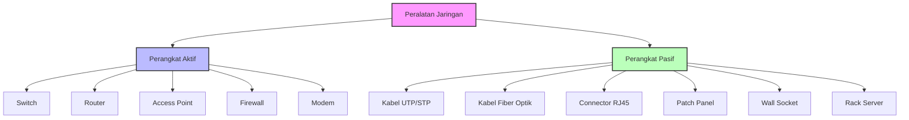
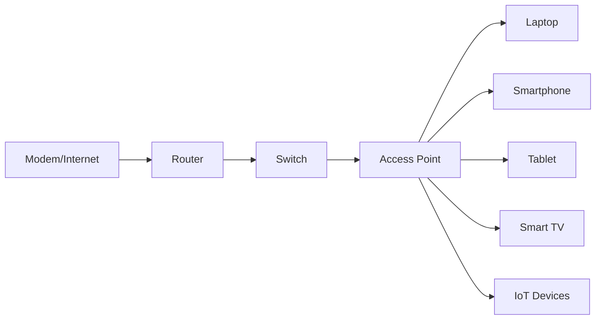
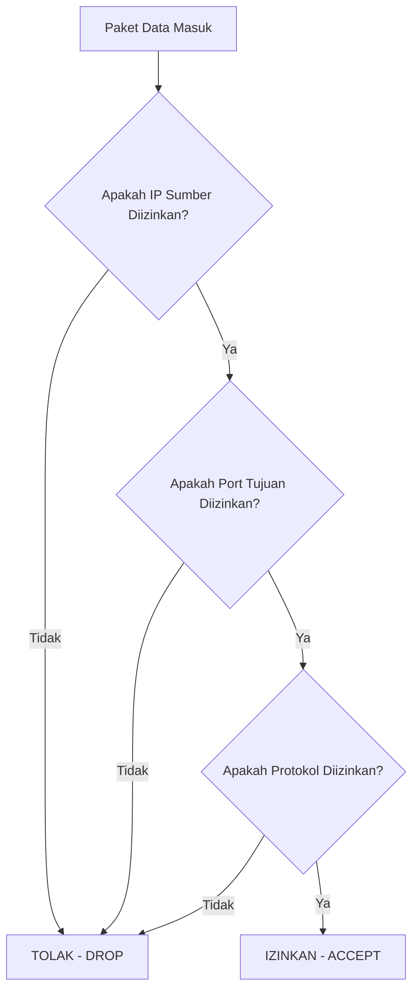
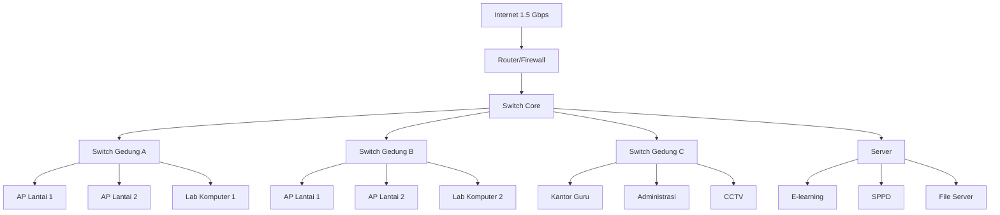
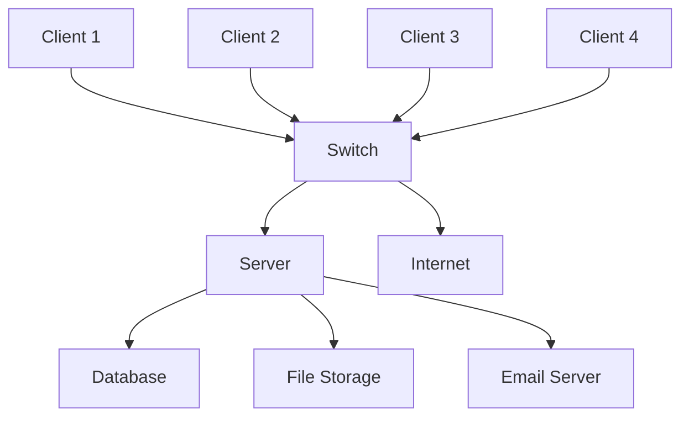
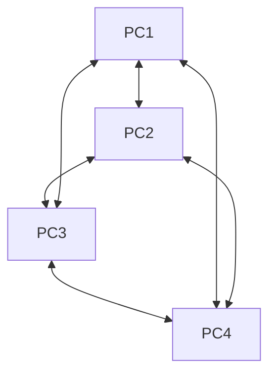
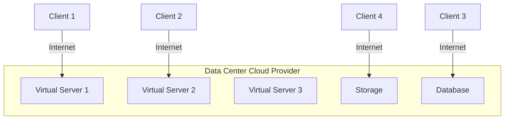
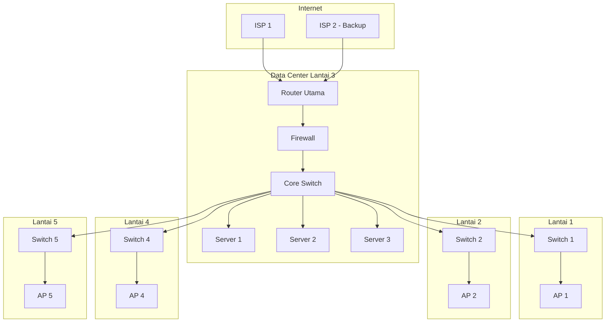

# MODUL LENGKAP PERENCANAAN DAN PENGELOLAAN JARINGAN KOMPUTER

## Panduan Praktis dari Dasar hingga Mahir

---

# 🎯 CAPAIAN PEMBELAJARAN (CP)

Pada akhir fase F, peserta didik **mampu**:

✅ Merencanakan topologi dan arsitektur jaringan sesuai kebutuhan  
✅ Mengumpulkan kebutuhan teknis pengguna yang menggunakan jaringan  
✅ Mengumpulkan data peralatan jaringan dengan teknologi yang sesuai  
✅ Melakukan pengalamatan jaringan  
✅ Memahami CIDR dan VLSM  
✅ Menghitung subnetting

---

# 📋 ALUR TUJUAN PEMBELAJARAN (ATP)

| **Pertemuan** | **Tujuan Pembelajaran** | **Indikator Pencapaian** |
|---------------|-------------------------|--------------------------|
| **1** | Memahami kebutuhan teknis pengguna dan peralatan jaringan dengan teknologi yang sesuai | - Mengidentifikasi kebutuhan pengguna<br>- Menentukan spesifikasi peralatan<br>- Memilih teknologi tepat guna |
| **2** | Memahami perencanaan topologi dan arsitektur jaringan sesuai kebutuhan | - Merancang topologi jaringan<br>- Memilih arsitektur yang tepat<br>- Membuat diagram jaringan |
| **3** | Memahami pengalamatan jaringan, CIDR dan VLSM dan menghitung subnetting | - Menghitung subnetting<br>- Menerapkan CIDR<br>- Menggunakan VLSM |

---

# 📚 BAB 1: ANALISIS KEBUTUHAN TEKNIS PENGGUNA DAN PERALATAN JARINGAN

## A. PENGANTAR ANALISIS KEBUTUHAN

Sebelum membangun sebuah jaringan komputer, kita harus melakukan **analisis kebutuhan**. Ini seperti membangun rumah - kita harus tahu berapa banyak penghuni, apa aktivitasnya, dan fasilitas apa yang dibutuhkan sebelum membangun.

### 🏠 Analogi Sederhana

Bayangkan Anda ingin membangun sebuah **kantor**:

| **Pertanyaan** | **Dalam Jaringan Komputer** | **Contoh Nyata** |
|----------------|------------------------------|------------------|
| Berapa banyak karyawan? | Jumlah pengguna jaringan | 100 karyawan |
| Apa pekerjaan mereka? | Jenis aktivitas jaringan | Video conference, akses server |
| Berapa meja yang dibutuhkan? | Jumlah perangkat (PC, laptop) | 80 PC, 20 laptop |
| Butuh ruang rapat? | Kebutuhan bandwidth tinggi | Meeting online 4K |
| Butuh keamanan? | Tingkat keamanan | Firewall, VPN |

---

## B. MENGIDENTIFIKASI KEBUTUHAN PENGGUNA

### 1. Langkah-langkah Analisis Kebutuhan

#### 📝 Langkah 1: Identifikasi Pengguna

Tanyakan pada diri Anda:
- **Siapa** saja yang akan menggunakan jaringan?
- **Di mana** mereka berada? (satu ruangan, gedung berbeda, atau cabang kota lain)
- **Kapan** mereka menggunakan jaringan? (jam kerja, 24 jam, atau musiman)

**Contoh Kasus: Sekolah**
```
Pengguna:
- 500 siswa (menggunakan lab komputer dan hotspot)
- 50 guru (mengakses e-learning, membuat soal)
- 10 staf administrasi (mengakses SPPD, keuangan)
- 5 pimpinan (email, video conference)
```

#### 📝 Langkah 2: Identifikasi Aktivitas dan Aplikasi

Setiap aktivitas membutuhkan **bandwidth** yang berbeda:

| **Aktivitas** | **Kebutuhan Bandwidth** | **Prioritas** |
|---------------|-------------------------|---------------|
| Browsing web, email | 0.5 - 1 Mbps | Rendah |
| Streaming YouTube (720p) | 2.5 Mbps | Sedang |
| Streaming YouTube (1080p) | 5 Mbps | Sedang |
| Streaming 4K | 15-25 Mbps | Tinggi |
| Video Conference (Zoom/Meet) | 2-4 Mbps | Tinggi |
| Gaming Online | 3-6 Mbps | Tinggi (latency rendah) |
| Download file besar | 10-100 Mbps | Sedang |
| VoIP (Telepon internet) | 0.1 Mbps | Tinggi (prioritas) |
| Server Database | 10-100 Mbps | Kritis |
| Backup Cloud | 50-500 Mbps | Rendah (bisa malam hari) |

**Contoh Analisis: Kantor Startup**
```
Aktivitas karyawan:
1. Email dan browsing: 60% karyawan → 1 Mbps/orang
2. Video conference: 30% karyawan (3x/hari) → 3 Mbps/orang  
3. Akses server internal: 100% karyawan → 2 Mbps/orang
4. Download/upload file: 20% karyawan → 5 Mbps/orang
5. VoIP telepon: 10% karyawan → 0.1 Mbps/orang
```

#### 📝 Langkah 3: Hitung Kebutuhan Bandwidth

**Rumus Dasar:**
```
Total Bandwidth = Σ (Jumlah Pengguna × Kebutuhan per Aktivitas)
```

**Contoh Perhitungan:**

Startup dengan 100 karyawan:

| Aktivitas | Pengguna | Bandwidth/org | Total |
|-----------|----------|---------------|-------|
| Email, browsing | 100 | 1 Mbps | 100 Mbps |
| Video conference | 30 (bersamaan) | 3 Mbps | 90 Mbps |
| Akses server | 100 | 2 Mbps | 200 Mbps |
| Download/upload | 20 | 5 Mbps | 100 Mbps |
| VoIP | 10 | 0.1 Mbps | 1 Mbps |

**Total kebutuhan puncak:** 100 + 90 + 200 + 100 + 1 = **491 Mbps**

**Rekomendasi:** Sediakan bandwidth **600-700 Mbps** (dengan buffer 20-30%)

---

### 3. Kebutuhan Berdasarkan Jenis Instansi

#### 🏫 Sekolah / Kampus

| **Komponen** | **Kebutuhan** | **Catatan** |
|--------------|---------------|-------------|
| Laboratorium komputer | 100 Mbps per lab | 30-40 PC/lab |
| Perpustakaan digital | 50 Mbps | Akses jurnal, ebook |
| E-learning | 100 Mbps | Video pembelajaran |
| Administrasi | 50 Mbps | SPPD, akademik |
| Wi-Fi hotspot | 200 Mbps | Untuk siswa/guru |
| **Total estimasi** | **500 Mbps - 1 Gbps** | |

#### 🏢 Kantor / Perusahaan

| **Komponen** | **Kebutuhan** | **Catatan** |
|--------------|---------------|-------------|
| Email & komunikasi | 5-10 Mbps | Prioritas tinggi |
| Akses file server | 50-100 Mbps | Sharing dokumen |
| Database server | 50-200 Mbps | Kritis |
| Video conference | 50-100 Mbps | Meeting online |
| VPN (remote work) | 50-100 Mbps | Karyawan WFH |
| Cloud backup | 100-500 Mbps | Malam hari |
| **Total estimasi** | **300 Mbps - 1 Gbps** | |

#### 🏥 Rumah Sakit / Klinik

| **Komponen** | **Kebutuhan** | **Catatan** |
|--------------|---------------|-------------|
| Rekam medis (EHR) | 100-200 Mbps | Kritis, real-time |
| Radiologi (CT/MRI) | 1-10 Gbps | File besar |
| Administrasi pasien | 50 Mbps | Pendaftaran |
| Telemedicine | 50 Mbps | Konsultasi online |
| IoT (monitor pasien) | 10 Mbps | Banyak device |
| **Total estimasi** | **1-10 Gbps** | |

#### 🏪 Warung/Kafe (Warnet/Coffee Shop)

| **Komponen** | **Kebutuhan** | **Catatan** |
|--------------|---------------|-------------|
| Gaming online | 5 Mbps per PC | 10-20 PC |
| Streaming | 5 Mbps per pengguna | YouTube, Netflix |
| Browsing | 1 Mbps per pengguna | |
| **Total estimasi** | **100-300 Mbps** | |

---

## C. PERALATAN JARINGAN DAN TEKNOLOGINYA

### 1. Perangkat Aktif vs Pasif



### 2. PENJELASAN LENGKAP PERANGKAT AKTIF

---

#### A. SWITCH (Penyambung Jaringan)

**Apa itu Switch?**
Switch adalah perangkat yang menghubungkan banyak perangkat dalam satu jaringan lokal (LAN). Bayangkan switch seperti **terminal bus** di stasiun - semua penumpang (data) masuk dan diarahkan ke tujuan yang tepat.

**Cara Kerja Switch:**
1. Switch menerima paket data dari satu port
2. Membaca alamat MAC tujuan
3. Meneruskan paket ke port yang tepat (bukan ke semua port seperti hub)

**Jenis-Jenis Switch:**

| **Jenis** | **Penjelasan** | **Kelebihan** | **Kekurangan** | **Harga** |
|-----------|----------------|---------------|----------------|-----------|
| **Unmanaged Switch** | Plug and play, tidak bisa diatur | - Mudah digunakan<br>- Murah<br>- Tanpa konfigurasi | - Tidak bisa monitoring<br>- Tidak ada QoS<br>- Keamanan terbatas | Rp 200-500 ribu |
| **Managed Switch** | Bisa dikonfigurasi | - VLAN support<br>- QoS (prioritas)<br>- Monitoring<br>- Keamanan tinggi | - Mahal<br>- Butuh keahlian | Rp 2-20 juta |
| **Smart Switch** | Semi-managed | - Harga menengah<br>- Beberapa fitur managed | - Fitur terbatas | Rp 1-5 juta |
| **PoE Switch** | Memberi daya lewat kabel | - Tidak perlu adapter perangkat<br>- Praktis untuk AP/IP Camera | - Mahal<br>- Panas berlebih | Rp 1-10 juta |

**Spesifikasi Switch yang Perlu Diperhatikan:**

1. **Jumlah Port:**
   - 8 port → untuk kantor kecil (1-5 pengguna)
   - 16 port → untuk UKM (10-15 pengguna)
   - 24 port → untuk kantor menengah
   - 48 port → untuk gedung kantor (40+ pengguna)
   - Stackable → beberapa switch digabung menjadi satu

2. **Kecepatan Port:**
   - 10/100 Mbps (Fast Ethernet) → sudah usang
   - 10/100/1000 Mbps (Gigabit) → standar saat ini
   - 10 Gbps → untuk server/backbone
   - 40/100 Gbps → data center besar

3. **Fitur Penting:**
   - **VLAN**: Memisahkan jaringan (misal: VLAN HRD, VLAN IT)
   - **QoS**: Prioritas untuk video conference, VoIP
   - **STP**: Mencegah loop jaringan
   - **Port Mirroring**: Monitoring lalu lintas
   - **SNMP**: Monitoring dari jarak jauh

---

#### B. ROUTER (Penghubung Antar Jaringan)

**Apa itu Router?**
Router adalah perangkat yang menghubungkan dua atau lebih jaringan yang berbeda. Router bertindak seperti **pos penjagaan perbatasan** yang mengatur lalu lintas antar negara (jaringan).

**Cara Kerja Router:**
1. Menerima paket data dari satu jaringan
2. Membaca alamat IP tujuan
3. Menentukan jalur terbaik menggunakan routing table
4. Meneruskan paket ke jaringan yang tepat

**Jenis Router:**

| **Jenis** | **Penjelasan** | **Contoh** |
|-----------|----------------|------------|
| **Router Kabel** | Menggunakan kabel Ethernet | MikroTik, Cisco |
| **Router Wireless** | Ada Wi-Fi | TP-Link, ASUS |
| **Router 4G/LTE** | Menggunakan SIM card | Huawei, ZTE |
| **Router Core** | Untuk ISP/data center | Cisco ASR, Juniper |
| **Router Edge** | Untuk batas jaringan | Cisco 4000 series |

**Fungsi Utama Router:**

1. **NAT (Network Address Translation)**
   - Menerjemahkan IP private (internal) ke IP public (internet)
   - Contoh: 192.168.1.100 → 180.254.1.50

2. **DHCP Server**
   - Memberikan IP address otomatis ke perangkat
   - Rentang IP: 192.168.1.100 - 192.168.1.200

3. **Firewall**
   - Menyaring lalu lintas berdasarkan aturan
   - Memblokir akses tidak sah

4. **VPN (Virtual Private Network)**
   - Koneksi aman dari luar kantor
   - Bisa PPTP, L2TP, OpenVPN, WireGuard

5. **Routing Dinamis**
   - Mengatur jalur secara otomatis
   - Protokol: RIP, OSPF, BGP

---

#### C. ACCESS POINT (Penyebar Sinyal Wi-Fi)

**Apa itu Access Point?**
Access Point adalah perangkat yang mengubah sinyal kabel menjadi sinyal wireless (Wi-Fi). Bayangkan AP seperti **pemancar radio** yang menyebarkan sinyal ke seluruh ruangan.

**Komponen Wi-Fi:**



**Standar Wi-Fi:**

| **Standar** | **Tahun** | **Kecepatan Maks** | **Frekuensi** | **Jangkauan** |
|-------------|-----------|-------------------|---------------|---------------|
| 802.11b | 1999 | 11 Mbps | 2.4 GHz | 35-140 m |
| 802.11g | 2003 | 54 Mbps | 2.4 GHz | 35-140 m |
| 802.11n (Wi-Fi 4) | 2009 | 600 Mbps | 2.4/5 GHz | 70-250 m |
| 802.11ac (Wi-Fi 5) | 2013 | 3.5 Gbps | 5 GHz | 35-100 m |
| 802.11ax (Wi-Fi 6) | 2019 | 9.6 Gbps | 2.4/5/6 GHz | 70-250 m |
| Wi-Fi 6E | 2021 | 9.6 Gbps | 6 GHz (baru) | 70-250 m |
| Wi-Fi 7 | 2024 | 30 Gbps | 2.4/5/6 GHz | 70-250 m |

**Faktor Penentu Kualitas AP:**

1. **MIMO (Multiple Input Multiple Output)**
   - Banyak antena = lebih cepat dan stabil
   - 2x2 MIMO: standar
   - 4x4 MIMO: kecepatan tinggi
   - 8x8 MIMO: enterprise

2. **Daya Pancar**
   - mW (mil watt) atau dBm
   - Semakin tinggi, semakin luas jangkauan
   - Tapi perlu izin (batas maksimal 100 mW di Indonesia)

3. **Fitur Tambahan**
   - **MU-MIMO**: Melayani banyak perangkat sekaligus
   - **Beamforming**: Fokus sinyal ke perangkat
   - **Mesh**: Beberapa AP saling terhubung
   - **PoE**: Mendapat daya dari kabel LAN

**Perencanaan Penempatan AP:**

| **Luas Area** | **Jumlah AP** | **Keterangan** |
|---------------|---------------|----------------|
| < 50 m² | 1 AP | Ruangan kecil |
| 50-200 m² | 2-3 AP | Kantor menengah |
| 200-500 m² | 4-6 AP | Gedung kantor |
| > 500 m² | 1 AP per 50 pengguna | Enterprise |

---

#### D. FIREWALL (Tembok Api Keamanan)

**Apa itu Firewall?**
Firewall adalah perangkat atau software yang melindungi jaringan dari akses tidak sah. Bayangkan firewall seperti **satpam di gerbang kompleks** - hanya orang yang diizinkan yang bisa masuk.

**Jenis Firewall:**

1. **Packet Filtering Firewall**
   - Memeriksa header paket (IP, port)
   - Dasar: allow/deny berdasarkan aturan
   - Contoh: iptables di Linux

2. **Stateful Firewall**
   - Melacak status koneksi
   - Lebih pintar dari packet filtering
   - Contoh: firewall di router modern

3. **Next-Generation Firewall (NGFW)**
   - Deep Packet Inspection
   - Identifikasi aplikasi
   - Perlindungan dari ancaman
   - Contoh: Fortinet, Palo Alto

4. **Web Application Firewall (WAF)**
   - Khusus untuk web server
   - Mencegah SQL injection, XSS
   - Contoh: CloudFlare, ModSecurity

**Aturan Firewall Dasar:**



**Contoh Aturan Firewall:**

| No | Sumber | Tujuan | Port | Aksi | Keterangan |
|----|--------|--------|------|------|------------|
| 1 | Any | 203.0.113.10 | 80,443 | Allow | Web server public |
| 2 | Any | 203.0.113.10 | 22 | Deny | SSH diblokir dari luar |
| 3 | 192.168.1.0/24 | Any | Any | Allow | LAN ke internet |
| 4 | Any | 192.168.1.100 | 3389 | Deny | RDP diblokir |

---

#### E. MODEM (Penerjemah Sinyal)

**Apa itu Modem?**
Modem adalah perangkat yang mengubah sinyal digital menjadi analog (dan sebaliknya) untuk transmisi melalui media tertentu.

**Kepanjangan:** Modulator-Demodulator

**Jenis Modem:**

| **Jenis** | **Media** | **Kecepatan** | **Penggunaan** |
|-----------|-----------|---------------|----------------|
| DSL Modem | Kabel telepon | 10-100 Mbps | Speedy, IndiHome (lama) |
| Cable Modem | Kabel TV | 100-1000 Mbps | First Media |
| Fiber Modem (ONT) | Fiber optik | 100-1000 Mbps | IndiHome fiber, MyRepublic |
| 4G/LTE Modem | Sinyal seluler | 10-100 Mbps | Mobile WiFi |
| 5G Modem | Sinyal 5G | 100-1000 Mbps | Router 5G |

---

### 3. Perangkat Pasif (Infrastruktur)

#### A. Kabel UTP/STP

**UTP (Unshielded Twisted Pair)**
Kabel dengan pasangan kabel yang dipilin tanpa pelindung tambahan.

**STP (Shielded Twisted Pair)**
Kabel dengan pelindung tambahan untuk mengurangi interferensi.

**Kategori Kabel:**

| **Kategori** | **Kecepatan** | **Frekuensi** | **Jarak Maks** | **Penggunaan** |
|--------------|---------------|---------------|----------------|----------------|
| **Cat 5e** | 1 Gbps | 100 MHz | 100 m | Jaringan dasar, paling umum |
| **Cat 6** | 1 Gbps (100m)<br>10 Gbps (55m) | 250 MHz | 100 m | Jaringan kecepatan tinggi |
| **Cat 6a** | 10 Gbps | 500 MHz | 100 m | Enterprise, data center |
| **Cat 7** | 10 Gbps | 600 MHz | 100 m | Data center, shielded |
| **Cat 8** | 25-40 Gbps | 2000 MHz | 30 m | Data center jarak pendek |

**Urutan Kabel UTP (RJ45):**

**Standar T568B (paling umum):**

```
   [1] [2] [3] [4] [5] [6] [7] [8]
   |   |   |   |   |   |   |   |
   Putih-Orange | Putih-Hijau | Putih-Coklat
   Orange       | Biru        | Coklat
   (1) (2)      | (3) (4)     | (5) (6) (7) (8)
                | Hijau       |
                | Putih-Biru  |
```

| PIN | Warna | Fungsi (10/100) | Fungsi (Gigabit) |
|-----|-------|-----------------|------------------|
| 1 | Putih-Orange | TX+ | BI_DA+ |
| 2 | Orange | TX- | BI_DA- |
| 3 | Putih-Hijau | RX+ | BI_DB+ |
| 4 | Biru | Tidak digunakan | BI_DC+ |
| 5 | Putih-Biru | Tidak digunakan | BI_DC- |
| 6 | Hijau | RX- | BI_DB- |
| 7 | Putih-Coklat | Tidak digunakan | BI_DD+ |
| 8 | Coklat | Tidak digunakan | BI_DD- |

**Jenis Kabel Berdasarkan Pemasangan:**

1. **Straight-through** (Ujung sama)
   - Untuk: PC ke Switch, Router ke Switch
   - Kedua ujung: T568B - T568B

2. **Crossover** (Ujung berbeda)
   - Untuk: PC ke PC, Switch ke Switch
   - Ujung 1: T568B, Ujung 2: T568A

3. **Rollover** (Console)
   - Untuk: Menghubungkan ke console router/switch
   - Susunan khusus

---

#### B. Kabel Fiber Optic

**Apa itu Fiber Optic?**
Kabel yang menggunakan cahaya untuk mentransmisikan data. Kecepatan sangat tinggi dan tahan interferensi.

**Komponen Fiber Optic:**
1. **Core**: Inti kaca tempat cahaya merambat
2. **Cladding**: Lapisan pembungkus yang memantulkan cahaya
3. **Coating**: Lapisan pelindung
4. **Strength member**: Penguat (Kevlar/fiberglass)
5. **Outer jacket**: Lapisan luar

**Jenis Fiber Optic:**

| **Jenis** | **Diameter Core** | **Jarak** | **Kecepatan** | **Penggunaan** |
|-----------|-------------------|-----------|---------------|----------------|
| **Single Mode** | 8-10 mikron | 40-100 km | 10-100 Gbps | Jarak jauh, backbone |
| **Multi Mode** | 50-62.5 mikron | 550 m - 2 km | 1-10 Gbps | Dalam gedung, data center |

**Konektor Fiber Optic:**

| **Konektor** | **Penjelasan** | **Penggunaan** |
|--------------|----------------|----------------|
| **SC** | Square connector | Paling umum |
| **LC** | Small form factor | Untuk patch panel |
| **ST** | Straight tip | Tipe lama |
| **MTP/MPO** | Multi-fiber | Data center |
| **SFP** | Small form-factor pluggable | Di switch/router |

**Keunggulan Fiber Optic:**
- Kecepatan sangat tinggi
- Jarak jauh
- Tahan interferensi
- Aman (sulit disadap)

**Kekurangan Fiber Optic:**
- Mahal
- Instalasi sulit
- Perlu peralatan khusus

---

#### C. Perangkat Pasif Lainnya

**1. Patch Panel**
- Tempat terminasi kabel horizontal
- Memudahkan manajemen kabel
- Tersedia: 12, 24, 48 port

**2. Wall Socket (Outlet)**
- Tempat koneksi ke pengguna
- Dipasang di dinding
- RJ45 female

**3. Rack Server**
- Tempat menyimpan perangkat jaringan
- Standar: 19 inch, 42U
- Dilengkapi PDU (Power Distribution Unit)

**4. Kabel Ties dan Cable Management**
- Mengatur kabel agar rapi
- Mencegah kusut
- Memudahkan troubleshooting

**5. UPS (Uninterruptible Power Supply)**
- Cadangan daya saat mati listrik
- Melindungi perangkat dari lonjakan daya
- Perhitungan: daya perangkat × waktu backup

---

## D. STUDI KASUS LENGKAP: ANALISIS KEBUTUHAN

### Kasus: SMA Bina Nusantara

**Profil Sekolah:**
- 800 siswa, 80 guru, 30 staf
- 3 gedung (A: kelas, B: lab, C: administrasi)
- Jarak antar gedung: 100-150 meter

**Kebutuhan:**
1. 2 lab komputer (masing-masing 40 PC)
2. Wi-Fi untuk semua siswa dan guru
3. Sistem e-learning
4. Perpustakaan digital
5. Sistem SPPD dan keuangan
6. CCTV (30 kamera)
7. Akses internet untuk 850 pengguna

### Analisis Kebutuhan:

#### Langkah 1: Kebutuhan Pengguna

| **Pengguna** | **Jumlah** | **Aktivitas** | **Bandwidth/Org** |
|--------------|------------|---------------|-------------------|
| Siswa (lab) | 80 (bersamaan) | E-learning, coding | 2 Mbps |
| Siswa (Wi-Fi) | 300 (bersamaan) | Browsing, streaming | 1.5 Mbps |
| Guru | 80 | E-learning, meeting | 3 Mbps |
| Staf | 30 | Admin, SPPD | 2 Mbps |
| CCTV | 30 kamera | Streaming 720p | 1 Mbps |
| Server E-learning | - | Akses simultan 500 user | 200 Mbps |

#### Langkah 2: Perhitungan Bandwidth

```
Total = (80 × 2) + (300 × 1.5) + (80 × 3) + (30 × 2) + (30 × 1) + 200
      = 160 + 450 + 240 + 60 + 30 + 200
      = 1,140 Mbps
```

**Kesimpulan:** Butuh koneksi internet minimal **1.5 Gbps**

#### Langkah 3: Kebutuhan Peralatan

| **Perangkat** | **Jumlah** | **Spesifikasi** |
|---------------|------------|-----------------|
| Router | 1 | 2 Gbps throughput, support 1000 pengguna |
| Switch Core | 1 | 48 port, 10 Gbps uplink, managed |
| Switch Gedung A | 3 | 24 port, Gigabit, PoE |
| Switch Gedung B | 2 | 48 port, Gigabit |
| Switch Gedung C | 2 | 24 port, Gigabit, PoE |
| Access Point | 15 | Wi-Fi 6, 4x4 MIMO, PoE |
| Firewall | 1 | NGFW, 2 Gbps throughput |
| Server | 3 | E-learning, SPPD, File server |
| UPS | 5 | 2000-3000 VA |
| Rack | 3 | 42U |

#### Langkah 4: Diagram Topologi



#### Langkah 5: Estimasi Biaya

| **Item** | **Estimasi Harga** |
|----------|-------------------|
| Perangkat aktif | Rp 80-120 juta |
| Perangkat pasif (kabel, panel) | Rp 30-50 juta |
| Server | Rp 60-90 juta |
| Router+Firewall | Rp 40-60 juta |
| Instalasi | Rp 30-50 juta |
| **Total** | **Rp 240-370 juta** |

---

# 📚 BAB 2: PERENCANAAN TOPOLOGI DAN ARSITEKTUR JARINGAN

## A. PENGANTAR TOPOLOGI

**Topologi jaringan** adalah cara atau pola menghubungkan perangkat-perangkat dalam suatu jaringan. Pilih topologi yang tepat seperti memilih **denah rumah** - harus sesuai dengan kebutuhan, efisien, dan nyaman digunakan.

---

## B. JENIS-JENIS TOPOLOGI SECARA LENGKAP

### 1. TOPOLOGI BUS

**Gambar:**
```
        [PC1]    [PC2]    [PC3]    [PC4]
          |        |        |        |
    ======+========+========+========+============= (Kabel Utama)
                              |
                           [Terminator]
```

**Penjelasan Detail:**
Semua perangkat terhubung ke satu kabel utama yang disebut **backbone** atau **bus**. Di kedua ujung kabel dipasang **terminator** untuk mencegah pantulan sinyal.

**Karakteristik:**
- Semua perangkat berbagi media yang sama
- Data dikirim dalam satu arah (broadcast)
- Jika dua perangkat mengirim bersamaan → terjadi collision

**Kelebihan:**
- ✅ Instalasi sangat sederhana
- ✅ Biaya rendah (hanya butuh satu kabel panjang)
- ✅ Tidak butuh perangkat tambahan (switch/hub)
- ✅ Cocok untuk jaringan kecil sementara

**Kekurangan:**
- ❌ Jika kabel putus, seluruh jaringan mati
- ❌ Kinerja menurun drastis jika banyak perangkat
- ❌ Sulit troubleshooting (harus cek seluruh kabel)
- ❌ Keamanan rendah (semua perangkat bisa melihat semua data)
- ❌ Single point of failure

**Cocok untuk:**
- Jaringan sementara
- Jaringan dengan sedikit perangkat (3-5 unit)
- Demonstrasi/praktikum

**Tidak cocok untuk:**
- Jaringan kantor/perusahaan
- Jaringan dengan banyak pengguna
- Jaringan yang membutuhkan keandalan tinggi

---

### 2. TOPOLOGI STAR (BINTANG)

**Gambar:**
```
                    [PC1]
                     |
              [PC2]--[SWITCH/HUB]--[PC3]
                     |
                    [PC4]
```

**Penjelasan Detail:**
Semua perangkat terhubung ke perangkat pusat (switch/hub). Setiap perangkat memiliki kabel sendiri ke pusat.

**Karakteristik:**
- Semua komunikasi melalui perangkat pusat
- Jika satu kabel putus, hanya satu perangkat yang terkena
- Switch lebih cerdas daripada hub

**Kelebihan:**
- ✅ Manajemen terpusat
- ✅ Jika satu perangkat rusak, yang lain tetap jalan
- ✅ Mudah dikembangkan (tambah perangkat baru)
- ✅ Mudah troubleshooting
- ✅ Kinerja lebih baik (switch)
- ✅ Keamanan lebih baik (dengan managed switch)

**Kekurangan:**
- ❌ Jika switch/hub rusak, seluruh jaringan mati
- ❌ Membutuhkan lebih banyak kabel
- ❌ Biaya lebih tinggi (butuh switch)
- ❌ Jarak terbatas (100m untuk kabel UTP)

**Cocok untuk:**
- Hampir semua kasus
- Kantor, sekolah, rumah
- Jaringan menengah hingga besar

**Ini adalah topologi paling populer dan direkomendasikan!**

---

### 3. TOPOLOGI RING (CINCIN)

**Gambar:**
```
        [PC1] ===== [PC2]
         ||          ||
         ||          ||
        [PC4] ===== [PC3]
```

**Penjelasan Detail:**
Setiap perangkat terhubung ke dua perangkat lain, membentuk lingkaran (ring). Data mengalir dalam satu arah (atau dua arah untuk yang lebih canggih).

**Karakteristik:**
- Token passing: perangkat hanya bisa mengirim jika memiliki token
- Tidak ada collision
- Biasanya menggunakan fiber optic (FDDI)

**Kelebihan:**
- ✅ Kinerja konsisten
- ✅ Tidak ada collision
- ✅ Bisa mencakup area luas
- ✅ Redundansi (jika dual ring)

**Kekurangan:**
- ❌ Jika satu perangkat/ kabel putus, jaringan bisa mati (single ring)
- ❌ Sulit troubleshooting
- ❌ Sulit dikembangkan
- ❌ Mahal (biasanya pakai fiber)

**Cocok untuk:**
- Jaringan backbone
- Jaringan dengan lalu lintas data tertentu

---

### 4. TOPOLOGI MESH (JARING)

**Gambar:**
```
        [PC1] ----- [PC2]
        /  \        /  \
       /    \      /    \
      /      [PC3]      \
     /        /  \        \
    /        /    \        \
   [PC4] ---- [PC5] --- [PC6]
```

**Penjelasan Detail:**
Setiap perangkat terhubung ke semua perangkat lain. Ada 2 jenis:
1. **Full Mesh**: Semua terhubung ke semua
2. **Partial Mesh**: Beberapa perangkat terhubung langsung

**Karakteristik:**
- Jumlah koneksi = n(n-1)/2
- Redundansi maksimal
- Paling andal

**Kelebihan:**
- ✅ Redundansi tinggi (banyak jalur alternatif)
- ✅ Jika satu jalur putus, masih ada jalur lain
- ✅ Keamanan tinggi
- ✅ Kinerja sangat baik

**Kekurangan:**
- ❌ Sangat mahal (banyak kabel dan port)
- ❌ Instalasi kompleks
- ❌ Sulit dikelola
- ❌ Membutuhkan banyak ruang

**Cocok untuk:**
- Jaringan kritikal (militer, rumah sakit, data center)
- Jaringan backbone utama

---

### 5. TOPOLOGI TREE (POHON)

**Gambar:**
```
                    [ROOT/SWITCH CORE]
                    /        |        \
              [SW1]        [SW2]      [SW3]
              / | \        / | \      / | \
            PC PC PC      PC PC PC  PC PC PC
```

**Penjelasan Detail:**
Gabungan dari beberapa topologi star yang dihubungkan secara hierarkis. Struktur seperti pohon dengan root, branch, dan leaf.

**Karakteristik:**
- Hierarkis: Core → Distribution → Access
- Skalabel (mudah diperluas)
- Manajemen terstruktur

**Kelebihan:**
- ✅ Sangat skalabel
- ✅ Manajemen terstruktur
- ✅ Cocok untuk gedung bertingkat
- ✅ Dapat di-group per departemen

**Kekurangan:**
- ❌ Jika core rusak, banyak yang terkena
- ❌ Membutuhkan switch di setiap level
- ❌ Biaya tinggi

**Cocok untuk:**
- Perusahaan besar
- Kampus
- Gedung bertingkat

---

### 6. TOPOLOGI HYBRID (GABUNGAN)

**Gambar:**
```
    [Gedung A]         [Gedung B]
    Star + Mesh        Star + Ring
         |                  |
    =====+===== FIBER =====+=====
         |                  |
    [Gedung C]         [Gedung D]
    Tree + Star        Mesh + Star
```

**Penjelasan Detail:**
Kombinasi dari dua atau lebih topologi dasar. Topologi ini menggabungkan kelebihan masing-masing.

**Kelebihan:**
- ✅ Fleksibel
- ✅ Dapat mengakomodasi berbagai kebutuhan
- ✅ Menggabungkan kelebihan berbagai topologi

**Kekurangan:**
- ❌ Kompleks
- ❌ Sulit dikelola
- ❌ Biaya tinggi

**Cocok untuk:**
- Jaringan antar gedung
- Jaringan perusahaan besar
- Jaringan dengan kebutuhan beragam

---

### 7. PERBANDINGAN TOPOLOGI

| **Aspek** | **Bus** | **Star** | **Ring** | **Mesh** | **Tree** |
|-----------|---------|----------|----------|----------|----------|
| **Biaya** | Sangat Rendah | Sedang | Tinggi | Sangat Tinggi | Tinggi |
| **Instalasi** | Mudah | Mudah | Sedang | Sulit | Sedang |
| **Perawatan** | Sulit | Mudah | Sulit | Sulit | Sedang |
| **Skalabilitas** | Buruk | Baik | Sedang | Buruk | Sangat Baik |
| **Reliabilitas** | Buruk | Sedang | Buruk | Sangat Baik | Sedang |
| **Keamanan** | Buruk | Baik | Sedang | Sangat Baik | Baik |
| **Kinerja** | Buruk | Baik | Baik | Sangat Baik | Baik |
| **Troubleshooting** | Sulit | Mudah | Sulit | Sulit | Sedang |

---

## C. ARSITEKTUR JARINGAN

### 1. ARSITEKTUR CLIENT-SERVER

**Gambar:**


**Penjelasan Detail:**
Terdapat **server** yang berfungsi sebagai penyedia layanan dan **client** yang meminta layanan. Server biasanya memiliki spesifikasi lebih tinggi.

**Karakteristik:**
- Ada server khusus
- Manajemen terpusat
- Keamanan lebih baik
- Client hanya menjalankan aplikasi, data di server

**Kelebihan:**
- ✅ Administrasi terpusat
- ✅ Keamanan lebih terkontrol
- ✅ Backup data terpusat
- ✅ Akses data dari mana saja
- ✅ Skalabel

**Kekurangan:**
- ❌ Biaya tinggi (server, software, admin)
- ❌ Single point of failure (jika server mati)
- ❌ Butuh bandwidth lebih
- ❌ Butuh administrator khusus

**Contoh Penerapan:**
- Sekolah (server e-learning, SPPD)
- Kantor (server file, email, database)
- Rumah sakit (server rekam medis)
- Perbankan (server transaksi)

**Jenis Server:**

| **Jenis Server** | **Fungsi** | **Port Standar** |
|------------------|------------|------------------|
| Web Server | Menyajikan website | 80 (HTTP), 443 (HTTPS) |
| Database Server | Menyimpan dan mengelola data | 3306 (MySQL), 1433 (MSSQL) |
| File Server | Menyimpan dan berbagi file | 445 (SMB) |
| Email Server | Mengirim dan menerima email | 25 (SMTP), 143 (IMAP) |
| DNS Server | Menerjemahkan domain ke IP | 53 |
| DHCP Server | Memberikan IP otomatis | 67/68 |
| Proxy Server | Menyimpan cache internet | 3128, 8080 |
| Backup Server | Mencadangkan data | Variatif |

---

### 2. ARSITEKTUR PEER-TO-PEER (P2P)

**Gambar:**


**Penjelasan Detail:**
Setiap perangkat memiliki kedudukan yang sama. Tidak ada server khusus. Setiap perangkat bisa menjadi client (meminta data) dan server (memberi data).

**Karakteristik:**
- Tidak ada server pusat
- Setiap perangkat bertanggung jawab atas datanya sendiri
- Desentralisasi

**Kelebihan:**
- ✅ Biaya rendah (tidak perlu server)
- ✅ Implementasi sederhana
- ✅ Tidak butuh administrator khusus
- ✅ Tahan terhadap kegagalan (jika satu mati, yang lain tetap jalan)
- ✅ Cocok untuk jaringan kecil

**Kekurangan:**
- ❌ Keamanan rendah
- ❌ Sulit dikelola jika banyak perangkat
- ❌ Kinerja tergantung spesifikasi perangkat
- ❌ Tidak ada backup terpusat
- ❌ Tidak ada manajemen akses yang baik

**Contoh Penerapan:**
- Jaringan rumah
- Kantor kecil (< 10 pengguna)
- Warnet kecil
- Sharing file informal

---

### 3. ARSITEKTUR CLOUD COMPUTING

**Gambar:**


**Penjelasan Detail:**
Sumber daya komputasi (server, storage, database) disediakan melalui internet. Pengguna hanya membayar apa yang digunakan (pay-as-you-go).

**Model Layanan Cloud:**

| **Model** | **Penjelasan** | **Contoh** |
|-----------|----------------|------------|
| **IaaS** | Infrastructure as a Service | AWS EC2, GCP Compute |
| **PaaS** | Platform as a Service | Google App Engine, Heroku |
| **SaaS** | Software as a Service | Gmail, Google Drive, Zoom |
| **FaaS** | Function as a Service | AWS Lambda |

**Kelebihan:**
- ✅ Skalabilitas tinggi
- ✅ Tidak perlu investasi hardware
- ✅ Akses dari mana saja
- ✅ Backup dan disaster recovery terjamin
- ✅ Maintenance oleh provider

**Kekurangan:**
- ❌ Keamanan data (di tangan pihak ketiga)
- ❌ Koneksi internet stabil harus
- ❌ Biaya operasional (subscription)
- ❌ Latensi (tergantung lokasi)

**Penyedia Cloud Populer:**
- Amazon Web Services (AWS)
- Google Cloud Platform (GCP)
- Microsoft Azure
- Alibaba Cloud
- DigitalOcean

---

## D. PERENCANAAN TOPOLOGI LANGKAH DEMI LANGKAH

### Langkah 1: Identifikasi Kebutuhan

Tanyakan:
1. Berapa jumlah perangkat?
2. Di mana lokasi perangkat?
3. Berapa jarak antar perangkat?
4. Apakah ada kebutuhan redundancy?
5. Berapa budget?

### Langkah 2: Pilih Topologi

Panduan pemilihan:

| **Jika...** | **Pilih Topologi...** |
|-------------|----------------------|
| Jumlah perangkat < 10 dan budget kecil | Star sederhana dengan hub |
| Jumlah perangkat 10-50 | Star dengan switch managed |
| Jumlah perangkat > 50 | Tree dengan core switch |
| Gedung bertingkat | Tree (per lantai 1 switch) |
| Jaringan sangat kritikal | Partial Mesh |
| Jaringan antar kota | Ring (fiber optik) |
| Jaringan sementara | Bus (tidak disarankan) |

### Langkah 3: Buat Diagram

**Tools untuk membuat diagram:**
- **Cisco Packet Tracer** → simulasi jaringan
- **Draw.io / diagrams.net** → gratis, online
- **Visio** → professional
- **Lucidchart** → online, kolaborasi
- **GNS3** → simulasi kompleks

### Langkah 4: Perencanaan IP Address

| **Aspek** | **Detail** |
|-----------|------------|
| Rentang IP | Contoh: 192.168.1.0/24 |
| DHCP Range | 192.168.1.100 - 192.168.1.200 |
| Static IP (server) | 192.168.1.10 - 192.168.1.20 |
| Default Gateway | 192.168.1.1 |
| DNS Server | 8.8.8.8, 1.1.1.1 |

### Langkah 5: Dokumentasi

Buat dokumentasi yang mencakup:
1. Diagram topologi
2. Tabel IP address
3. Konfigurasi perangkat
4. SOP maintenance
5. Contact person

---

## E. STUDI KASUS: PERENCANAAN TOPOLOGI

### Kasus: PT. Maju Jaya

**Data Perusahaan:**
- 250 karyawan
- 5 lantai (masing-masing 50 karyawan)
- 1 data center di lantai 3
- 2 cabang (Jakarta dan Surabaya)
- Server: web, database, file, email

**Rancangan Topologi:**



**Detail Perencanaan:**

| **Lantai** | **Switch** | **AP** | **Jumlah PC** | **VLAN** |
|------------|------------|--------|---------------|----------|
| Lantai 1 | 2 switch 24 port | 2 AP | 50 | VLAN 10 |
| Lantai 2 | 2 switch 24 port | 2 AP | 50 | VLAN 20 |
| Lantai 3 | 1 switch core | - | Server | VLAN 30 |
| Lantai 4 | 2 switch 24 port | 2 AP | 50 | VLAN 40 |
| Lantai 5 | 2 switch 24 port | 2 AP | 50 | VLAN 50 |

**Alokasi IP Address:**

| **Lantai** | **Subnet** | **CIDR** | **Range Host** | **Gateway** |
|------------|------------|----------|----------------|-------------|
| Lantai 1 | 192.168.10.0 | /24 | 192.168.10.1-254 | 192.168.10.1 |
| Lantai 2 | 192.168.20.0 | /24 | 192.168.20.1-254 | 192.168.20.1 |
| Lantai 3 | 192.168.30.0 | /24 | 192.168.30.1-254 | 192.168.30.1 |
| Lantai 4 | 192.168.40.0 | /24 | 192.168.40.1-254 | 192.168.40.1 |
| Lantai 5 | 192.168.50.0 | /24 | 192.168.50.1-254 | 192.168.50.1 |

---

# 📚 BAB 3: PENGALAMATAN JARINGAN, SUBNETTING, CIDR, DAN VLSM

## A. KONSEP DASAR IP ADDRESS

### 1. Apa itu IP Address?

**IP Address** (Internet Protocol Address) adalah alamat unik yang diberikan ke setiap perangkat di jaringan komputer. Bayangkan IP address seperti **alamat rumah** - setiap rumah memiliki alamat yang unik sehingga surat (data) bisa sampai ke tujuan.

**Contoh IP Address:** `192.168.1.100`

```
192       168        1        100
│          │          │         │
└──────────┴──────────┴─────────┘
    4 angka (oktet) dipisahkan titik
    Masing-masing 8 bit (1 byte)
    Total 32 bit
```

### 2. Struktur IP Address

IP Address terdiri dari 32 bit yang dibagi menjadi 4 oktet (masing-masing 8 bit).

**Bentuk Biner:**
```
192.168.1.100 dalam biner:
11000000.10101000.00000001.01100100
```

**Setiap oktet nilainya 0-255:**
- Minimum: 00000000 = 0
- Maksimum: 11111111 = 255

### 3. Komponen IP Address

IP Address terdiri dari dua bagian:

| **Bagian** | **Fungsi** | **Contoh** |
|------------|------------|------------|
| **Network ID** | Mengidentifikasi jaringan | 192.168.1 |
| **Host ID** | Mengidentifikasi perangkat | 100 |

**Analoginya:**
- Network ID = Nama jalan/ komplek
- Host ID = Nomor rumah

### 4. Subnet Mask

**Subnet Mask** adalah angka yang membedakan mana Network ID dan Host ID.

**Contoh Subnet Mask:**
```
IP:        192.168.1.100  → 11000000.10101000.00000001.01100100
Subnet:    255.255.255.0  → 11111111.11111111.11111111.00000000
           ──────────────    ─────────────────────────────────────
Network ID: 192.168.1     →  11000000.10101000.00000001
Host ID:             100  →                          01100100
```

**Subnet Mask Paling Umum:**

| **Subnet Mask** | **CIDR** | **Network ID** | **Host ID** |
|-----------------|----------|----------------|-------------|
| 255.0.0.0 | /8 | 1 oktet pertama | 3 oktet terakhir |
| 255.255.0.0 | /16 | 2 oktet pertama | 2 oktet terakhir |
| 255.255.255.0 | /24 | 3 oktet pertama | 1 oktet terakhir |

---

## B. KELAS IP ADDRESS

Dulu, IP address dibagi menjadi kelas-kelas (classful addressing). Sistem ini sudah usang dan digantikan oleh CIDR, tapi penting untuk dipahami.

### 1. KELAS A

**Karakteristik:**
- Bit pertama: **0**
- Range: **1.0.0.0 - 126.255.255.255**
- Network ID: 8 bit (1 oktet)
- Host ID: 24 bit (3 oktet)
- Jumlah host: 16.777.214
- Subnet mask default: 255.0.0.0 (/8)

**Penggunaan:** Jaringan sangat besar (ISP, perusahaan global)

### 2. KELAS B

**Karakteristik:**
- Bit pertama: **10**
- Range: **128.0.0.0 - 191.255.255.255**
- Network ID: 16 bit (2 oktet)
- Host ID: 16 bit (2 oktet)
- Jumlah host: 65.534
- Subnet mask default: 255.255.0.0 (/16)

**Penggunaan:** Jaringan besar (perusahaan, universitas)

### 3. KELAS C

**Karakteristik:**
- Bit pertama: **110**
- Range: **192.0.0.0 - 223.255.255.255**
- Network ID: 24 bit (3 oktet)
- Host ID: 8 bit (1 oktet)
- Jumlah host: 254
- Subnet mask default: 255.255.255.0 (/24)

**Penggunaan:** Jaringan kecil (kantor, warnet)

### 4. KELAS D

**Karakteristik:**
- Bit pertama: **1110**
- Range: **224.0.0.0 - 239.255.255.255**
- Fungsi: Multicast

### 5. KELAS E

**Karakteristik:**
- Bit pertama: **1111**
- Range: **240.0.0.0 - 255.255.255.255**
- Fungsi: Eksperimental

### Tabel Ringkasan Kelas IP

| **Kelas** | **Range** | **Subnet Default** | **Jumlah Host** | **Penggunaan** |
|-----------|-----------|-------------------|-----------------|----------------|
| A | 1 - 126 | 255.0.0.0 (/8) | 16.777.214 | Jaringan sangat besar |
| B | 128 - 191 | 255.255.0.0 (/16) | 65.534 | Jaringan besar |
| C | 192 - 223 | 255.255.255.0 (/24) | 254 | Jaringan kecil |
| D | 224 - 239 | - | - | Multicast |
| E | 240 - 255 | - | - | Eksperimental |

### 🚨 CATATAN PENTING:

1. **127.0.0.0/8** adalah **loopback address** (localhost)
   - Digunakan untuk testing
   - 127.0.0.1 = localhost

2. **Private IP Address** (tidak bisa diakses dari internet):
   - 10.0.0.0/8 (10.0.0.0 - 10.255.255.255)
   - 172.16.0.0/12 (172.16.0.0 - 172.31.255.255)
   - 192.168.0.0/16 (192.168.0.0 - 192.168.255.255)

3. **Public IP Address** (bisa diakses dari internet):
   - Semua IP di luar private IP
   - Diberikan oleh ISP

---

## C. SUBNETTING

### 1. APA ITU SUBNETTING?

**Subnetting** adalah proses membagi satu jaringan besar menjadi beberapa jaringan kecil (subnet).

**Kenapa perlu subnetting?**

| **Alasan** | **Penjelasan** |
|------------|----------------|
| **Efisiensi IP** | Tidak membuang-buang IP address |
| **Keamanan** | Memisahkan departemen/jaringan |
| **Performa** | Mengurangi broadcast domain |
| **Manajemen** | Memudahkan pengelolaan |
| **Routing** | Memperkecil routing table |

### 2. KONSEP DASAR SUBNETTING

**Komponen dalam subnetting:**

| **Istilah** | **Penjelasan** | **Contoh** |
|-------------|----------------|------------|
| **Network Address** | Alamat jaringan (host ID semua 0) | 192.168.1.0 |
| **Broadcast Address** | Alamat untuk semua host (host ID semua 1) | 192.168.1.255 |
| **Host Address** | Alamat yang bisa digunakan | 192.168.1.1 - 192.168.1.254 |
| **Subnet Mask** | Menentukan batas jaringan | 255.255.255.0 |

**Rumus Dasar Subnetting:**

| **Rumus** | **Keterangan** | **Contoh** |
|-----------|----------------|------------|
| 2^n | Jumlah subnet | n = jumlah bit 1 tambahan |
| 2^m - 2 | Jumlah host per subnet | m = jumlah bit 0 |
| | | dikurangi 2 untuk network & broadcast |

### 3. CARA MENGHITUNG SUBNETTING

#### Metode 1: Metode Cepat (Blok Subnet)

**Langkah-langkah:**

1. Tentukan subnet mask baru
2. Hitung jumlah subnet: 2^n
3. Hitung host per subnet: 2^m - 2
4. Tentukan blok subnet: 256 - nilai oktet terakhir subnet mask
5. Buat tabel subnet

**Contoh: Subnetting 192.168.1.0/24 menjadi /26**

```
Langkah 1: /24 → /26 (n = 2)
Subnet mask baru: 255.255.255.192

Langkah 2: Jumlah subnet = 2^2 = 4 subnet

Langkah 3: Host per subnet = 2^6 - 2 = 62 host

Langkah 4: Blok subnet = 256 - 192 = 64

Langkah 5: Tabel subnet:
```

| **Subnet** | **Network** | **Host Range** | **Broadcast** |
|------------|-------------|----------------|---------------|
| 0 | 192.168.1.0 | 192.168.1.1 - 192.168.1.62 | 192.168.1.63 |
| 1 | 192.168.1.64 | 192.168.1.65 - 192.168.1.126 | 192.168.1.127 |
| 2 | 192.168.1.128 | 192.168.1.129 - 192.168.1.190 | 192.168.1.191 |
| 3 | 192.168.1.192 | 192.168.1.193 - 192.168.1.254 | 192.168.1.255 |

#### Metode 2: Metode Biner (Lengkap)

**Contoh: 192.168.1.0/24 → 4 subnet**

```
IP:        192.168.1.0     → 11000000.10101000.00000001.00000000
Subnet /24:255.255.255.0   → 11111111.11111111.11111111.00000000

Untuk 4 subnet, ambil 2 bit dari host:
Subnet baru:255.255.255.192 → 11111111.11111111.11111111.11000000

Subnet-subnet:
00 → 00000000 = 0     → 192.168.1.0
01 → 01000000 = 64    → 192.168.1.64
10 → 10000000 = 128   → 192.168.1.128
11 → 11000000 = 192   → 192.168.1.192
```

### 4. TABEL SUBNETTING LENGKAP (CIDR /24 - /30)

| **CIDR** | **Subnet Mask** | **Blok** | **Host/Subnet** | **Subnet** |
|----------|-----------------|----------|-----------------|------------|
| /24 | 255.255.255.0 | 256 | 254 | 1 |
| /25 | 255.255.255.128 | 128 | 126 | 2 |
| /26 | 255.255.255.192 | 64 | 62 | 4 |
| /27 | 255.255.255.224 | 32 | 30 | 8 |
| /28 | 255.255.255.240 | 16 | 14 | 16 |
| /29 | 255.255.255.248 | 8 | 6 | 32 |
| /30 | 255.255.255.252 | 4 | 2 | 64 |

---

## D. CIDR (Classless Inter-Domain Routing)

### 1. APA ITU CIDR?

**CIDR** adalah metode pengalamatan IP yang menggantikan sistem kelas (classful). Dengan CIDR, kita tidak terbatas pada /8, /16, atau /24 saja, tapi bisa menggunakan prefix length berapa pun (misal /27, /29, dll).

**Format CIDR:** `IP_Address/Prefix_Length`

Contoh: `192.168.1.0/26` (dibaca: "192.168.1.0 slash 26")

### 2. BAGAIMANA CIDR BEKERJA?

CIDR menggunakan **Variable Length Subnet Mask (VLSM)** yang memungkinkan penggunaan subnet mask berbeda-beda.

**Contoh Perbandingan:**

| **Sistem Kelas** | **CIDR** |
|------------------|----------|
| Hanya /8, /16, /24 | Bisa /8 sampai /32 |
| Boros IP | Efisien |
| Tidak fleksibel | Sangat fleksibel |

**Contoh Penggunaan:**

```
Sebelum (Classful):
- Perusahaan mendapat 192.168.1.0/24 (254 host)
- Hanya butuh 50 host → 204 IP terbuang

Sesudah (CIDR):
- Perusahaan mendapat 192.168.1.0/26 (62 host)
- Hanya 12 IP terbuang
- Sisa IP bisa digunakan untuk jaringan lain
```

### 3. KELEBIHAN CIDR

1. **Efisiensi IP** → Tidak boros
2. **Fleksibilitas** → Bisa memilih prefix berapa pun
3. **Aggregation** → Bisa menggabungkan rute (route summarization)
4. **Mengurangi routing table** → Lebih cepat

### 4. TABEL CIDR LENGKAP

| **CIDR** | **Subnet Mask** | **Jumlah IP** | **Jumlah Host** | **Range** |
|----------|-----------------|---------------|-----------------|-----------|
| /1 | 128.0.0.0 | 2,147,483,648 | 2,147,483,646 | - |
| /2 | 192.0.0.0 | 1,073,741,824 | 1,073,741,822 | - |
| /3 | 224.0.0.0 | 536,870,912 | 536,870,910 | - |
| /4 | 240.0.0.0 | 268,435,456 | 268,435,454 | - |
| /5 | 248.0.0.0 | 134,217,728 | 134,217,726 | - |
| /6 | 252.0.0.0 | 67,108,864 | 67,108,862 | - |
| /7 | 254.0.0.0 | 33,554,432 | 33,554,430 | - |
| /8 | 255.0.0.0 | 16,777,216 | 16,777,214 | - |
| /9 | 255.128.0.0 | 8,388,608 | 8,388,606 | - |
| /10 | 255.192.0.0 | 4,194,304 | 4,194,302 | - |
| /11 | 255.224.0.0 | 2,097,152 | 2,097,150 | - |
| /12 | 255.240.0.0 | 1,048,576 | 1,048,574 | - |
| /13 | 255.248.0.0 | 524,288 | 524,286 | - |
| /14 | 255.252.0.0 | 262,144 | 262,142 | - |
| /15 | 255.254.0.0 | 131,072 | 131,070 | - |
| /16 | 255.255.0.0 | 65,536 | 65,534 | - |
| /17 | 255.255.128.0 | 32,768 | 32,766 | - |
| /18 | 255.255.192.0 | 16,384 | 16,382 | - |
| /19 | 255.255.224.0 | 8,192 | 8,190 | - |
| /20 | 255.255.240.0 | 4,096 | 4,094 | - |
| /21 | 255.255.248.0 | 2,048 | 2,046 | - |
| /22 | 255.255.252.0 | 1,024 | 1,022 | - |
| /23 | 255.255.254.0 | 512 | 510 | - |
| /24 | 255.255.255.0 | 256 | 254 | - |
| /25 | 255.255.255.128 | 128 | 126 | - |
| /26 | 255.255.255.192 | 64 | 62 | - |
| /27 | 255.255.255.224 | 32 | 30 | - |
| /28 | 255.255.255.240 | 16 | 14 | - |
| /29 | 255.255.255.248 | 8 | 6 | - |
| /30 | 255.255.255.252 | 4 | 2 | - |
| /31 | 255.255.255.254 | 2 | 0* | - |
| /32 | 255.255.255.255 | 1 | 0 | - |

*Catatan: /31 digunakan untuk point-to-point link (tidak perlu network dan broadcast)

---

## E. VLSM (Variable Length Subnet Mask)

### 1. APA ITU VLSM?

**VLSM** adalah teknik subnetting yang memungkinkan penggunaan subnet mask yang berbeda-beda dalam satu jaringan. Dengan VLSM, kita bisa mengalokasikan IP sesuai kebutuhan masing-masing subnet.

**Analoginya:**
Bayangkan Anda memiliki tanah 1000 m². Anda ingin membangun beberapa bangunan:
- Rumah utama: butuh 400 m²
- Garasi: butuh 100 m²
- Gudang: butuh 50 m²
- Taman: butuh 450 m²

Dengan VLSM, Anda bisa membagi tanah sesuai kebutuhan masing-masing. Tanpa VLSM, semua bangunan mendapat ukuran yang sama (boros).

### 2. PERBANDINGAN TANPA VLSM vs DENGAN VLSM

**Kasus:**
Jaringan 192.168.1.0/24, kebutuhan:

| **Departemen** | **Host** |
|----------------|----------|
| IT | 50 |
| HRD | 20 |
| Marketing | 15 |
| Finance | 8 |

**Tanpa VLSM (pake /24 semua):**
- Semua dapat /24 → 254 host masing-masing
- Total IP terpakai: 50+20+15+8 = 93 host
- IP terbuang: (254×4) - 93 = 923 IP ❌ SANGAT BOROS

**Dengan VLSM:**

| **Dept** | **Host** | **CIDR** | **Host tersedia** | **Efisiensi** |
|----------|----------|----------|-------------------|---------------|
| IT | 50 | /26 | 62 | 12 IP sisa |
| HRD | 20 | /27 | 30 | 10 IP sisa |
| MKT | 15 | /28 | 14 | Tidak cukup! Harus /27 |
| FIN | 8 | /28 | 14 | 6 IP sisa |

**Perbaikan dengan VLSM:**

| **Dept** | **Host** | **CIDR** | **Host tersedia** | **Efisiensi** |
|----------|----------|----------|-------------------|---------------|
| IT | 50 | /26 | 62 | 12 IP sisa |
| HRD | 20 | /27 | 30 | 10 IP sisa |
| MKT | 15 | /27 | 30 | 15 IP sisa |
| FIN | 8 | /28 | 14 | 6 IP sisa |

Total IP terbuang: 12+10+15+6 = 43 IP ✅ EFISIEN

### 3. LANGKAH-LANGKAH VLSM

**Metode 1: Bottom-up (dari host terkecil ke terbesar)**

1. Urutkan kebutuhan dari host terkecil ke terbesar
2. Mulai dari yang terkecil, cari CIDR yang sesuai
3. Alokasikan IP secara berurutan

**Metode 2: Top-down (dari host terbesar ke terkecil)**

1. Urutkan kebutuhan dari host terbesar ke terkecil (lebih umum)
2. Mulai dari yang terbesar, cari CIDR yang sesuai
3. Alokasikan IP secara berurutan

### 4. CONTOH LENGKAP VLSM

**Kasus:**
Jaringan: 192.168.10.0/24

| **Departemen** | **Jumlah Host** |
|----------------|-----------------|
| Engineering | 60 |
| Marketing | 25 |
| Finance | 12 |
| HR | 6 |
| Guest Wi-Fi | 30 |

**Langkah 1: Urutkan dari terbesar ke terkecil**

| **No** | **Dept** | **Host** | **CIDR** | **Host tersedia** |
|--------|----------|----------|----------|-------------------|
| 1 | Engineering | 60 | /26 | 62 |
| 2 | Guest Wi-Fi | 30 | /27 | 30 |
| 3 | Marketing | 25 | /27 | 30 |
| 4 | Finance | 12 | /28 | 14 |
| 5 | HR | 6 | /29 | 6 |

**Langkah 2: Tentukan urutan alokasi**

Urutan: Engineering → Guest → Marketing → Finance → HR

**Langkah 3: Alokasikan IP**

| **Dept** | **Network** | **CIDR** | **Range** | **Broadcast** |
|----------|-------------|----------|-----------|---------------|
| Engineering | 192.168.10.0 | /26 | 192.168.10.1 - 192.168.10.62 | 192.168.10.63 |
| Guest Wi-Fi | 192.168.10.64 | /27 | 192.168.10.65 - 192.168.10.94 | 192.168.10.95 |
| Marketing | 192.168.10.96 | /27 | 192.168.10.97 - 192.168.10.126 | 192.168.10.127 |
| Finance | 192.168.10.128 | /28 | 192.168.10.129 - 192.168.10.142 | 192.168.10.143 |
| HR | 192.168.10.144 | /29 | 192.168.10.145 - 192.168.10.150 | 192.168.10.151 |

**Sisa IP:** 192.168.10.152 - 192.168.10.255 (104 IP) → untuk masa depan

### 5. LATIHAN VLSM

**Soal 1:**
Jaringan 172.16.0.0/16. Buat VLSM untuk:

| **Cabang** | **Host** |
|------------|----------|
| Jakarta | 500 |
| Bandung | 200 |
| Surabaya | 100 |
| Medan | 50 |
| Server | 20 |

**Penyelesaian:**

1. **Urutan dari terbesar:**
   - Jakarta: 500 → /23 (510 host)
   - Bandung: 200 → /24 (254 host)
   - Surabaya: 100 → /25 (126 host)
   - Medan: 50 → /26 (62 host)
   - Server: 20 → /27 (30 host)

2. **Alokasi:**

| **Cabang** | **Network** | **CIDR** |
|------------|-------------|----------|
| Jakarta | 172.16.0.0 | /23 |
| Bandung | 172.16.2.0 | /24 |
| Surabaya | 172.16.3.0 | /25 |
| Medan | 172.16.3.128 | /26 |
| Server | 172.16.3.192 | /27 |

**Soal 2:**
Perusahaan memiliki 3 departemen:
- IT: 100 host
- Finance: 30 host
- HR: 10 host

Dengan jaringan 192.168.5.0/24, buat VLSM!

**Penyelesaian:**

| **Dept** | **Network** | **CIDR** | **Range** | **Broadcast** |
|----------|-------------|----------|-----------|---------------|
| IT | 192.168.5.0 | /25 | 192.168.5.1 - 192.168.5.126 | 192.168.5.127 |
| Finance | 192.168.5.128 | /27 | 192.168.5.129 - 192.168.5.158 | 192.168.5.159 |
| HR | 192.168.5.160 | /28 | 192.168.5.161 - 192.168.5.174 | 192.168.5.175 |

---

## F. RUMUS CEPAT SUBNETTING DAN VLSM

### 1. Menentukan CIDR dari Jumlah Host

| **Jumlah Host** | **CIDR** | **Jumlah Host Tersedia** |
|-----------------|----------|--------------------------|
| 1-2 | /30 | 2 |
| 3-6 | /29 | 6 |
| 7-14 | /28 | 14 |
| 15-30 | /27 | 30 |
| 31-62 | /26 | 62 |
| 63-126 | /25 | 126 |
| 127-254 | /24 | 254 |
| 255-510 | /23 | 510 |
| 511-1022 | /22 | 1022 |

### 2. Menentukan Subnet Mask dari CIDR

| **CIDR** | **Subnet Mask** |
|----------|-----------------|
| /8 | 255.0.0.0 |
| /9 | 255.128.0.0 |
| /10 | 255.192.0.0 |
| /11 | 255.224.0.0 |
| /12 | 255.240.0.0 |
| /13 | 255.248.0.0 |
| /14 | 255.252.0.0 |
| /15 | 255.254.0.0 |
| /16 | 255.255.0.0 |
| /17 | 255.255.128.0 |
| /18 | 255.255.192.0 |
| /19 | 255.255.224.0 |
| /20 | 255.255.240.0 |
| /21 | 255.255.248.0 |
| /22 | 255.255.252.0 |
| /23 | 255.255.254.0 |
| /24 | 255.255.255.0 |
| /25 | 255.255.255.128 |
| /26 | 255.255.255.192 |
| /27 | 255.255.255.224 |
| /28 | 255.255.255.240 |
| /29 | 255.255.255.248 |
| /30 | 255.255.255.252 |

### 3. Tips Cepat Subnetting

1. **Blok subnet = 256 - oktet terakhir subnet mask**
2. **Network = kelipatan blok**
3. **Host range = network+1 sampai broadcast-1**
4. **Broadcast = network+blok-1**

---

## G. PERBANDINGAN SUBNETTING, CIDR, DAN VLSM

| **Aspek** | **Subnetting** | **CIDR** | **VLSM** |
|-----------|----------------|----------|----------|
| **Definisi** | Membagi jaringan menjadi subnet | Metode pengalamatan tanpa kelas | Subnetting dengan mask berbeda |
| **Tujuan** | Efisiensi IP, keamanan | Fleksibilitas, aggregasi | Efisiensi maksimal |
| **Subnet Mask** | Bisa sama atau berbeda | Variable | Variable |
| **Kompleksitas** | Sedang | Sedang | Tinggi |
| **Penggunaan** | Jaringan lokal | Routing global | Jaringan dengan banyak segmen |

---

# 📝 LATIHAN SOAL LENGKAP

## A. SOAL ANALISIS KEBUTUHAN

### Soal 1:
Sebuah perusahaan memiliki 120 karyawan. Kebutuhan bandwidth:
- 80% karyawan: 2 Mbps untuk browsing dan email
- 15% karyawan: 5 Mbps untuk video conference (2x sehari)
- 5% karyawan: 10 Mbps untuk download file besar

Hitung total bandwidth minimal!

**Penyelesaian:**
```
80% × 120 = 96 karyawan → 96 × 2 Mbps = 192 Mbps
15% × 120 = 18 karyawan → 18 × 5 Mbps = 90 Mbps
5% × 120 = 6 karyawan → 6 × 10 Mbps = 60 Mbps
Total = 192 + 90 + 60 = 342 Mbps
Rekomendasi: 400-450 Mbps
```

### Soal 2:
Sekolah dengan 3 gedung:
- Gedung A: 2 lantai, masing-masing 30 PC
- Gedung B: 1 lantai, 40 PC
- Gedung C: 3 lantai, masing-masing 20 PC

Berapa switch yang dibutuhkan? (asumsi 1 switch untuk 24 PC)

**Penyelesaian:**
```
Gedung A: 60 PC → 3 switch (2 switch 24 port + 1 switch 24 port sisa 12 port)
Gedung B: 40 PC → 2 switch 24 port
Gedung C: 60 PC → 3 switch 24 port
Total: 3 + 2 + 3 = 8 switch 24 port
```

## B. SOAL SUBNETTING

### Soal 1:
Diberikan 192.168.10.0/24, buat 8 subnet!
Hitung:
a. Subnet mask
b. Jumlah host per subnet
c. Tabel subnet

**Penyelesaian:**
```
/24 → /27 (tambah 3 bit)
Subnet mask: 255.255.255.224
Jumlah subnet: 2^3 = 8
Jumlah host: 2^5 - 2 = 30
Blok: 256 - 224 = 32
```

| **Subnet** | **Network** | **Range** | **Broadcast** |
|------------|-------------|-----------|---------------|
| 0 | 192.168.10.0 | 192.168.10.1 - 30 | 192.168.10.31 |
| 1 | 192.168.10.32 | 192.168.10.33 - 62 | 192.168.10.63 |
| 2 | 192.168.10.64 | 192.168.10.65 - 94 | 192.168.10.95 |
| 3 | 192.168.10.96 | 192.168.10.97 - 126 | 192.168.10.127 |
| 4 | 192.168.10.128 | 192.168.10.129 - 158 | 192.168.10.159 |
| 5 | 192.168.10.160 | 192.168.10.161 - 190 | 192.168.10.191 |
| 6 | 192.168.10.192 | 192.168.10.193 - 222 | 192.168.10.223 |
| 7 | 192.168.10.224 | 192.168.10.225 - 254 | 192.168.10.255 |

### Soal 2:
172.16.0.0/16. Buat subnet untuk 10 departemen dengan masing-masing 1000 host!

**Penyelesaian:**
```
1000 host → butuh /22 (1022 host)
/16 → /22 (tambah 6 bit)
Jumlah subnet: 2^6 = 64 subnet
Subnet mask: 255.255.252.0
Blok: 256 - 252 = 4
```

10 subnet pertama:

| **Subnet** | **Network** | **Range** | **Broadcast** |
|------------|-------------|-----------|---------------|
| 0 | 172.16.0.0 | 172.16.0.1 - 172.16.3.254 | 172.16.3.255 |
| 1 | 172.16.4.0 | 172.16.4.1 - 172.16.7.254 | 172.16.7.255 |
| 2 | 172.16.8.0 | 172.16.8.1 - 172.16.11.254 | 172.16.11.255 |
| ... | ... | ... | ... |

## C. SOAL VLSM

### Soal:
Perusahaan memiliki jaringan 192.168.1.0/24, kebutuhan:

| **Departemen** | **Jumlah Host** |
|----------------|-----------------|
| R&D | 55 |
| Produksi | 30 |
| Marketing | 15 |
| Keuangan | 10 |
| SDM | 5 |

Buat VLSM!

**Penyelesaian:**

1. **Urutkan dari terbesar:**
   - R&D: 55 → /26 (62 host)
   - Produksi: 30 → /27 (30 host)
   - Marketing: 15 → /27 (30 host)
   - Keuangan: 10 → /28 (14 host)
   - SDM: 5 → /29 (6 host)

2. **Alokasi:**

| **Dept** | **Network** | **CIDR** | **Range** | **Broadcast** |
|----------|-------------|----------|-----------|---------------|
| R&D | 192.168.1.0 | /26 | 192.168.1.1 - 192.168.1.62 | 192.168.1.63 |
| Produksi | 192.168.1.64 | /27 | 192.168.1.65 - 192.168.1.94 | 192.168.1.95 |
| Marketing | 192.168.1.96 | /27 | 192.168.1.97 - 192.168.1.126 | 192.168.1.127 |
| Keuangan | 192.168.1.128 | /28 | 192.168.1.129 - 192.168.1.142 | 192.168.1.143 |
| SDM | 192.168.1.144 | /29 | 192.168.1.145 - 192.168.1.150 | 192.168.1.151 |

**Sisa:** 192.168.1.152 - 192.168.1.255 (104 IP)

---

# 📊 RANGKUMAN AKHIR

## 10 Poin Penting

1. **Analisis kebutuhan** adalah langkah pertama dan paling penting
2. **Topologi Star** adalah yang paling direkomendasikan untuk sebagian besar kasus
3. **Arsitektur Client-Server** lebih baik untuk keamanan dan manajemen
4. **Peralatan jaringan** harus dipilih sesuai dengan skala dan kebutuhan
5. **IP Address** adalah alamat unik setiap perangkat di jaringan
6. **Subnetting** membagi jaringan besar menjadi jaringan kecil
7. **CIDR** adalah standar modern untuk pengalamatan IP
8. **VLSM** menghemat IP dengan memberikan subnet sesuai kebutuhan
9. **Dokumentasi** sangat penting untuk maintenance
10. **Keamanan** harus menjadi pertimbangan dari awal

## Rumus Penting

| **Rumus** | **Kegunaan** |
|-----------|--------------|
| 2^n | Jumlah subnet |
| 2^m - 2 | Jumlah host per subnet |
| 256 - nilai_oktet | Blok subnet |
| n(n-1)/2 | Jumlah koneksi mesh |

## Tools yang Berguna

1. **Cisco Packet Tracer** - Simulasi jaringan
2. **Subnet Calculator** - Menghitung subnetting
3. **Advanced IP Scanner** - Melihat perangkat di jaringan
4. **Wireshark** - Analisis paket data
5. **Angry IP Scanner** - Scan IP address

---

*Selamat Belajar! Semoga Sukses dalam Perencanaan Jaringan!* 🚀
