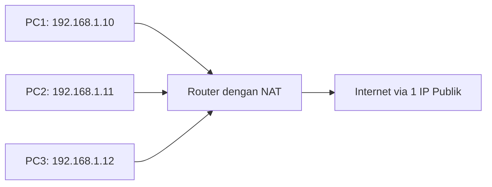
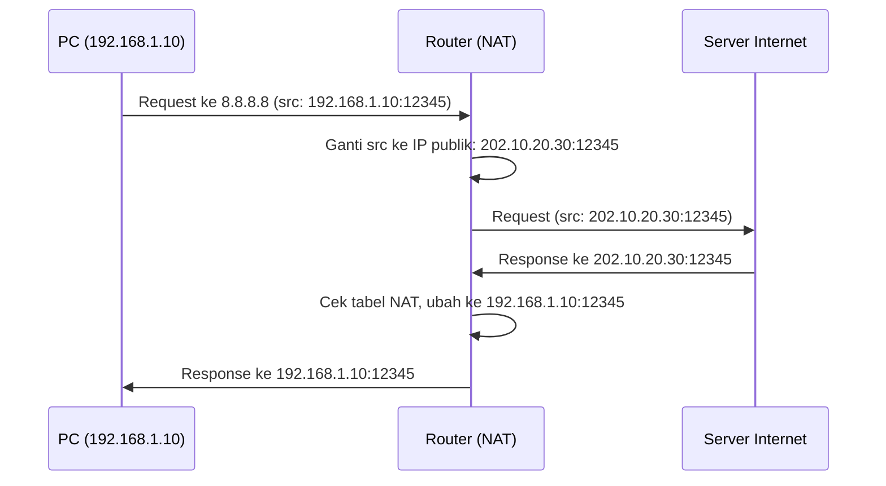
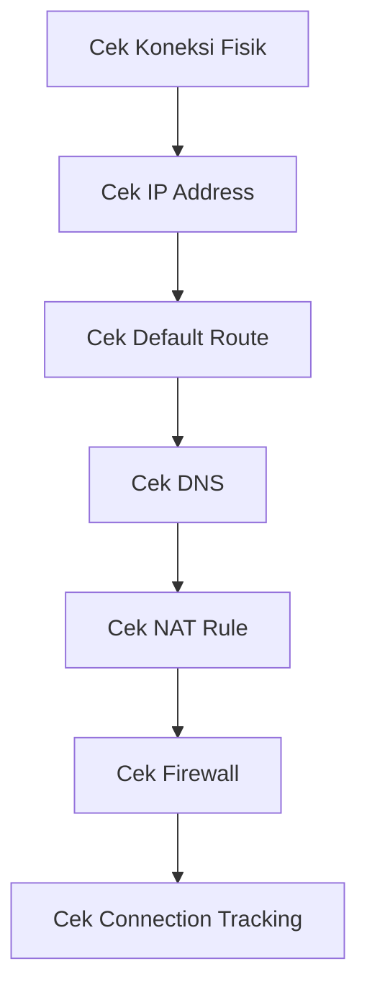
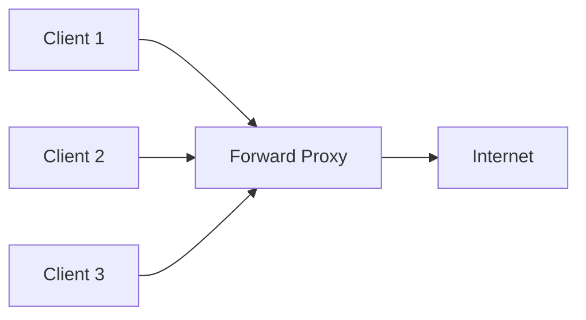
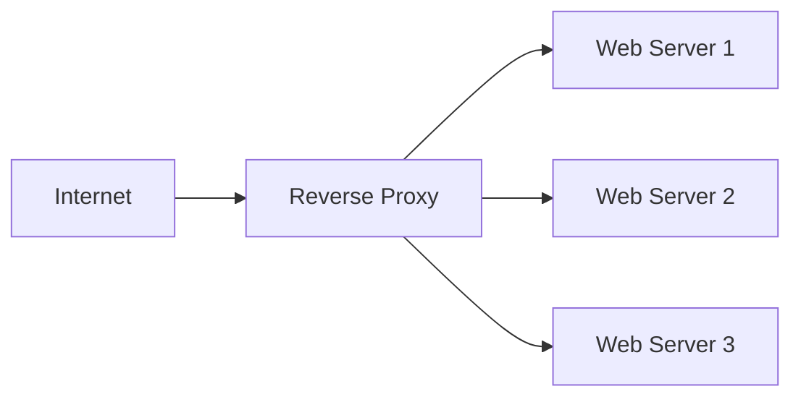

# 📘 PEMASANGAN DAN KONFIGURASI PERANGKAT JARINGAN
## Kelas XII – Semester 1 (Ganjil)

> **Fokus Pembelajaran:** NAT, Internet Gateway, Proxy Server, Manajemen Bandwidth, dan Load Balancing.

---

# 📑 DAFTAR ISI (Klik untuk Navigasi)

## [BAB 12: Konsep NAT (Network Address Translation)](#bab-12-konsep-nat-network-address-translation)
- [12.1 Pengertian NAT](#121-pengertian-nat)
- [12.2 Fungsi dan Manfaat NAT](#122-fungsi-dan-manfaat-nat)
- [12.3 Jenis-jenis NAT](#123-jenis-jenis-nat)
- [12.4 Cara Kerja NAT](#124-cara-kerja-nat)
- [12.5 Kelebihan dan Kekurangan NAT](#125-kelebihan-dan-kekurangan-nat)
- [12.6 Latihan Soal](#126-latihan-soal)

## [BAB 13: Konfigurasi NAT di Router](#bab-13-konfigurasi-nat-di-router)
- [13.1 Konfigurasi NAT di MikroTik](#131-konfigurasi-nat-di-mikrotik)
- [13.2 Konfigurasi NAT di Cisco](#132-konfigurasi-nat-di-cisco)
- [13.3 Konfigurasi Port Forwarding / Destination NAT](#133-konfigurasi-port-forwarding--destination-nat)
- [13.4 Konfigurasi Internet Gateway Sederhana](#134-konfigurasi-internet-gateway-sederhana)
- [13.5 Verifikasi dan Pengujian NAT](#135-verifikasi-dan-pengujian-nat)
- [13.6 Praktikum Konfigurasi NAT](#136-praktikum-konfigurasi-nat)

## [BAB 14: Analisis & Perbaikan Internet Gateway & NAT](#bab-14-analisis--perbaikan-internet-gateway--nat)
- [14.1 Masalah Umum pada NAT dan Gateway](#141-masalah-umum-pada-nat-dan-gateway)
- [14.2 Troubleshooting NAT Masquerade / Src-Nat](#142-troubleshooting-nat-masquerade--src-nat)
- [14.3 Troubleshooting Port Forwarding / Dst-Nat](#143-troubleshooting-port-forwarding--dst-nat)
- [14.4 Studi Kasus Troubleshooting NAT](#144-studi-kasus-troubleshooting-nat)
- [14.5 Praktikum Troubleshooting NAT](#145-praktikum-troubleshooting-nat)

## [BAB 15: Pengenalan dan Konsep Proxy Server](#bab-15-pengenalan-dan-konsep-proxy-server)
- [15.1 Pengertian Proxy Server](#151-pengertian-proxy-server)
- [15.2 Fungsi dan Manfaat Proxy Server](#152-fungsi-dan-manfaat-proxy-server)
- [15.3 Forward Proxy vs Reverse Proxy](#153-forward-proxy-vs-reverse-proxy)
- [15.4 Transparent Proxy vs Non-Transparent Proxy](#154-transparent-proxy-vs-non-transparent-proxy)
- [15.5 Komponen Proxy Server](#155-komponen-proxy-server)
- [15.6 Jenis-jenis Proxy Berdasarkan Protokol](#156-jenis-jenis-proxy-berdasarkan-protokol)
- [15.7 Latihan Soal](#157-latihan-soal)

## [BAB 16: Konfigurasi Proxy Server](#bab-16-konfigurasi-proxy-server)
- [16.1 Instalasi Proxy Server (Squid di Linux)](#161-instalasi-proxy-server-squid-di-linux)
- [16.2 Konfigurasi Dasar Squid](#162-konfigurasi-dasar-squid)
- [16.3 Konfigurasi Web Proxy di MikroTik](#163-konfigurasi-web-proxy-di-mikrotik)
- [16.4 Transparent Proxy](#164-transparent-proxy)
- [16.5 Filtering Konten dengan Proxy](#165-filtering-konten-dengan-proxy)
- [16.6 Verifikasi dan Pengujian Proxy](#166-verifikasi-dan-pengujian-proxy)
- [16.7 Praktikum Konfigurasi Proxy](#167-praktikum-konfigurasi-proxy)

## [BAB 17: Analisis & Perbaikan Konfigurasi Proxy](#bab-17-analisis--perbaikan-konfigurasi-proxy)
- [17.1 Masalah Umum pada Proxy Server](#171-masalah-umum-pada-proxy-server)
- [17.2 Troubleshooting Proxy](#172-troubleshooting-proxy)
- [17.3 Studi Kasus Troubleshooting Proxy](#173-studi-kasus-troubleshooting-proxy)
- [17.4 Praktikum Troubleshooting Proxy](#174-praktikum-troubleshooting-proxy)

## [Ringkasan Materi Semester 1](#-ringkasan-materi-semester-1)
## [Daftar Pustaka](#-daftar-pustaka)
## [Glosarium](#-glosarium)

---

# BAB 12: Konsep NAT (Network Address Translation)

[🔝 Kembali ke Daftar Isi](#-daftar-isi-klik-untuk-navigasi)

## 12.1 Pengertian NAT

### A. Definisi NAT

**NAT (Network Address Translation)** adalah teknologi yang memungkinkan pengubahan alamat IP (Internet Protocol) saat paket data melewati perangkat router atau firewall. NAT memungkinkan beberapa perangkat dalam jaringan lokal (LAN) menggunakan satu alamat IP publik untuk mengakses internet .

### B. Mengapa NAT Dibutuhkan?



| **Masalah** | **Solusi dengan NAT** |
|:---|:---|
| Keterbatasan IPv4 (hanya ~4.3 miliar) | Satu IP publik untuk banyak perangkat |
| Keamanan | IP private tidak terekspos ke internet |
| Efisiensi | Menghemat penggunaan IP publik |

### C. Istilah Penting dalam NAT

| **Istilah** | **Penjelasan** | **Contoh** |
|:---|:---|:---|
| **Inside Local** | IP perangkat di jaringan lokal | 192.168.1.10 |
| **Inside Global** | IP publik hasil NAT | 202.10.20.30 |
| **Outside Local** | IP tujuan dari sisi LAN | 10.0.0.1 |
| **Outside Global** | IP tujuan dari sisi WAN | 8.8.8.8 |

---

## 12.2 Fungsi dan Manfaat NAT

### A. Fungsi NAT

| **Fungsi** | **Penjelasan** |
|:---|:---|
| **Menghemat IP Publik** | Satu IP publik digunakan oleh banyak perangkat |
| **Menyembunyikan IP Private** | Meningkatkan keamanan jaringan |
| **Mengatur Lalu Lintas** | Port forwarding untuk layanan tertentu |
| **Load Sharing** | Mendistribusikan traffic ke beberapa server |

### B. Manfaat NAT

| **Manfaat** | **Penjelasan** |
|:---|:---|
| **Keamanan** | Perangkat internal tidak langsung terlihat dari luar  |
| **Efisiensi Biaya** | Tidak perlu membeli IP publik untuk setiap perangkat |
| **Fleksibilitas** | Mudah mengubah ISP tanpa mengubah IP internal |
| **Skalabilitas** | Mudah menambah perangkat baru |

---

## 12.3 Jenis-jenis NAT

### A. Berdasarkan Tipe Translasi

| **Jenis NAT** | **Penjelasan** | **Penggunaan** |
|:---|:---|:---|
| **Static NAT** | 1 IP private ↔ 1 IP publik (1:1) | Server yang perlu akses dari luar |
| **Dynamic NAT** | IP private ↔ IP publik dari pool | Perusahaan dengan beberapa IP publik |
| **PAT / NAT Overload** | Banyak IP private ↔ 1 IP publik (many:1) | Sharing internet di rumah/kantor |

### B. Berdasarkan Arah Paket

| **Jenis NAT** | **Penjelasan** | **Contoh Penggunaan** |
|:---|:---|:---|
| **Source NAT (SNAT)** | Mengubah IP sumber | PC ke internet (masquerade) |
| **Destination NAT (DNAT)** | Mengubah IP tujuan | Port forwarding ke server |

### C. Ilustrasi Jenis NAT

```
Static NAT (1:1):
192.168.1.10 ↔ 202.10.20.30 (server web)

Dynamic NAT (Pool):
192.168.1.10 → 202.10.20.30
192.168.1.11 → 202.10.20.31
192.168.1.12 → 202.10.20.32

PAT/NAT Overload (Many:1):
192.168.1.10 → 202.10.20.30:12345
192.168.1.11 → 202.10.20.30:12346
192.168.1.12 → 202.10.20.30:12347
```

---

## 12.4 Cara Kerja NAT

### A. Proses NAT (PAT/Masquerade)



### B. Tabel NAT (NAT Table)

| **Inside Local** | **Inside Global** | **Outside Global** | **Port** |
|:---|:---|:---|:---|
| 192.168.1.10 | 202.10.20.30 | 8.8.8.8 | 12345 |
| 192.168.1.11 | 202.10.20.30 | 142.250.185.46 | 12346 |
| 192.168.1.12 | 202.10.20.30 | 13.107.42.14 | 12347 |

---

## 12.5 Kelebihan dan Kekurangan NAT

### A. Kelebihan NAT

| **Kelebihan** | **Penjelasan** |
|:---|:---|
| **Hemat IP** | Satu IP publik untuk banyak perangkat |
| **Keamanan** | Perangkat internal tersembunyi |
| **Mudah** | Konfigurasi sederhana |
| **Kompatibel** | Mendukung semua protokol |

### B. Kekurangan NAT

| **Kekurangan** | **Penjelasan** |
|:---|:---|
| **Masalah Peer-to-Peer** | Sulit untuk aplikasi yang butuh koneksi langsung |
| **Delay** | Proses translasi menambah latency |
| **Troubleshooting** | Sulit melacak koneksi dari luar |
| **IPv6** | NAT tidak diperlukan di IPv6 |

---

## 12.6 Latihan Soal

### Soal Pilihan Ganda

1. **Apa fungsi utama NAT?**
   - A. Mengubah alamat MAC Address
   - B. Mengubah alamat IP private ke public
   - C. Mempercepat koneksi internet
   - D. Mengenkripsi data

2. **Jenis NAT mana yang menggunakan satu IP publik untuk banyak perangkat?**
   - A. Static NAT
   - B. Dynamic NAT
   - C. PAT/NAT Overload
   - D. Destination NAT

### Soal Essay

1. **Jelaskan perbedaan antara Static NAT dan PAT!**
2. **Gambarkan cara kerja NAT masquerade pada sebuah jaringan!**
3. **Apa yang dimaksud dengan Inside Local dan Inside Global address?**

---

# BAB 13: Konfigurasi NAT di Router

[🔝 Kembali ke Daftar Isi](#-daftar-isi-klik-untuk-navigasi)

## 13.1 Konfigurasi NAT di MikroTik

### A. NAT Masquerade (Internet Sharing)

**Topologi:**
```
[PC: 192.168.1.10] --- [MikroTik Router] --- [Internet]
     └── LAN: 192.168.1.1/24       └── WAN: 10.0.0.2/24
```

**Langkah Konfigurasi:**

```bash
# 1. Setting IP Address di interface
/ip address add address=192.168.1.1/24 interface=ether2
/ip address add address=10.0.0.2/24 interface=ether1

# 2. Setting DNS
/ip dns set primary-dns=8.8.8.8 secondary-dns=1.1.1.1

# 3. Setting Default Route
/ip route add gateway=10.0.0.1

# 4. Setting NAT Masquerade
/ip firewall nat add chain=srcnat out-interface=ether1 action=masquerade

# 5. Setting DHCP Server (opsional)
/ip pool add name=dhcp-pool ranges=192.168.1.100-192.168.1.200
/ip dhcp-server add interface=ether2 address-pool=dhcp-pool
/ip dhcp-server network add address=192.168.1.0/24 gateway=192.168.1.1 dns-server=8.8.8.8
/ip dhcp-server enable [find]
```

### B. NAT Masquerade dengan Address List

```bash
# Membuat address list untuk network yang akan di-NAT
/ip firewall address-list add list=local-networks address=192.168.1.0/24
/ip firewall address-list add list=local-networks address=172.16.1.0/24

# NAT Masquerade berdasarkan address-list
/ip firewall nat add chain=srcnat src-address-list=local-networks out-interface=ether1 action=masquerade
```

### C. NAT dengan Source NAT (Src-Nat)

```bash
# Untuk multiple IP publik di WAN
/ip firewall nat add chain=srcnat out-interface=ether1 action=src-nat to-addresses=10.0.0.3-10.0.0.7
```

### D. Verifikasi NAT MikroTik

```bash
# Cek NAT rules
/ip firewall nat print

# Cek koneksi NAT aktif
/ip firewall nat print detail

# Cek connection tracking
/ip firewall connection print

# Cek traffic NAT
/interface monitor-traffic ether1
```

---

## 13.2 Konfigurasi NAT di Cisco

### A. NAT Masquerade (PAT)

**Topologi:**
```
[PC: 192.168.1.10] --- [Cisco Router] --- [Internet]
     └── Fa0/0: 192.168.1.1/24   └── Fa0/1: 10.0.0.2/24
```

**Langkah Konfigurasi:**

```bash
Router> enable
Router# configure terminal
Router(config)# hostname R1

# 1. Konfigurasi Interface
R1(config)# interface fastEthernet 0/0
R1(config-if)# ip address 192.168.1.1 255.255.255.0
R1(config-if)# ip nat inside
R1(config-if)# no shutdown
R1(config-if)# exit

R1(config)# interface fastEthernet 0/1
R1(config-if)# ip address 10.0.0.2 255.255.255.0
R1(config-if)# ip nat outside
R1(config-if)# no shutdown
R1(config-if)# exit

# 2. Default Route
R1(config)# ip route 0.0.0.0 0.0.0.0 10.0.0.1

# 3. NAT Overload (PAT)
R1(config)# ip nat pool nat-pool 10.0.0.2 10.0.0.2 netmask 255.255.255.0
R1(config)# access-list 1 permit 192.168.1.0 0.0.0.255
R1(config)# ip nat inside source list 1 pool nat-pool overload

# Simpan konfigurasi
R1# copy running-config startup-config
```

### B. Verifikasi NAT Cisco

```bash
# Cek NAT translation
R1# show ip nat translations

# Cek NAT statistics
R1# show ip nat statistics

# Debug NAT
R1# debug ip nat
```

---

## 13.3 Konfigurasi Port Forwarding / Destination NAT

### A. Pengertian Port Forwarding

**Port Forwarding (Destination NAT)** adalah teknik meneruskan traffic dari port tertentu di IP publik ke IP dan port tertentu di jaringan internal .

### B. Konfigurasi Port Forwarding di MikroTik

**Skenario:** Forward port 80 (HTTP) dan 443 (HTTPS) ke server web 192.168.1.100

```bash
# 1. Destination NAT (DNAT)
/ip firewall nat add chain=dstnat in-interface=ether1 protocol=tcp dst-port=80 action=dst-nat to-addresses=192.168.1.100 to-ports=80
/ip firewall nat add chain=dstnat in-interface=ether1 protocol=tcp dst-port=443 action=dst-nat to-addresses=192.168.1.100 to-ports=443

# 2. Source NAT untuk return traffic
/ip firewall nat add chain=srcnat src-address=192.168.1.100 out-interface=ether1 action=masquerade
```

**Menggunakan Port Berbeda:**

```bash
# Forward port 8080 public ke port 80 internal
/ip firewall nat add chain=dstnat in-interface=ether1 protocol=tcp dst-port=8080 action=dst-nat to-addresses=192.168.1.100 to-ports=80
```

### C. Konfigurasi Port Forwarding di Cisco

```bash
# 1. Static NAT (1:1)
R1(config)# ip nat inside source static 192.168.1.100 10.0.0.3

# 2. Port Forwarding (PAT)
R1(config)# ip nat inside source static tcp 192.168.1.100 80 10.0.0.2 80
R1(config)# ip nat inside source static tcp 192.168.1.100 443 10.0.0.2 443
```

---

## 13.4 Konfigurasi Internet Gateway Sederhana

### A. Topologi Gateway

```
[PC1: 192.168.1.10] ─┐
[PC2: 192.168.1.11] ─┼─ [Gateway: 192.168.1.1] ─ [Internet]
[PC3: 192.168.1.12] ─┘
```

### B. Konfigurasi Lengkap MikroTik

```bash
# 1. Reset config
/system reset-configuration

# 2. Interface naming
/interface ethernet set ether1 name=WAN
/interface ethernet set ether2 name=LAN

# 3. IP Address
/ip address add address=10.0.0.2/24 interface=WAN
/ip address add address=192.168.1.1/24 interface=LAN

# 4. DNS
/ip dns set primary-dns=8.8.8.8 secondary-dns=1.1.1.1

# 5. Default Route
/ip route add gateway=10.0.0.1

# 6. NAT Masquerade
/ip firewall nat add chain=srcnat out-interface=WAN action=masquerade

# 7. DHCP Server
/ip pool add name=dhcp-pool ranges=192.168.1.100-192.168.1.200
/ip dhcp-server add interface=LAN address-pool=dhcp-pool
/ip dhcp-server network add address=192.168.1.0/24 gateway=192.168.1.1 dns-server=8.8.8.8
/ip dhcp-server enable [find]

# 8. Firewall (optional)
/ip firewall filter add chain=input connection-state=established,related action=accept
/ip firewall filter add chain=input in-interface=WAN action=drop
```

---

## 13.5 Verifikasi dan Pengujian NAT

### A. Verifikasi di MikroTik

```bash
# 1. Cek apakah NAT berfungsi
/ip firewall nat print

# Output yang diharapkan:
# Flags: X - disabled, I - invalid, D - dynamic 
# 0   chain=srcnat out-interface=WAN action=masquerade

# 2. Cek koneksi NAT aktif
/ip firewall connection print

# 3. Cek ARP
/ip arp print

# 4. Ping ke internet dari router
/ping 8.8.8.8

# 5. Ping dari client ke internet
/ping src-address=192.168.1.10 8.8.8.8
```

### B. Verifikasi di Cisco

```bash
# 1. Cek NAT translations
R1# show ip nat translations

# Output yang diharapkan:
# Pro Inside global     Inside local     Outside local    Outside global
# icmp 10.0.0.2:12345  192.168.1.10:12345 8.8.8.8:12345   8.8.8.8:12345

# 2. Cek NAT statistics
R1# show ip nat statistics

# 3. Cek interface status
R1# show ip interface brief
```

### C. Pengujian dari Client

```bash
# Dari PC dengan IP 192.168.1.10:
ping 8.8.8.8
tracert 8.8.8.8
# Buka browser, akses google.com
```

---

## 13.6 Praktikum Konfigurasi NAT

### Praktikum 1: NAT Masquerade Sederhana

**Tujuan:** Membagikan internet dari router ke client.

**Topologi:**
```
[PC] --- [Router MikroTik] --- [Internet]
       192.168.1.0/24
```

**Tugas:**
1. Konfigurasi router dengan NAT masquerade
2. Setting DHCP di router
3. Tes koneksi dari PC

### Praktikum 2: Port Forwarding

**Tujuan:** Membuat server web dapat diakses dari internet.

**Topologi:**
```
[Web Server: 192.168.1.100] --- [Router] --- [Internet]
```

**Tugas:**
1. Konfigurasi port forwarding port 80 ke server
2. Tes akses dari internet

### Praktikum 3: NAT dengan 2 ISP (Failover)

**Tujuan:** Konfigurasi NAT dengan 2 jalur internet.

**Topologi:**
```
[Router] --- ISP1 (primary)
      |
      └──── ISP2 (backup)
```

**Tugas:**
1. Konfigurasi 2 default route
2. Setting NAT untuk kedua ISP
3. Tes failover

---

# BAB 14: Analisis & Perbaikan Internet Gateway & NAT

[🔝 Kembali ke Daftar Isi](#-daftar-isi-klik-untuk-navigasi)

## 14.1 Masalah Umum pada NAT dan Gateway

### A. Kategori Masalah NAT

| **Kategori** | **Masalah** | **Gejala** |
|:---|:---|:---|
| **Konfigurasi** | NAT rule salah | Client tidak bisa browsing |
| **Routing** | Default route hilang | Ping ke internet gagal |
| **Firewall** | Firewall block | Koneksi ditolak |
| **DNS** | DNS tidak bisa resolve | Browsing gagal, ping IP bisa |
| **Koneksi** | Interface down | Tidak ada koneksi |

### B. Tabel Masalah dan Solusi

| **Masalah** | **Penyebab** | **Solusi** |
|:---|:---|:---|
| **Client tidak bisa browsing** | NAT tidak aktif | Cek NAT rule |
| **Ping ke internet gagal** | Default route tidak ada | Tambahkan default route |
| **Website tidak bisa diakses** | DNS salah | Cek DNS server |
| **Port forwarding tidak jalan** | Dst-Nat salah | Cek rule port forwarding |
| **Koneksi terputus-putus** | ISP bermasalah | Cek koneksi ISP |

---

## 14.2 Troubleshooting NAT Masquerade / Src-Nat

### A. Langkah Troubleshooting



### B. Contoh Kasus dan Solusi

#### Kasus 1: Client Tidak Bisa Browsing

**Masalah:** Client di LAN tidak bisa mengakses internet.

**Analisis:**
```bash
# 1. Cek IP Client
# PC: 192.168.1.10/24 ✅

# 2. Ping ke gateway
ping 192.168.1.1
Reply ✅

# 3. Ping ke internet (IP)
ping 8.8.8.8
Request timed out ❌

# 4. Cek routing router
/ip route print
# Tidak ada default route! ❌
```

**Diagnosis:** Default route hilang

**Solusi:**
```bash
/ip route add gateway=10.0.0.1
/ping 8.8.8.8
Reply ✅
```

#### Kasus 2: NAT Tidak Berfungsi

**Masalah:** NAT rule sudah dibuat tapi tidak bekerja.

**Analisis:**
```bash
# 1. Cek NAT rule
/ip firewall nat print
# 0   chain=srcnat action=masquerade ❌ (disabled)

# 2. Cek apakah rule aktif
/ip firewall nat print detail
# flags: X - disabled ❌
```

**Diagnosis:** NAT rule disabled

**Solusi:**
```bash
/ip firewall nat enable 0
```

#### Kasus 3: NAT Rule Salah Interface

**Masalah:** Client tidak bisa browsing, tapi NAT rule ada.

**Analisis:**
```bash
# Cek NAT rule
/ip firewall nat print
# chain=srcnat out-interface=ether2 action=masquerade ❌

# Cek interface
/interface print
# ether1 = WAN
# ether2 = LAN ❌ (salah!)
```

**Diagnosis:** Out-interface salah (seharusnya WAN)

**Solusi:**
```bash
/ip firewall nat set 0 out-interface=ether1
```

---

## 14.3 Troubleshooting Port Forwarding / Dst-Nat

### A. Langkah Troubleshooting Port Forwarding

```bash
# 1. Cek DNAT rule
/ip firewall nat print where chain=dstnat

# 2. Cek apakah port terbuka
/tool netstat

# 3. Cek dari luar
/tool mac-telnet 10.0.0.2 80

# 4. Cek connection tracking
/ip firewall connection print where protocol=tcp dst-port=80
```

### B. Contoh Kasus Port Forwarding

#### Kasus 1: Port Forwarding Tidak Bekerja

**Masalah:** Server web (192.168.1.100:80) tidak bisa diakses dari internet.

**Analisis:**
```bash
# 1. Cek DNAT rule
/ip firewall nat print
# chain=dstnat in-interface=ether1 protocol=tcp dst-port=80 action=dst-nat to-addresses=192.168.1.101 ❌

# 2. Cek IP server
/ping 192.168.1.100
# ✅

# 3. Cek port di server
/tool netstat | grep 80
# ❌ Tidak ada service di port 80
```

**Diagnosis:** 
1. IP server salah (192.168.1.101, seharusnya 192.168.1.100)
2. Web server tidak berjalan

**Solusi:**
```bash
# 1. Perbaiki DNAT
/ip firewall nat set 0 to-addresses=192.168.1.100

# 2. Nyalakan web server di server
```

#### Kasus 2: Return Traffic Tidak Kembali

**Masalah:** Request masuk ke server, tapi response tidak sampai.

**Analisis:**
```bash
# 1. Cek apakah request masuk
/ip firewall connection print where protocol=tcp dst-address=192.168.1.100
# ❌ Tidak ada koneksi ke server

# 2. Cek src-nat untuk return traffic
/ip firewall nat print
# Tidak ada src-nat untuk server ❌
```

**Diagnosis:** Tidak ada src-nat untuk return traffic

**Solusi:**
```bash
/ip firewall nat add chain=srcnat src-address=192.168.1.100 out-interface=ether1 action=masquerade
```

---

## 14.4 Studi Kasus Troubleshooting NAT

### Kasus 1: Internet Gateway Down

**Masalah:** Semua client tidak bisa mengakses internet.

**Gejala:**
- Client tidak bisa ping ke 8.8.8.8
- Router bisa ping ke 8.8.8.8

**Analisis:**
```bash
# 1. Cek IP Client
# 192.168.1.10/24 ✅

# 2. Ping ke gateway
ping 192.168.1.1 ✅

# 3. Ping ke internet
ping 8.8.8.8 ❌

# 4. Cek NAT di router
/ip firewall nat print
# 0   chain=srcnat action=masquerade ✅

# 5. Cek IP router
/ip address print
# WAN: 10.0.0.2/24 ✅
# LAN: 192.168.1.1/24 ✅

# 6. Cek default route
/ip route print
# Tidak ada default route! ❌
```

**Diagnosis:** Default route hilang

**Solusi:**
```bash
/ip route add gateway=10.0.0.1
# Internet kembali normal ✅
```

### Kasus 2: Port Forwarding FTP

**Masalah:** Server FTP (port 21) tidak bisa diakses dari luar.

**Analisis:**
```bash
# 1. Cek DNAT
/ip firewall nat print
# chain=dstnat in-interface=ether1 protocol=tcp dst-port=21 action=dst-nat to-addresses=192.168.1.100 to-ports=21 ✅

# 2. Cek dari luar
/tool netstat | grep 21
# ❌ Tidak ada koneksi

# 3. Cek FTP server
/ping 192.168.1.100 ✅
# Cek apakah FTP server aktif di port 21
```

**Diagnosis:** FTP server tidak aktif

**Solusi:**
1. Nyalakan FTP server
2. Pastikan port 21 terbuka di server
3. Cek firewall server

---

## 14.5 Praktikum Troubleshooting NAT

### Praktikum 1: Troubleshooting Internet Gateway

**Skenario:** Jaringan client tidak bisa internet.

**Tugas:**
1. Identifikasi masalah
2. Perbaiki konfigurasi
3. Verifikasi

### Praktikum 2: Troubleshooting Port Forwarding

**Skenario:** Server web tidak bisa diakses dari internet.

**Tugas:**
1. Identifikasi masalah
2. Perbaiki konfigurasi
3. Verifikasi

### Praktikum 3: Troubleshooting NAT Komprehensif

**Skenario:** Gabungan masalah NAT, routing, dan firewall.

**Tugas:**
1. Identifikasi semua masalah
2. Buat laporan troubleshooting
3. Perbaiki semua masalah
4. Verifikasi end-to-end connectivity

---

# BAB 15: Pengenalan dan Konsep Proxy Server

[🔝 Kembali ke Daftar Isi](#-daftar-isi-klik-untuk-navigasi)

## 15.1 Pengertian Proxy Server

### A. Definisi Proxy Server

**Proxy Server** adalah server yang bertindak sebagai perantara (intermediary) antara client dan server tujuan. Proxy menerima request dari client, meneruskannya ke server tujuan, dan mengembalikan response ke client .


### B. Istilah Penting

| **Istilah** | **Penjelasan** |
|:---|:---|
| **Proxy** | Perantara antara client dan server |
| **Proxy Server** | Server yang menjalankan layanan proxy |
| **Forward Proxy** | Proxy untuk client (user) |
| **Reverse Proxy** | Proxy untuk server (website) |
| **Transparent Proxy** | Proxy yang tidak perlu konfigurasi di client |

---

## 15.2 Fungsi dan Manfaat Proxy Server

### A. Fungsi Proxy Server

| **Fungsi** | **Penjelasan** |
|:---|:---|
| **Cache** | Menyimpan konten yang sering diakses untuk akses lebih cepat |
| **Filtering** | Memblokir akses ke situs tertentu  |
| **Authentication** | Mengatur siapa yang boleh akses internet |
| **Logging** | Mencatat aktivitas browsing user |
| **Bandwidth Saving** | Menghemat bandwidth dengan cache |
| **Anonymity** | Menyembunyikan IP client |

### B. Manfaat Proxy Server

| **Manfaat** | **Penjelasan** |
|:---|:---|
| **Kecepatan Akses** | Cache membuat akses lebih cepat |
| **Keamanan** | Menyembunyikan IP internal |
| **Kontrol Akses** | Membatasi akses ke situs tertentu |
| **Monitoring** | Memantau aktivitas user |
| **Efisiensi Bandwidth** | Mengurangi traffic internet |

---

## 15.3 Forward Proxy vs Reverse Proxy

### A. Forward Proxy

**Forward Proxy** melayani permintaan dari client ke internet.



| **Karakteristik** | **Penjelasan** |
|:---|:---|
| **Arah** | Client → Proxy → Internet |
| **Tujuan** | Untuk client (user) |
| **Fungsi** | Cache, filtering, anonymity |
| **Contoh** | Squid, Web Proxy MikroTik |

### B. Reverse Proxy

**Reverse Proxy** melayani permintaan dari internet ke server internal.



| **Karakteristik** | **Penjelasan** |
|:---|:---|
| **Arah** | Internet → Proxy → Server |
| **Tujuan** | Untuk server (backend) |
| **Fungsi** | Load balancing, security, SSL termination |
| **Contoh** | Nginx, HAProxy |

---

## 15.4 Transparent Proxy vs Non-Transparent Proxy

### A. Transparent Proxy

**Transparent Proxy** adalah proxy yang tidak memerlukan konfigurasi di sisi client.


| **Karakteristik** | **Penjelasan** |
|:---|:---|
| **Konfigurasi Client** | Tidak perlu |
| **Cara Kerja** | Redirect traffic via router |
| **Keuntungan** | Mudah implementasi |
| **Kekurangan** | Tidak ada autentikasi user |

### B. Non-Transparent Proxy

**Non-Transparent Proxy** memerlukan konfigurasi manual di sisi client.


| **Karakteristik** | **Penjelasan** |
|:---|:---|
| **Konfigurasi Client** | Perlu setting proxy di browser |
| **Autentikasi** | Bisa dengan username/password |
| **Keuntungan** | Kontrol user lebih baik |
| **Kekurangan** | Setiap client harus dikonfigurasi |

---

## 15.5 Komponen Proxy Server

### A. Komponen Utama

| **Komponen** | **Fungsi** | **Contoh** |
|:---|:---|:---|
| **Cache Manager** | Menyimpan dan mengelola cache | Squid cache manager |
| **Filter Engine** | Memfilter konten | URL filtering, keyword filtering |
| **Authentication Module** | Autentikasi user | LDAP, RADIUS |
| **Logging Module** | Mencatat aktivitas | Access log, error log |
| **Bandwidth Manager** | Mengatur bandwidth | Queue, traffic shaping |

### B. Contoh Proxy Server

| **Proxy Server** | **Platform** | **Keunggulan** |
|:---|:---|:---|
| **Squid** | Linux/Unix | Open source, powerful |
| **Web Proxy MikroTik** | RouterOS | Terintegrasi dengan router |
| **Nginx** | Linux/Unix | Reverse proxy, load balancer |
| **Apache** | Linux/Unix | Proxy dan web server |
| **Proxy Server Windows** | Windows | Mudah digunakan |

---

## 15.6 Jenis-jenis Proxy Berdasarkan Protokol

| **Jenis Proxy** | **Protokol** | **Penggunaan** |
|:---|:---|:---|
| **HTTP Proxy** | HTTP | Web browsing |
| **HTTPS Proxy** | HTTPS | Web browsing aman |
| **FTP Proxy** | FTP | Transfer file |
| **SOCKS Proxy** | SOCKS | Aplikasi apa saja |
| **SMTP Proxy** | SMTP | Email |

---

## 15.7 Latihan Soal

### Soal Pilihan Ganda

1. **Apa fungsi utama proxy server?**
   - A. Mempercepat koneksi internet
   - B. Bertindak sebagai perantara client dan server
   - C. Mengubah alamat IP
   - D. Mengenkripsi data

2. **Jenis proxy yang tidak memerlukan konfigurasi di client adalah?**
   - A. Forward Proxy
   - B. Reverse Proxy
   - C. Transparent Proxy
   - D. Non-Transparent Proxy

### Soal Essay

1. **Jelaskan perbedaan antara Forward Proxy dan Reverse Proxy!**
2. **Apa kelebihan menggunakan transparent proxy?**
3. **Sebutkan 5 manfaat proxy server!**

---

# BAB 16: Konfigurasi Proxy Server

[🔝 Kembali ke Daftar Isi](#-daftar-isi-klik-untuk-navigasi)

## 16.1 Instalasi Proxy Server (Squid di Linux)

### A. Persiapan

**Sistem:** Ubuntu Server / Debian

**Spesifikasi Minimal:**
- RAM: 512 MB
- Disk: 10 GB
- Network: 2 NIC

### B. Instalasi Squid

```bash
# Update repository
sudo apt update

# Instal Squid
sudo apt install squid -y

# Cek versi Squid
squid -v

# Cek status service
sudo systemctl status squid
```

### C. Konfigurasi Dasar Squid

**File Konfigurasi:** `/etc/squid/squid.conf`

```bash
# Backup konfigurasi default
sudo cp /etc/squid/squid.conf /etc/squid/squid.conf.bak

# Edit konfigurasi
sudo nano /etc/squid/squid.conf
```

### D. Konfigurasi Dasar

```bash
# 1. Port yang digunakan
http_port 3128

# 2. Cache directory
cache_dir ufs /var/spool/squid 100 16 256

# 3. Log
access_log /var/log/squid/access.log
cache_log /var/log/squid/cache.log

# 4. ACL - Access Control List
acl localnet src 192.168.1.0/24
acl localnet src 172.16.0.0/12
acl localnet src 10.0.0.0/8

# 5. Izin akses
http_access allow localnet
http_access deny all

# 6. Cache settings
cache_mem 256 MB
maximum_object_size_in_memory 512 KB
maximum_object_size 4096 KB
```

### E. Restart Squid

```bash
# Cek konfigurasi
sudo squid -k parse

# Restart service
sudo systemctl restart squid

# Enable auto-start
sudo systemctl enable squid
```

---

## 16.2 Konfigurasi Dasar Squid

### A. ACL (Access Control List)

**ACL** digunakan untuk mengatur siapa yang bisa mengakses proxy.

```bash
# ACL berdasarkan IP
acl allow_ip src 192.168.1.0/24
acl allow_ip src 172.16.1.0/24

# ACL berdasarkan waktu
acl office_hours time M-F 08:00-17:00

# ACL berdasarkan domain
acl block_domain dstdomain .youtube.com
acl block_domain dstdomain .facebook.com

# ACL berdasarkan URL
acl block_url url_regex -i ^http://.*\.torrent

# ACL autentikasi
auth_param basic program /usr/lib/squid/basic_ncsa_auth /etc/squid/passwd
acl auth_user proxy_auth REQUIRED
```

### B. Konfigurasi Filtering

```bash
# Memblokir situs
http_access deny block_domain
http_access deny block_url

# Batasi akses berdasarkan waktu
http_access allow office_hours
http_access deny all
```

### C. Konfigurasi Cache

```bash
# Setting cache memory
cache_mem 256 MB

# Object size
maximum_object_size_in_memory 512 KB
maximum_object_size 4 MB

# Cache directory
cache_dir ufs /var/spool/squid 100 16 256

# Cache replacement policy
cache_replacement_policy heap GDSF

# Refresh pattern
refresh_pattern ^ftp:          1440    20%     10080
refresh_pattern ^gopher:       1440    0%      1440
refresh_pattern -i (/cgi-bin/|\?) 0     0%      0
refresh_pattern .               0       20%     4320
```

---

## 16.3 Konfigurasi Web Proxy di MikroTik

### A. Mengaktifkan Web Proxy

```bash
# 1. Aktifkan web proxy
/ip proxy set enabled=yes port=8080

# 2. Setting cache
/ip proxy set cache-size=1000

# 3. Setting parent proxy (jika ada)
/ip proxy set parent-proxy=192.168.1.200 parent-proxy-port=3128

# 4. Verifikasi
/ip proxy print
```

### B. Transparent Proxy di MikroTik

```bash
# 1. Aktifkan web proxy
/ip proxy set enabled=yes port=8080

# 2. Buat NAT redirect
/ip firewall nat add chain=dstnat protocol=tcp dst-port=80 in-interface=LAN action=redirect to-ports=8080
/ip firewall nat add chain=dstnat protocol=tcp dst-port=443 in-interface=LAN action=redirect to-ports=8080

# 3. Setting cache
/ip proxy set cache-size=1000

# 4. Cek status
/ip proxy print
/ip firewall nat print
```

### C. Filtering dengan Web Proxy MikroTik

```bash
# 1. Buat access rule untuk block situs
/ip proxy access add action=deny dst-host=*.youtube.com
/ip proxy access add action=deny dst-host=*.facebook.com
/ip proxy access add action=deny dst-host=*.twitter.com

# 2. Block berdasarkan kata kunci
/ip proxy access add action=deny dst-host=*torrent*

# 3. Allow hanya untuk network tertentu
/ip proxy access add action=allow src-address=192.168.1.0/24
/ip proxy access add action=deny
```

---

## 16.4 Transparent Proxy

### A. Konsep Transparent Proxy

**Transparent Proxy** adalah proxy yang bekerja tanpa perlu konfigurasi di client. Traffic HTTP dan HTTPS di-redirect secara otomatis ke proxy .

### B. Konfigurasi Transparent Proxy dengan Squid

**1. Konfigurasi Squid:**
```bash
# /etc/squid/squid.conf
http_port 3128 transparent
```

**2. Konfigurasi IPTables:**
```bash
# Redirect traffic HTTP
iptables -t nat -A PREROUTING -i eth0 -p tcp --dport 80 -j REDIRECT --to-port 3128

# Redirect traffic HTTPS
iptables -t nat -A PREROUTING -i eth0 -p tcp --dport 443 -j REDIRECT --to-port 3128

# Save configuration
iptables-save > /etc/iptables/rules.v4
```

### C. Konfigurasi Transparent Proxy di MikroTik

```bash
# 1. Aktifkan web proxy
/ip proxy set enabled=yes port=8080

# 2. Setting NAT untuk HTTP
/ip firewall nat add chain=dstnat protocol=tcp dst-port=80 in-interface=LAN action=redirect to-ports=8080

# 3. Setting NAT untuk HTTPS
/ip firewall nat add chain=dstnat protocol=tcp dst-port=443 in-interface=LAN action=redirect to-ports=8080

# 4. Verifikasi
/ip proxy print
/ip firewall nat print
```

---

## 16.5 Filtering Konten dengan Proxy

### A. Filtering di Squid

**1. Memblokir Situs:**
```bash
# Buat file daftar block
sudo nano /etc/squid/blocklist.txt

# Isi dengan domain yang diblokir:
.youtube.com
.facebook.com
.twitter.com
.instagram.com

# Konfigurasi di squid.conf:
acl block_sites dstdomain "/etc/squid/blocklist.txt"
http_access deny block_sites
```

**2. Memblokir Berdasarkan Kata Kunci:**
```bash
# Buat file daftar kata kunci
sudo nano /etc/squid/keyword.txt

# Isi:
torrent
porn
sex
gambling

# Konfigurasi:
acl block_keyword url_regex -i "/etc/squid/keyword.txt"
http_access deny block_keyword
```

**3. Memblokir Berdasarkan MIME Type:**
```bash
acl block_files rep_mime_type application/octet-stream
http_reply_access deny block_files
```

### B. Filtering di MikroTik Web Proxy

```bash
# 1. Block domain
/ip proxy access add action=deny dst-host=*.youtube.com
/ip proxy access add action=deny dst-host=*.facebook.com

# 2. Block berdasarkan kata kunci
/ip proxy access add action=deny dst-host=*porn*
/ip proxy access add action=deny dst-host=*torrent*

# 3. Block berdasarkan konten
/ip proxy access add action=deny dst-host=*exe*
/ip proxy access add action=deny dst-host=*zip*
```

---

## 16.6 Verifikasi dan Pengujian Proxy

### A. Verifikasi di Squid

```bash
# 1. Cek status service
sudo systemctl status squid

# 2. Cek log akses
sudo tail -f /var/log/squid/access.log

# 3. Cek cache log
sudo tail -f /var/log/squid/cache.log

# 4. Cek apakah proxy berfungsi
curl -x http://localhost:3128 http://google.com
```

### B. Verifikasi di MikroTik

```bash
# 1. Cek status proxy
/ip proxy print

# 2. Cek cache yang tersimpan
/ip proxy cache print

# 3. Cek access log
/ip proxy access print

# 4. Monitoring traffic
/ip proxy monitor-traffic

# 5. Cek koneksi active
/ip proxy connections print
```

### C. Pengujian dari Client

```bash
# 1. Set proxy di browser
# Setting → Proxy → Manual Proxy Configuration
# HTTP Proxy: 192.168.1.1, Port: 8080

# 2. Akses website
# Buka google.com, youtube.com

# 3. Cek di log proxy
# Lihat apakah request tercatat di log
```

---

## 16.7 Praktikum Konfigurasi Proxy

### Praktikum 1: Install Squid Proxy

**Tujuan:** Menginstal dan mengkonfigurasi proxy server Squid di Linux.

**Tugas:**
1. Instal Squid
2. Konfigurasi basic
3. Setting ACL
4. Test dari client

### Praktikum 2: Web Proxy MikroTik

**Tujuan:** Mengaktifkan web proxy di MikroTik.

**Tugas:**
1. Aktifkan web proxy
2. Konfigurasi cache
3. Buat filtering
4. Test dari client

### Praktikum 3: Transparent Proxy

**Tujuan:** Mengkonfigurasi transparent proxy.

**Tugas:**
1. Konfigurasi proxy transparent
2. Redirect traffic ke proxy
3. Test tanpa setting di client

### Praktikum 4: Filtering Konten

**Tujuan:** Memblokir akses ke situs tertentu.

**Tugas:**
1. Buat daftar blokir
2. Konfigurasi filtering
3. Test akses ke situs yang diblokir

---

# BAB 17: Analisis & Perbaikan Konfigurasi Proxy

[🔝 Kembali ke Daftar Isi](#-daftar-isi-klik-untuk-navigasi)

## 17.1 Masalah Umum pada Proxy Server

### A. Kategori Masalah Proxy

| **Kategori** | **Masalah** | **Gejala** |
|:---|:---|:---|
| **Koneksi** | Client tidak bisa akses | Browser error |
| **Cache** | Cache tidak bekerja | Kecepatan lambat |
| **Filtering** | Filter tidak jalan | Situs tetap bisa diakses |
| **Performance** | Proxy lambat | Loading lama |
| **Konfigurasi** | Proxy tidak aktif | Service down |

### B. Tabel Masalah dan Solusi

| **Masalah** | **Penyebab** | **Solusi** |
|:---|:---|:---|
| **Proxy tidak berjalan** | Service mati | Restart service |
| **Client tidak bisa akses** | Firewall block | Tambahkan rule firewall |
| **Cache tidak bekerja** | Cache directory penuh | Hapus cache |
| **Filtering tidak jalan** | ACL salah | Perbaiki ACL |
| **Transparent proxy tidak jalan** | NAT rule salah | Perbaiki redirect |
| **Proxy lambat** | Resource penuh | Upgrade hardware |

---

## 17.2 Troubleshooting Proxy

### A. Troubleshooting Squid

```bash
# 1. Cek status service
sudo systemctl status squid

# 2. Cek konfigurasi
sudo squid -k parse

# 3. Cek log error
sudo tail -f /var/log/squid/cache.log

# 4. Cek access log
sudo tail -f /var/log/squid/access.log

# 5. Cek port yang terbuka
sudo netstat -tulpn | grep 3128

# 6. Cek cache
sudo squid -z
```

### B. Troubleshooting MikroTik Web Proxy

```bash
# 1. Cek status proxy
/ip proxy print

# 2. Cek apakah proxy aktif
/ip proxy monitor

# 3. Cek cache
/ip proxy cache print

# 4. Cek access rule
/ip proxy access print

# 5. Cek connection
/ip proxy connections print

# 6. Cek log
/log print where topics~"proxy"
```

---

## 17.3 Studi Kasus Troubleshooting Proxy

### Kasus 1: Transparent Proxy Tidak Bekerja

**Masalah:** Client bisa browsing, tapi tidak terlihat di log proxy.

**Analisis:**
```bash
# 1. Cek apakah proxy aktif
/ip proxy print
# enabled=yes ✅

# 2. Cek NAT redirect
/ip firewall nat print
# chain=dstnat protocol=tcp dst-port=80 action=redirect to-ports=8080 ✅

# 3. Cek apakah ada traffic yang lewat
/ip proxy monitor
# ❌ Tidak ada traffic
```

**Diagnosis:** Client tidak menggunakan gateway router

**Solusi:**
1. Cek gateway client (harus 192.168.1.1)
2. Ubah gateway client

### Kasus 2: Filtering Tidak Bekerja

**Masalah:** Situs youtube.com masih bisa diakses meskipun sudah diblokir.

**Analisis:**
```bash
# 1. Cek access rule
/ip proxy access print
# action=deny dst-host=*.youtube.com ✅

# 2. Cek urutan access rule
/ip proxy access print
# 0   deny *.youtube.com
# 1   allow all ✅ (urutan benar)

# 3. Cek apakah proxy digunakan
# Client menggunakan proxy? 🔍
```

**Diagnosis:** Client menggunakan HTTPS (443), sedangkan proxy hanya untuk HTTP (80)

**Solusi:**
```bash
# Tambahkan NAT untuk HTTPS
/ip firewall nat add chain=dstnat protocol=tcp dst-port=443 in-interface=LAN action=redirect to-ports=8080
```

### Kasus 3: Squid Cache Tidak Bekerja

**Masalah:** Akses ke website tetap lambat.

**Analisis:**
```bash
# 1. Cek cache hit ratio
tail -f /var/log/squid/access.log | grep HIT
# ❌ Tidak ada HIT

# 2. Cek cache directory
ls -la /var/spool/squid/
# Directory kosong ❌

# 3. Cek konfigurasi cache
cat /etc/squid/squid.conf | grep cache
# cache_dir ufs /var/spool/squid 100 16 256
# cache_mem 256 MB
```

**Diagnosis:** Cache directory belum diinisialisasi

**Solusi:**
```bash
# Inisialisasi cache directory
sudo squid -z

# Restart squid
sudo systemctl restart squid

# Cek cache directory
ls -la /var/spool/squid/
# Sekarang ada file cache ✅
```

---

## 17.4 Praktikum Troubleshooting Proxy

### Praktikum 1: Troubleshooting Squid

**Skenario:** Proxy server tidak bisa diakses oleh client.

**Tugas:**
1. Identifikasi masalah
2. Perbaiki konfigurasi
3. Verifikasi

### Praktikum 2: Troubleshooting Transparent Proxy

**Skenario:** Transparent proxy tidak bekerja di jaringan.

**Tugas:**
1. Identifikasi masalah
2. Perbaiki konfigurasi
3. Verifikasi

### Praktikum 3: Troubleshooting Filtering

**Skenario:** Fitur filtering proxy tidak berfungsi.

**Tugas:**
1. Identifikasi masalah
2. Perbaiki konfigurasi
3. Verifikasi

---

# 📝 RINGKASAN MATERI SEMESTER 1

[🔝 Kembali ke Daftar Isi](#-daftar-isi-klik-untuk-navigasi)

## Poin-poin Penting

### 1. NAT (Network Address Translation)

| **Konsep** | **Penjelasan** |
|:---|:---|
| **NAT** | Mengubah IP private ke public |
| **PAT/Masquerade** | Banyak IP private → 1 IP public |
| **Port Forwarding** | Forward port public ke server internal |
| **Static NAT** | 1:1 mapping IP |

### 2. Konfigurasi NAT

**MikroTik:**
```bash
/ip firewall nat add chain=srcnat out-interface=WAN action=masquerade
```

**Cisco:**
```bash
ip nat inside source list 1 pool nat-pool overload
```

### 3. Proxy Server

| **Konsep** | **Penjelasan** |
|:---|:---|
| **Proxy** | Perantara client dan server |
| **Forward Proxy** | Proxy untuk client |
| **Reverse Proxy** | Proxy untuk server |
| **Transparent Proxy** | Tanpa konfigurasi client |

### 4. Konfigurasi Proxy

**Squid:**
```bash
http_port 3128
acl localnet src 192.168.1.0/24
http_access allow localnet
```

**MikroTik Web Proxy:**
```bash
/ip proxy set enabled=yes port=8080
/ip proxy access add action=deny dst-host=*.youtube.com
```

### 5. Troubleshooting

| **Masalah** | **Solusi** |
|:---|:---|
| **NAT tidak jalan** | Cek out-interface |
| **Port forwarding tidak jalan** | Cek DNAT rule |
| **Proxy tidak jalan** | Cek service status |
| **Filtering tidak jalan** | Cek ACL |

---

# 📚 DAFTAR PUSTAKA

[🔝 Kembali ke Daftar Isi](#-daftar-isi-klik-untuk-navigasi)

1. Cisco Systems. (2020). *CCNA 200-301 Official Cert Guide*. Cisco Press.
2. MikroTik. (2021). *MikroTik RouterOS v7 Documentation*. MikroTik.
3. Tanenbaum, A.S. (2019). *Computer Networks (5th Edition)*. Pearson.
4. Kurose, J.F. & Ross, K.W. (2017). *Computer Networking: A Top-Down Approach (7th Edition)*. Pearson.
5. Forouzan, B.A. (2018). *Data Communications and Networking (5th Edition)*. McGraw-Hill.
6. Cisco Networking Academy. (2021). *Introduction to Networks v7.0*.
7. Hidayat, R. (2022). *Jaringan Komputer untuk SMK*. Penerbit Informatika.
8. MikroTik Wiki. (2023). *NAT Configuration*. 
9. Squid Documentation. (2023). *Squid Proxy Server*. 

---

# 📝 GLOSARIUM

[🔝 Kembali ke Daftar Isi](#-daftar-isi-klik-untuk-navigasi)

| **Istilah** | **Arti** |
|:---|:---|
| **ACL (Access Control List)** | Daftar aturan untuk mengatur akses |
| **Cache** | Penyimpanan sementara data |
| **DNAT (Destination NAT)** | NAT yang mengubah alamat tujuan |
| **Forward Proxy** | Proxy untuk client/user |
| **Gateway** | Pintu keluar dari jaringan lokal |
| **Inside Global** | IP publik hasil NAT |
| **Inside Local** | IP private di jaringan lokal |
| **Masquerade** | PAT/NAT Overload di MikroTik |
| **NAT (Network Address Translation)** | Terjemahan alamat IP |
| **PAT (Port Address Translation)** | NAT dengan port |
| **Port Forwarding** | Meneruskan port ke server internal |
| **Proxy Server** | Server perantara client dan internet |
| **Reverse Proxy** | Proxy untuk server |
| **SNAT (Source NAT)** | NAT yang mengubah alamat sumber |
| **Squid** | Proxy server open source |
| **Transparent Proxy** | Proxy tanpa konfigurasi client |

---

> **📌 Catatan:** Materi ini adalah panduan belajar untuk semester 1 kelas 12. Praktikum langsung di laboratorium sangat disarankan untuk memahami konsep secara mendalam.

---

**Selamat Belajar! 💻📡**
