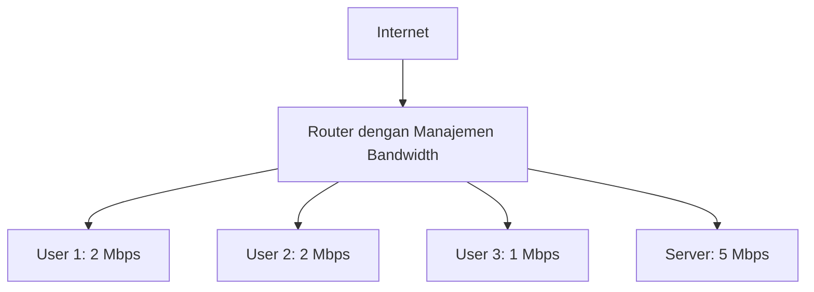
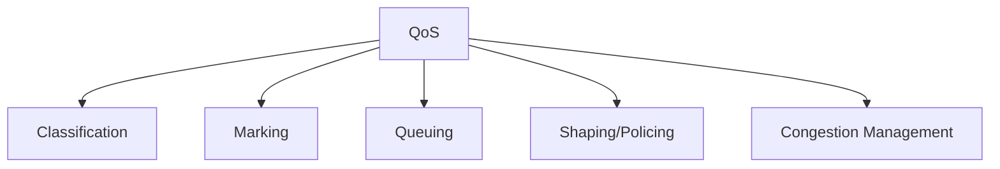
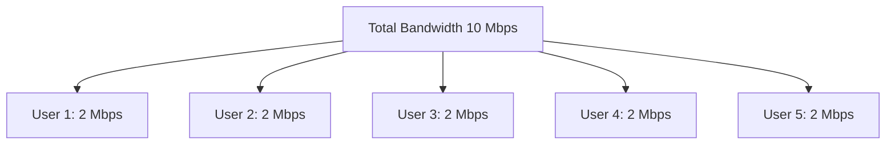
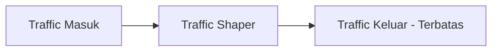
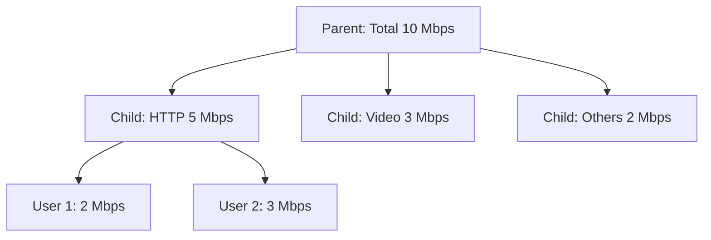
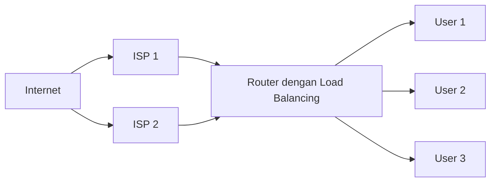
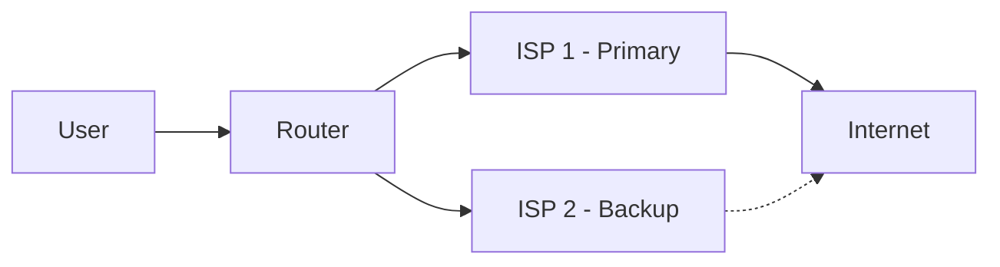
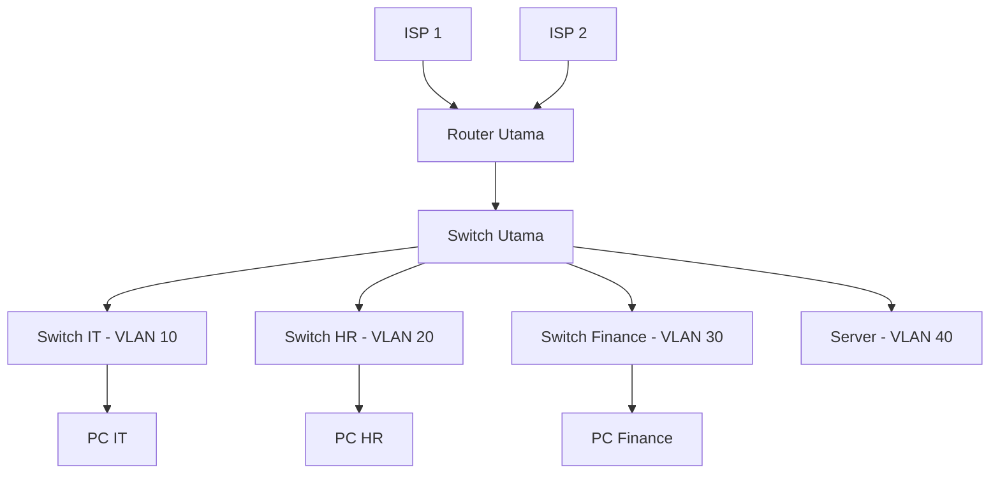

# 📘 PEMASANGAN DAN KONFIGURASI PERANGKAT JARINGAN
## Kelas XII – Semester 2 (Genap)

> **Fokus Pembelajaran:** Manajemen Bandwidth, Load Balancing, dan Uji Kompetensi Keahlian (UKK).

---

# 📑 DAFTAR ISI (Klik untuk Navigasi)

## [BAB 18: Konsep Manajemen Bandwidth](#bab-18-konsep-manajemen-bandwidth)
- [18.1 Pengertian Manajemen Bandwidth](#181-pengertian-manajemen-bandwidth)
- [18.2 Teori Quality of Service (QoS)](#182-teori-quality-of-service-qos)
- [18.3 Parameter QoS](#183-parameter-qos)
- [18.4 Jenis-jenis Metode Antrian (Queue)](#184-jenis-jenis-metode-antrian-queue)
- [18.5 Perhitungan Bandwidth dan Traffic Shaping](#185-perhitungan-bandwidth-dan-traffic-shaping)
- [18.6 Latihan Soal](#186-latihan-soal)

## [BAB 19: Konfigurasi dan Pengujian Manajemen Bandwidth](#bab-19-konfigurasi-dan-pengujian-manajemen-bandwidth)
- [19.1 Simple Queue di MikroTik](#191-simple-queue-di-mikrotik)
- [19.2 Queue Tree di MikroTik](#192-queue-tree-di-mikrotik)
- [19.3 PCQ (Per Connection Queue)](#193-pcq-per-connection-queue)
- [19.4 Perbandingan Simple Queue, Queue Tree, dan PCQ](#194-perbandingan-simple-queue-queue-tree-dan-pcq)
- [19.5 Pengujian Bandwidth (Speed Test / BTest)](#195-pengujian-bandwidth-speed-test--btest)
- [19.6 Praktikum Manajemen Bandwidth](#196-praktikum-manajemen-bandwidth)

## [BAB 20: Analisis & Perbaikan Manajemen Bandwidth](#bab-20-analisis--perbaikan-manajemen-bandwidth)
- [20.1 Masalah Umum Manajemen Bandwidth](#201-masalah-umum-manajemen-bandwidth)
- [20.2 Troubleshooting Queue](#202-troubleshooting-queue)
- [20.3 Studi Kasus Troubleshooting Bandwidth](#203-studi-kasus-troubleshooting-bandwidth)

## [BAB 21: Konsep Load Balancing](#bab-21-konsep-load-balancing)
- [21.1 Pengertian Load Balancing](#211-pengertian-load-balancing)
- [21.2 Konsep Failover](#212-konsep-failover)
- [21.3 Metode Load Balancing](#213-metode-load-balancing)
- [21.4 Per-Connection vs Per-Packet Load Balancing](#214-per-connection-vs-per-packet-load-balancing)
- [21.5 ECMP (Equal Cost Multi-Path)](#215-ecmp-equal-cost-multi-path)
- [21.6 Latihan Soal](#216-latihan-soal)

## [BAB 22: Konfigurasi dan Pengujian Load Balancing](#bab-22-konfigurasi-dan-pengujian-load-balancing)
- [22.1 Konfigurasi Load Balancing PCC di MikroTik](#221-konfigurasi-load-balancing-pcc-di-mikrotik)
- [22.2 Konfigurasi Load Balancing ECMP di MikroTik](#222-konfigurasi-load-balancing-ecmp-di-mikrotik)
- [22.3 Konfigurasi Failover di MikroTik](#223-konfigurasi-failover-di-mikrotik)
- [22.4 Pengujian Load Balancing](#224-pengujian-load-balancing)
- [22.5 Praktikum Load Balancing](#225-praktikum-load-balancing)

## [BAB 23: Analisis & Perbaikan Load Balancing](#bab-23-analisis--perbaikan-load-balancing)
- [23.1 Masalah Umum Load Balancing](#231-masalah-umum-load-balancing)
- [23.2 Troubleshooting Load Balancing](#232-troubleshooting-load-balancing)
- [23.3 Studi Kasus Troubleshooting Load Balancing](#233-studi-kasus-troubleshooting-load-balancing)

## [BAB 24: Uji Kompetensi Keahlian (UKK) & Simulasi](#bab-24-uji-kompetensi-keahlian-ukk--simulasi)
- [24.1 Persiapan UKK](#241-persiapan-ukk)
- [24.2 Simulasi Kasus: Jaringan Kantor](#242-simulasi-kasus-jaringan-kantor)
- [24.3 Troubleshooting Komprehensif](#243-troubleshooting-komprehensif)

## [Ringkasan Materi Semester 2](#-ringkasan-materi-semester-2)
## [Daftar Pustaka](#-daftar-pustaka)
## [Glosarium](#-glosarium)

---

# BAB 18: Konsep Manajemen Bandwidth

[🔝 Kembali ke Daftar Isi](#-daftar-isi-klik-untuk-navigasi)

## 18.1 Pengertian Manajemen Bandwidth

### A. Definisi Manajemen Bandwidth

**Manajemen Bandwidth** adalah proses mengatur dan mengontrol penggunaan bandwidth pada jaringan untuk memastikan distribusi bandwidth yang adil dan optimal bagi semua pengguna .



### B. Tujuan Manajemen Bandwidth

| **Tujuan** | **Penjelasan** |
|:---|:---|
| **Distribusi Adil** | Setiap user mendapat bandwidth sesuai kebutuhan  |
| **Prioritas Layanan** | Layanan penting (VoIP, video) mendapat prioritas |
| **Mencegah Abuse** | Membatasi user yang melakukan download besar  |
| **Efisiensi** | Mengoptimalkan penggunaan bandwidth yang tersedia |

### C. Mengapa Manajemen Bandwidth Diperlukan?

| **Masalah** | **Solusi dengan Manajemen Bandwidth** |
|:---|:---|
| Satu user melakukan download besar | Batasi kecepatan per user |
| Video conference buffering | Prioritaskan traffic video |
| Bandwidth tidak merata | Queue untuk distribusi adil |
| Jaringan lambat di jam sibuk | Traffic shaping |

---

## 18.2 Teori Quality of Service (QoS)

### A. Pengertian QoS

**Quality of Service (QoS)** adalah kemampuan jaringan untuk menyediakan layanan dengan kualitas yang baik, terutama untuk aplikasi yang sensitif terhadap delay dan packet loss .

### B. Parameter QoS

| **Parameter** | **Penjelasan** | **Standar Baik** |
|:---|:---|:---|
| **Throughput** | Kecepatan transfer data aktual | ≥ 80% dari bandwidth |
| **Delay (Latency)** | Waktu tempuh paket data | < 150 ms |
| **Jitter** | Variasi delay | < 30 ms |
| **Packet Loss** | Paket yang hilang | < 1% |

### C. Komponen QoS



| **Komponen** | **Fungsi** |
|:---|:---|
| **Classification** | Mengidentifikasi jenis traffic |
| **Marking** | Memberi tanda pada paket (prioritas) |
| **Queuing** | Mengatur antrian paket |
| **Shaping/Policing** | Membatasi kecepatan traffic |
| **Congestion Management** | Mengatasi kemacetan jaringan |

---

## 18.3 Parameter QoS

### A. Throughput

**Throughput** adalah jumlah data yang berhasil ditransfer dalam satuan waktu (bps) .

```
Throughput = Data yang diterima / Waktu
```

**Contoh:**
- Bandwidth: 10 Mbps
- Throughput aktual: 8 Mbps
- Efisiensi: 80%

### B. Delay (Latency)

**Delay** adalah waktu yang dibutuhkan paket untuk mencapai tujuan .

| **Jenis Delay** | **Penjelasan** |
|:---|:---|
| **Propagation Delay** | Waktu tempuh di media |
| **Transmission Delay** | Waktu memasukkan bit ke media |
| **Queuing Delay** | Waktu menunggu di antrian |
| **Processing Delay** | Waktu proses di router |

### C. Jitter

**Jitter** adalah variasi delay antar paket .

```
Jitter = Delay paket n - Delay paket n-1
```

### D. Packet Loss

**Packet Loss** adalah persentase paket yang hilang selama pengiriman .

```
Packet Loss = (Paket dikirim - Paket diterima) / Paket dikirim × 100%
```

---

## 18.4 Jenis-jenis Metode Antrian (Queue)

### A. FIFO (First In First Out)

**FIFO** adalah metode antrian paling sederhana: paket yang datang pertama dilayani pertama.

```
[Paket 1] → [Paket 2] → [Paket 3] → ... → [Output]
```

| **Keunggulan** | **Kelemahan** |
|:---|:---|
| Sederhana | Tidak ada prioritas |
| Resource ringan | Traffic besar bisa memenuhi antrian |

### B. PCQ (Per Connection Queue)

**PCQ** adalah metode yang membagi bandwidth secara merata ke setiap koneksi atau user .



**Kelebihan PCQ:**
- Pembagian bandwidth adil
- Skalabel untuk banyak user
- Konfigurasi sederhana 

**Parameter PCQ:**
| **Parameter** | **Fungsi** |
|:---|:---|
| `pcq-rate` | Kecepatan per sub-stream |
| `pcq-limit` | Ukuran antrian per sub-stream |
| `pcq-classifier` | Pengenal sub-stream (src-address, dst-address, dst-port, src-port)  |

### C. RED (Random Early Detection)

**RED** adalah metode yang mendeteksi kemacetan lebih awal dengan menjatuhkan paket secara acak sebelum antrian penuh.

### D. SFQ (Stochastic Fairness Queuing)

**SFQ** adalah metode yang memastikan setiap aliran (flow) mendapat giliran yang adil.

### E. Perbandingan Metode Queue

| **Metode** | **Kompleksitas** | **Skalabilitas** | **Prioritas** | **Keadilan** |
|:---|:---|:---|:---|:---|
| **FIFO** | Rendah | Rendah | Tidak | Rendah |
| **PCQ** | Sedang | Tinggi | Tidak | Tinggi  |
| **RED** | Sedang | Tinggi | Tidak | Sedang |
| **SFQ** | Sedang | Tinggi | Tidak | Tinggi |

---

## 18.5 Perhitungan Bandwidth dan Traffic Shaping

### A. Perhitungan Kebutuhan Bandwidth

**Rumus Dasar:**
```
Total Bandwidth = Σ (Bandwidth per User × Jumlah User)
```

**Contoh Perhitungan:**
```
Jumlah user: 50
Kebutuhan per user: 2 Mbps
Total bandwidth = 50 × 2 Mbps = 100 Mbps
```

### B. Traffic Shaping

**Traffic Shaping** adalah teknik mengatur kecepatan traffic untuk mencegah penggunaan bandwidth berlebihan .



**Jenis Traffic Shaping:**
| **Jenis** | **Penjelasan** |
|:---|:---|
| **Rate Limiting** | Membatasi kecepatan maksimum |
| **Burst** | Mengizinkan kecepatan tinggi dalam waktu singkat |
| **Priority Queuing** | Prioritas berdasarkan jenis traffic |

### C. Contoh Perhitungan Traffic Shaping

```
Bandwidth total: 10 Mbps
User: 20 orang
Per user limit: 1 Mbps
Burst: 2 Mbps (untuk 10 detik)
```

---

## 18.6 Latihan Soal

### Soal Pilihan Ganda

1. **Apa yang dimaksud dengan QoS?**
   - A. Kemampuan jaringan menyediakan layanan berkualitas
   - B. Kecepatan transfer data
   - C. Jumlah paket yang hilang
   - D. Variasi delay

2. **Metode queue mana yang membagi bandwidth secara merata ke setiap user?**
   - A. FIFO
   - B. PCQ
   - C. RED
   - D. SFQ

### Soal Essay

1. **Jelaskan 4 parameter QoS!**
2. **Apa perbedaan antara Traffic Shaping dan Rate Limiting?**
3. **Berapa bandwidth yang dibutuhkan untuk 100 user dengan kebutuhan 5 Mbps per user?**

---

# BAB 19: Konfigurasi dan Pengujian Manajemen Bandwidth

[🔝 Kembali ke Daftar Isi](#-daftar-isi-klik-untuk-navigasi)

## 19.1 Simple Queue di MikroTik

### A. Pengertian Simple Queue

**Simple Queue** adalah metode manajemen bandwidth paling sederhana di MikroTik. Cocok untuk alokasi bandwidth per user atau per interface .

### B. Konfigurasi Simple Queue

```bash
# 1. Membatasi bandwidth per user
/queue simple add name=user1 target=192.168.1.10 max-limit=2M/2M
/queue simple add name=user2 target=192.168.1.11 max-limit=2M/2M
/queue simple add name=user3 target=192.168.1.12 max-limit=1M/1M

# 2. Membatasi bandwidth per interface
/queue simple add name=LAN-Limit target=ether2 max-limit=10M/10M

# 3. Dengan burst
/queue simple add name=user1 target=192.168.1.10 \
    max-limit=1M/1M burst-limit=2M/2M burst-threshold=1M/1M burst-time=10s/10s

# 4. Prioritas
/queue simple add name=VIP target=192.168.1.100 max-limit=5M/5M priority=1
/queue simple add name=Regular target=192.168.1.0/24 max-limit=2M/2M priority=8
```

### C. Verifikasi Simple Queue

```bash
# Cek semua queue
/queue simple print

# Cek queue detail
/queue simple print detail

# Cek traffic queue
/queue simple monitor-traffic user1

# Cek statistik
/queue simple stats print
```

### D. Simple Queue dengan Address List

```bash
# Buat address list
/ip firewall address-list add list=VIP-Users address=192.168.1.100
/ip firewall address-list add list=VIP-Users address=192.168.1.101
/ip firewall address-list add list=Regular-Users address=192.168.1.0/24

# Queue berdasarkan address list
/queue simple add name=VIP target=VIP-Users max-limit=5M/5M
/queue simple add name=Regular target=Regular-Users max-limit=2M/2M
```

---

## 19.2 Queue Tree di MikroTik

### A. Pengertian Queue Tree

**Queue Tree** adalah metode manajemen bandwidth yang lebih fleksibel dan powerful daripada Simple Queue. Dapat mengatur prioritas dan hierarki bandwidth .



### B. Konfigurasi Queue Tree

```bash
# 1. Buat packet marks di firewall mangle
/ip firewall mangle add chain=forward protocol=tcp dst-port=80 action=mark-packet new-packet-mark=web-traffic
/ip firewall mangle add chain=forward protocol=tcp dst-port=443 action=mark-packet new-packet-mark=web-traffic
/ip firewall mangle add chain=forward protocol=udp dst-port=53 action=mark-packet new-packet-mark=dns-traffic

# 2. Buat Queue Tree
/queue tree add name=Total parent=global max-limit=10M
/queue tree add name=Web parent=Total packet-mark=web-traffic max-limit=5M priority=1
/queue tree add name=Video parent=Total packet-mark=video-traffic max-limit=3M priority=2
/queue tree add name=DNS parent=Total packet-mark=dns-traffic max-limit=1M priority=1
/queue tree add name=Others parent=Total max-limit=1M priority=8
```

### C. Queue Tree dengan Interface

```bash
# Parent berdasarkan interface
/queue tree add name=WAN-Total parent=ether1 max-limit=10M
/queue tree add name=LAN-Total parent=ether2 max-limit=10M

# Child untuk VLAN
/queue tree add name=VLAN10 parent=LAN-Total max-limit=5M
/queue tree add name=VLAN20 parent=LAN-Total max-limit=3M
```

### D. Verifikasi Queue Tree

```bash
# Cek queue tree
/queue tree print

# Cek traffic
/queue tree monitor-traffic Total

# Cek packet marks
/ip firewall mangle print
```

---

## 19.3 PCQ (Per Connection Queue)

### A. Pengertian PCQ

**PCQ (Per Connection Queue)** adalah metode yang membagi bandwidth secara otomatis dan adil ke setiap koneksi atau user .

### B. Konfigurasi PCQ

```bash
# 1. Buat tipe queue PCQ
/queue type add name=pcq-download kind=pcq pcq-rate=0 pcq-classifier=dst-address
/queue type add name=pcq-upload kind=pcq pcq-rate=0 pcq-classifier=src-address

# 2. Buat Queue Tree dengan PCQ
/queue tree add name=Download parent=global packet-mark=download-traffic queue=pcq-download
/queue tree add name=Upload parent=global packet-mark=upload-traffic queue=pcq-upload

# 3. Buat packet marks
/ip firewall mangle add chain=prerouting in-interface=LAN action=mark-packet new-packet-mark=upload-traffic passthrough=no
/ip firewall mangle add chain=prerouting out-interface=LAN action=mark-packet new-packet-mark=download-traffic passthrough=no
```

### C. PCQ dengan Limit Per User

```bash
# PCQ dengan limit 1 Mbps per user
/queue type add name=pcq-1M kind=pcq pcq-rate=1M pcq-classifier=src-address

# PCQ dengan limit 2 Mbps per user
/queue type add name=pcq-2M kind=pcq pcq-rate=2M pcq-classifier=src-address

# Gunakan di queue tree
/queue tree add name=User-Limit parent=global queue=pcq-1M
```

### D. Perbandingan Metode Queue

| **Metode** | **Kelebihan** | **Kekurangan** | **Penggunaan** |
|:---|:---|:---|:---|
| **Simple Queue** | Sederhana, mudah | Kurang fleksibel | Jaringan kecil  |
| **Queue Tree** | Fleksibel, prioritas | Konfigurasi kompleks | Jaringan menengah-besar  |
| **PCQ** | Adil, skalabel | Tidak ada prioritas | Hotspot, RT/RW Net  |

---

## 19.4 Perbandingan Simple Queue, Queue Tree, dan PCQ

### A. Tabel Perbandingan

| **Aspek** | **Simple Queue** | **Queue Tree** | **PCQ** |
|:---|:---|:---|:---|
| **Kompleksitas** | Rendah | Tinggi | Sedang |
| **Prioritas** | Ya (1-8) | Ya (1-8) | Tidak |
| **Hierarki** | Tidak | Ya | Tidak |
| **Distribusi Adil** | Manual | Manual | Otomatis  |
| **Skalabilitas** | Rendah | Tinggi | Tinggi  |
| **Throughput** | Tertinggi  | Sedang | Sedang |

### B. Kapan Menggunakan?

| **Metode** | **Kondisi** |
|:---|:---|
| **Simple Queue** | Jaringan kecil (< 20 user) |
| **Queue Tree** | Jaringan dengan prioritas layanan |
| **PCQ** | Hotspot, RT/RW Net, banyak user  |

---

## 19.5 Pengujian Bandwidth (Speed Test / BTest)

### A. Pengujian dengan Speed Test

```bash
# 1. Di MikroTik
/tool speed-test address=8.8.8.8

# 2. Di PC dengan speedtest.net
# Buka browser, akses speedtest.net
```

### B. Pengujian dengan BTest (MikroTik)

```bash
# 1. Aktifkan BTest server
/tool bandwidth-server set enabled=yes

# 2. Jalankan BTest client
/tool bandwidth-test address=192.168.1.1 direction=both duration=30

# 3. BTest dengan protokol TCP
/tool bandwidth-test address=192.168.1.1 protocol=tcp

# 4. BTest dengan protokol UDP
/tool bandwidth-test address=192.168.1.1 protocol=udp
```

### C. Pengujian dengan Torch

```bash
# Monitoring traffic real-time
/tool torch interface=ether1
/tool torch interface=ether2 port=80
/tool torch interface=ether1 protocol=tcp
```

### D. Contoh Hasil Pengujian

```
Status: Bandwidth Test
Server: 192.168.1.1
Duration: 30 seconds
TCP Download: 8.5 Mbps
TCP Upload: 9.2 Mbps
UDP Download: 9.8 Mbps (loss: 0.1%)
```

---

## 19.6 Praktikum Manajemen Bandwidth

### Praktikum 1: Simple Queue

**Tujuan:** Membatasi bandwidth per user.

**Tugas:**
1. Konfigurasi Simple Queue untuk 3 user
2. User 1: 2 Mbps, User 2: 1 Mbps, User 3: 512 kbps
3. Verifikasi dengan speed test

### Praktikum 2: Queue Tree dengan Prioritas

**Tujuan:** Memberi prioritas pada traffic tertentu.

**Tugas:**
1. Buat packet marks untuk HTTP, HTTPS, DNS
2. Buat Queue Tree dengan prioritas
3. Verifikasi

### Praktikum 3: PCQ

**Tujuan:** Membagi bandwidth secara adil ke banyak user.

**Tugas:**
1. Konfigurasi PCQ
2. Uji dengan 5 client
3. Verifikasi distribusi bandwidth

---

# BAB 20: Analisis & Perbaikan Manajemen Bandwidth

[🔝 Kembali ke Daftar Isi](#-daftar-isi-klik-untuk-navigasi)

## 20.1 Masalah Umum Manajemen Bandwidth

### A. Kategori Masalah

| **Kategori** | **Masalah** | **Gejala** |
|:---|:---|:---|
| **Konfigurasi** | Queue tidak aktif | Tidak ada limitasi |
| **Konfigurasi** | Target salah | User tidak terkena limit |
| **Performance** | Queue lambat | Loading lama |
| **Performance** | Resource penuh | CPU tinggi |
| **Prioritas** | Prioritas tidak jalan | Traffic tidak diprioritaskan |

### B. Tabel Masalah dan Solusi

| **Masalah** | **Penyebab** | **Solusi** |
|:---|:---|:---|
| **Queue tidak berfungsi** | Queue disable | Enable queue |
| **User tidak terlimit** | Target salah | Perbaiki target |
| **Prioritas tidak jalan** | Packet mark salah | Perbaiki mangle |
| **Bandwidth tidak adil** | PCQ classifier salah | Perbaiki classifier  |
| **CPU tinggi** | Terlalu banyak queue | Gunakan PCQ |

---

## 20.2 Troubleshooting Queue

### A. Troubleshooting Simple Queue

```bash
# 1. Cek status queue
/queue simple print
# Status: X = disabled, R = running

# 2. Cek apakah queue aktif
/queue simple monitor-traffic user1

# 3. Cek target queue
/queue simple print detail
# target: 192.168.1.10 ✅

# 4. Cek limit
/queue simple print detail
# max-limit=2M/2M ✅

# 5. Enable queue jika disabled
/queue simple enable user1
```

### B. Troubleshooting Queue Tree

```bash
# 1. Cek queue tree
/queue tree print
# Status: X = disabled

# 2. Cek packet marks
/ip firewall mangle print
# Apakah packet mark ada?

# 3. Cek apakah traffic masuk ke queue
/queue tree monitor-traffic Total

# 4. Cek parent queue
/queue tree print detail
# parent: global ✅
```

### C. Troubleshooting PCQ

```bash
# 1. Cek tipe queue
/queue type print
# kind=pcq ✅

# 2. Cek classifier
/queue type print detail
# pcq-classifier=src-address ✅

# 3. Cek rate
/queue type print detail
# pcq-rate=1M ✅
```

---

## 20.3 Studi Kasus Troubleshooting Bandwidth

### Kasus 1: Queue Tidak Berfungsi

**Masalah:** User 1 seharusnya terlimit 2 Mbps, tapi bisa akses 10 Mbps.

**Analisis:**
```bash
# 1. Cek queue user1
/queue simple print user1
# ⚠️ Status: X - disabled

# 2. Cek target
/queue simple print detail user1
# target: 192.168.1.10 ✅
```

**Diagnosis:** Queue disabled

**Solusi:**
```bash
/queue simple enable user1
```

### Kasus 2: PCQ Tidak Adil

**Masalah:** Beberapa user dapat bandwidth lebih besar.

**Analisis:**
```bash
# 1. Cek tipe PCQ
/queue type print
# pcq-classifier=dst-address ❌ (seharusnya src-address)
```

**Diagnosis:** Classifier salah

**Solusi:**
```bash
/queue type set pcq-download pcq-classifier=src-address
```

---

# BAB 21: Konsep Load Balancing

[🔝 Kembali ke Daftar Isi](#-daftar-isi-klik-untuk-navigasi)

## 21.1 Pengertian Load Balancing

### A. Definisi Load Balancing

**Load Balancing** adalah teknik membagi beban traffic internet secara merata ke beberapa jalur koneksi (ISP) yang tersedia untuk meningkatkan kecepatan dan keandalan jaringan .



### B. Tujuan Load Balancing

| **Tujuan** | **Penjelasan** |
|:---|:---|
| **Membagi Beban** | Traffic dibagi ke semua jalur yang tersedia  |
| **Meningkatkan Kecepatan** | Menggabungkan bandwidth dari 2 ISP |
| **Redundansi** | Jika satu ISP mati, jalur lain tetap aktif  |
| **Stabilitas** | Mengurangi bottleneck pada jam sibuk  |

---

## 21.2 Konsep Failover

### A. Pengertian Failover

**Failover** adalah mekanisme otomatis untuk beralih ke jalur cadangan jika jalur utama mengalami kegagalan .



### B. Cara Kerja Failover

| **Langkah** | **Penjelasan** |
|:---|:---|
| **Monitoring** | Router memonitor koneksi ISP |
| **Deteksi Gangguan** | ISP 1 down |
| **Failover** | Router beralih ke ISP 2 |
| **Recovery** | ISP 1 kembali, router beralih kembali |

### C. Waktu Failover

| **Metode** | **Waktu Failover** |
|:---|:---|
| **PCC** | < 1 detik  |
| **ECMP** | 1-2 detik  |
| **NTH** | 2-3 detik |

---

## 21.3 Metode Load Balancing

### A. Metode PCC (Per Connection Classifier)

**PCC** adalah metode proprietary MikroTik yang menggunakan algoritma hashing untuk menentukan jalur .

**Cara Kerja PCC:**
1. Mengambil field tertentu dari IP header (src-address, dst-address, src-port, dst-port)
2. Algoritma hashing mengubah field menjadi nilai 32-bit
3. Nilai dibagi dengan jumlah jalur
4. Sisa pembagian menentukan jalur yang digunakan 

**Field Classifier PCC :**
| **Classifier** | **Keterangan** |
|:---|:---|
| `both-addresses` | src-address + dst-address |
| `both-ports` | src-port + dst-port |
| `src-address` | Hanya IP sumber |
| `dst-address` | Hanya IP tujuan |
| `src-address-and-port` | IP sumber + port |
| `dst-address-and-port` | IP tujuan + port |

### B. Metode ECMP (Equal Cost Multi-Path)

**ECMP** adalah metode yang membagi traffic ke beberapa jalur dengan cost (metric) yang sama .

**Cara Kerja ECMP:**
1. Menambahkan beberapa gateway dengan metric yang sama
2. Router membagi traffic ke semua gateway
3. Jika satu gateway down, traffic dialihkan ke gateway lain

### C. Metode NTH (Nth)

**NTH** adalah metode load balancing berdasarkan urutan paket .

**Cara Kerja NTH:**
1. Setiap paket diberi nomor urut
2. Paket dengan nomor tertentu dikirim ke jalur tertentu
3. Contoh: NTH 3,0 → paket ke 1,4,7,10... ke ISP 1

### D. Perbandingan Metode Load Balancing

| **Metode** | **Kelebihan** | **Kekurangan** | **Penggunaan** |
|:---|:---|:---|:---|
| **PCC** | Stabil, failover cepat  | Konfigurasi kompleks | Jaringan enterprise  |
| **ECMP** | Sederhana | Failover lambat  | Jaringan kecil |
| **NTH** | Sederhana | Kurang stabil | Jaringan sederhana |

---

## 21.4 Per-Connection vs Per-Packet Load Balancing

### A. Per-Connection Load Balancing

**Per-Connection** berarti semua paket dalam satu koneksi (satu session) menggunakan jalur yang sama .

| **Keunggulan** | **Kelemahan** |
|:---|:---|
| Stabil | Beban bisa tidak merata |
| Tidak ada reordering | - |

### B. Per-Packet Load Balancing

**Per-Packet** berarti setiap paket bisa menggunakan jalur yang berbeda, meskipun dalam satu koneksi .

| **Keunggulan** | **Kelemahan** |
|:---|:---|
| Distribusi merata | Paket bisa datang tidak urut (reordering) |
| - | Tidak cocok untuk aplikasi real-time |

### C. Contoh Perbedaan

```
Per-Connection:
Koneksi 1 (User A ke Server X) → ISP 1
Koneksi 2 (User A ke Server Y) → ISP 2
Koneksi 3 (User B ke Server Z) → ISP 1

Per-Packet:
Paket 1 (User A ke Server X) → ISP 1
Paket 2 (User A ke Server X) → ISP 2
Paket 3 (User A ke Server X) → ISP 1
```

---

## 21.5 ECMP (Equal Cost Multi-Path)

### A. Pengertian ECMP

**ECMP** adalah metode load balancing yang menggunakan multiple gateway dengan metric yang sama .

### B. Kelebihan ECMP

| **Kelebihan** | **Penjelasan** |
|:---|:---|
| **Sederhana** | Hanya menambahkan gateway |
| **Per-Connection** | Stabil untuk setiap koneksi |
| **Failover** | Otomatis jika gateway down  |

### C. Kekurangan ECMP

| **Kekurangan** | **Penjelasan** |
|:---|:---|
| **Distribusi Kurang Optimal** | Bisa tidak merata |
| **Failover Lebih Lambat** | Dibanding PCC  |

---

## 21.6 Latihan Soal

### Soal Pilihan Ganda

1. **Metode load balancing mana yang menggunakan algoritma hashing?**
   - A. ECMP
   - B. PCC
   - C. NTH
   - D. FIFO

2. **Apa fungsi failover pada load balancing?**
   - A. Membagi traffic
   - B. Beralih ke jalur cadangan jika utama down
   - C. Mempercepat koneksi
   - D. Mengurangi packet loss

### Soal Essay

1. **Jelaskan perbedaan antara Per-Connection dan Per-Packet load balancing!**
2. **Apa kelebihan dan kekurangan metode PCC dibanding ECMP?**
3. **Gambarkan cara kerja failover pada jaringan dengan 2 ISP!**

---

# BAB 22: Konfigurasi dan Pengujian Load Balancing

[🔝 Kembali ke Daftar Isi](#-daftar-isi-klik-untuk-navigasi)

## 22.1 Konfigurasi Load Balancing PCC di MikroTik

### A. Topologi Jaringan

```
[ISP 1: 10.0.0.1/24] ─┐
                      ├─ [MikroTik Router] ─ [LAN: 192.168.1.0/24]
[ISP 2: 10.0.1.1/24] ─┘
```

### B. Konfigurasi Dasar

```bash
# 1. IP Address
/ip address add address=10.0.0.2/24 interface=ether1 comment=ISP1
/ip address add address=10.0.1.2/24 interface=ether2 comment=ISP2
/ip address add address=192.168.1.1/24 interface=ether3 comment=LAN

# 2. DNS
/ip dns set primary-dns=8.8.8.8 secondary-dns=1.1.1.1

# 3. NAT Masquerade
/ip firewall nat add chain=srcnat out-interface=ether1 action=masquerade
/ip firewall nat add chain=srcnat out-interface=ether2 action=masquerade

# 4. Default Route (ECMP sementara)
/ip route add dst-address=0.0.0.0/0 gateway=10.0.0.1,10.0.1.1
```

### C. Konfigurasi Firewall Mangle untuk PCC

```bash
# 1. Mark connection
/ip firewall mangle add chain=prerouting dst-address-type=!local in-interface=ether3 \
    per-connection-classifier=both-addresses:2/0 action=mark-connection new-connection-mark=ISP1-conn

/ip firewall mangle add chain=prerouting dst-address-type=!local in-interface=ether3 \
    per-connection-classifier=both-addresses:2/1 action=mark-connection new-connection-mark=ISP2-conn

# 2. Mark routing
/ip firewall mangle add chain=prerouting connection-mark=ISP1-conn in-interface=ether3 \
    action=mark-routing new-routing-mark=to-ISP1

/ip firewall mangle add chain=prerouting connection-mark=ISP2-conn in-interface=ether3 \
    action=mark-routing new-routing-mark=to-ISP2
```

### D. Konfigurasi Routing dengan Mark

```bash
# 1. Route dengan routing mark
/ip route add dst-address=0.0.0.0/0 gateway=10.0.0.1 routing-mark=to-ISP1
/ip route add dst-address=0.0.0.0/0 gateway=10.0.1.1 routing-mark=to-ISP2

# 2. Default route untuk router sendiri
/ip route add dst-address=0.0.0.0/0 gateway=10.0.0.1 distance=1
/ip route add dst-address=0.0.0.0/0 gateway=10.0.1.1 distance=2
```

### E. Konfigurasi Interface List

```bash
# 1. Buat interface list
/interface list add name=WAN
/interface list add name=LAN

# 2. Tambahkan interface ke list
/interface list member add interface=ether1 list=WAN
/interface list member add interface=ether2 list=WAN
/interface list member add interface=ether3 list=LAN
```

### F. Verifikasi PCC

```bash
# 1. Cek mangle rules
/ip firewall mangle print

# 2. Cek routing marks
/ip route print where routing-mark

# 3. Cek koneksi
/ip firewall connection print

# 4. Cek traffic
/interface monitor-traffic ether1
/interface monitor-traffic ether2
```

---

## 22.2 Konfigurasi Load Balancing ECMP di MikroTik

### A. Konfigurasi Dasar

```bash
# 1. IP Address
/ip address add address=10.0.0.2/24 interface=ether1 comment=ISP1
/ip address add address=10.0.1.2/24 interface=ether2 comment=ISP2
/ip address add address=192.168.1.1/24 interface=ether3 comment=LAN

# 2. DNS
/ip dns set primary-dns=8.8.8.8 secondary-dns=1.1.1.1

# 3. NAT Masquerade
/ip firewall nat add chain=srcnat out-interface=ether1 action=masquerade
/ip firewall nat add chain=srcnat out-interface=ether2 action=masquerade

# 4. ECMP Route
/ip route add dst-address=0.0.0.0/0 gateway=10.0.0.1,10.0.1.1 distance=1

# 5. Failover (opsional)
/ip route add dst-address=0.0.0.0/0 gateway=10.0.0.1 distance=1 check-gateway=ping
/ip route add dst-address=0.0.0.0/0 gateway=10.0.1.1 distance=2
```

### B. Verifikasi ECMP

```bash
# Cek route
/ip route print where dst-address=0.0.0.0/0

# Cek traffic
/interface monitor-traffic ether1
/interface monitor-traffic ether2
```

---

## 22.3 Konfigurasi Failover di MikroTik

### A. Failover dengan Gateway Check

```bash
# 1. Primary ISP
/ip route add dst-address=0.0.0.0/0 gateway=10.0.0.1 distance=1 check-gateway=ping

# 2. Backup ISP
/ip route add dst-address=0.0.0.0/0 gateway=10.0.1.1 distance=2

# 3. Monitoring
/tool netwatch add host=10.0.0.1 down-script="/ip route enable [find gateway=10.0.1.1]" up-script="/ip route disable [find gateway=10.0.1.1]"
```

### B. Failover dengan Netwatch

```bash
# 1. Buat script
/system script add name=isp-down source={/ip route set [find dst-address=0.0.0.0/0 gateway=10.0.0.1] disabled=yes}
/system script add name=isp-up source={/ip route set [find dst-address=0.0.0.0/0 gateway=10.0.0.1] disabled=no}

# 2. Netwatch
/tool netwatch add host=10.0.0.1 down-script=isp-down up-script=isp-up
```

### C. Failover dengan PCC

```bash
# 1. Route dengan distance berbeda
/ip route add dst-address=0.0.0.0/0 gateway=10.0.0.1 routing-mark=to-ISP1 distance=1
/ip route add dst-address=0.0.0.0/0 gateway=10.0.1.1 routing-mark=to-ISP2 distance=1

# 2. Default route (untuk router)
/ip route add dst-address=0.0.0.0/0 gateway=10.0.0.1 distance=1
/ip route add dst-address=0.0.0.0/0 gateway=10.0.1.1 distance=2
```

---

## 22.4 Pengujian Load Balancing

### A. Pengujian Distribusi Traffic

```bash
# 1. Cek traffic per interface
/interface monitor-traffic ether1
/interface monitor-traffic ether2

# 2. Cek koneksi
/ip firewall connection print

# 3. Speed test
/tool speed-test address=8.8.8.8
```

### B. Pengujian Failover

```bash
# 1. Matikan ISP 1
/interface disable ether1

# 2. Cek apakah traffic pindah ke ISP 2
/interface monitor-traffic ether2

# 3. Nyalakan kembali ISP 1
/interface enable ether1

# 4. Cek apakah traffic kembali ke ISP 1
/interface monitor-traffic ether1
```

### C. Hasil Pengujian PCC

| **Parameter** | **Hasil** |
|:---|:---|
| Throughput | 59.9 Mbps (gabungan 2 ISP)  |
| Jitter | 4.6 ms  |
| Failover Time | 0.9 detik  |

---

## 22.5 Praktikum Load Balancing

### Praktikum 1: Load Balancing PCC

**Tujuan:** Mengkonfigurasi load balancing PCC dengan 2 ISP.

**Tugas:**
1. Konfigurasi IP Address
2. Konfigurasi Mangle
3. Konfigurasi Routing
4. Verifikasi

### Praktikum 2: Load Balancing ECMP

**Tujuan:** Mengkonfigurasi load balancing ECMP.

**Tugas:**
1. Konfigurasi IP Address
2. Konfigurasi Route ECMP
3. Verifikasi

### Praktikum 3: Failover

**Tujuan:** Mengkonfigurasi failover.

**Tugas:**
1. Konfigurasi primary dan backup route
2. Matikan primary ISP
3. Verifikasi failover

---

# BAB 23: Analisis & Perbaikan Load Balancing

[🔝 Kembali ke Daftar Isi](#-daftar-isi-klik-untuk-navigasi)

## 23.1 Masalah Umum Load Balancing

### A. Kategori Masalah

| **Kategori** | **Masalah** | **Gejala** |
|:---|:---|:---|
| **Konfigurasi** | Traffic tidak terdistribusi | Semua traffic lewat 1 ISP |
| **Konfigurasi** | Mangle salah | Routing mark tidak jalan |
| **Failover** | Tidak failover saat ISP down | Koneksi terputus |
| **Performance** | Distribusi tidak merata | Satu ISP overload |

### B. Tabel Masalah dan Solusi

| **Masalah** | **Penyebab** | **Solusi** |
|:---|:---|:---|
| **Traffic hanya lewat 1 ISP** | Mangle tidak jalan | Cek mangle rules |
| **Failover tidak jalan** | Check-gateway tidak aktif | Aktifkan check-gateway  |
| **Distribusi tidak merata** | PCC classifier salah | Perbaiki classifier  |
| **Koneksi terputus** | Firewall block | Cek firewall |

---

## 23.2 Troubleshooting Load Balancing

### A. Troubleshooting PCC

```bash
# 1. Cek mangle rules
/ip firewall mangle print
# Apakah ada rule yang disabled?

# 2. Cek routing marks
/ip route print where routing-mark

# 3. Cek connection
/ip firewall connection print
# connection-mark=ISP1-conn

# 4. Cek apakah traffic masuk ke mangle
/ip firewall mangle print stats
```

### B. Troubleshooting ECMP

```bash
# 1. Cek route
/ip route print where dst-address=0.0.0.0/0

# 2. Cek apakah gateway reachable
/ping 10.0.0.1
/ping 10.0.1.1

# 3. Cek status route
/ip route print detail
# S - static, r - reachable
```

### C. Troubleshooting Failover

```bash
# 1. Cek check-gateway
/ip route print where dst-address=0.0.0.0/0
# check-gateway=ping ✅

# 2. Cek apakah gateway down
/ping 10.0.0.1
# Timeout ❌

# 3. Cek apakah route disabled
/ip route print where dst-address=0.0.0.0/0
# status: r (reachable) atau d (disabled)
```

---

## 23.3 Studi Kasus Troubleshooting Load Balancing

### Kasus 1: Traffic Hanya Lewat 1 ISP

**Masalah:** Setelah konfigurasi PCC, semua traffic lewat ISP 1.

**Analisis:**
```bash
# 1. Cek mangle
/ip firewall mangle print
# 0   chain=prerouting pcc=both-addresses:2/0 action=mark-connection new-connection-mark=ISP1-conn
# 1   chain=prerouting pcc=both-addresses:2/1 action=mark-connection new-connection-mark=ISP2-conn

# 2. Cek routing marks
/ip route print where routing-mark
# ❌ Tidak ada route dengan routing-mark
```

**Diagnosis:** Route dengan routing-mark tidak ada

**Solusi:**
```bash
/ip route add dst-address=0.0.0.0/0 gateway=10.0.0.1 routing-mark=to-ISP1
/ip route add dst-address=0.0.0.0/0 gateway=10.0.1.1 routing-mark=to-ISP2
```

### Kasus 2: Failover Tidak Jalan

**Masalah:** Saat ISP 1 mati, traffic tidak pindah ke ISP 2.

**Analisis:**
```bash
# 1. Cek route
/ip route print where dst-address=0.0.0.0/0
# 0   gateway=10.0.0.1 distance=1 check-gateway=ping ❌ (tidak ada check-gateway)
# 1   gateway=10.0.1.1 distance=2
```

**Diagnosis:** Check-gateway tidak diaktifkan

**Solusi:**
```bash
/ip route set [find gateway=10.0.0.1] check-gateway=ping
```

### Kasus 3: PCC Distribusi Tidak Merata

**Masalah:** ISP 1 overload, ISP 2 ringan.

**Analisis:**
```bash
# 1. Cek classifier
/ip firewall mangle print
# per-connection-classifier=both-addresses:2/0 ✅
```

**Diagnosis:** Skema pembagian tidak sesuai (1:1)

**Solusi:**
```bash
# Ubah ke 3 stream (2:1)
/ip firewall mangle set [find new-connection-mark=ISP1-conn] per-connection-classifier=both-addresses:3/0
/ip firewall mangle set [find new-connection-mark=ISP2-conn] per-connection-classifier=both-addresses:3/1
```

---

# BAB 24: Uji Kompetensi Keahlian (UKK) & Simulasi

[🔝 Kembali ke Daftar Isi](#-daftar-isi-klik-untuk-navigasi)

## 24.1 Persiapan UKK

### A. Kompetensi yang Diuji

| **No** | **Kompetensi** | **Bobot** |
|:---:|:---|:---:|
| 1 | Pemasangan perangkat jaringan | 10% |
| 2 | Konfigurasi VLAN | 15% |
| 3 | Konfigurasi Routing (Static/Dinamis) | 20% |
| 4 | Konfigurasi NAT | 15% |
| 5 | Konfigurasi Proxy Server | 10% |
| 6 | Manajemen Bandwidth | 15% |
| 7 | Load Balancing | 15% |

### B. Checklist Persiapan

| **No** | **Item** | **Status** |
|:---:|:---|:---:|
| 1 | Perangkat tersedia (Router, Switch, PC) | ☐ |
| 2 | Kabel dan konektor siap | ☐ |
| 3 | Topologi jaringan sudah direncanakan | ☐ |
| 4 | IP Address sudah ditentukan | ☐ |
| 5 | Backup config disiapkan | ☐ |
| 6 | Tools (WinBox, Putty, Terminal) siap | ☐ |

---

## 24.2 Simulasi Kasus: Jaringan Kantor

### A. Spesifikasi

**Perusahaan ABC** memiliki:
- 3 departemen: IT, HR, Finance
- Masing-masing 10 user
- 2 koneksi ISP
- 1 server web internal

### B. Topologi



### C. Spesifikasi Jaringan

| **Departemen** | **VLAN** | **Subnet** | **Jumlah User** |
|:---|:---:|:---|:---:|
| IT | 10 | 192.168.10.0/24 | 10 |
| HR | 20 | 192.168.20.0/24 | 10 |
| Finance | 30 | 192.168.30.0/24 | 10 |
| Server | 40 | 192.168.40.0/24 | 1 |

### D. Konfigurasi yang Dibutuhkan

1. **VLAN** - Buat VLAN 10, 20, 30, 40 
2. **Trunking** - Trunk antar switch
3. **Inter-VLAN Routing** - Router on a Stick
4. **NAT** - Masquerade untuk internet 
5. **Proxy** - Transparent proxy, block situs tertentu 
6. **Bandwidth** - Limit per VLAN (IT: 5 Mbps, HR: 3 Mbps, Finance: 2 Mbps)
7. **Load Balancing** - PCC dengan 2 ISP 

### E. Langkah-langkah Implementasi

#### 1. Konfigurasi VLAN di Switch

```bash
Switch(config)# vlan 10
Switch(config-vlan)# name IT_Dept
Switch(config-vlan)# exit

Switch(config)# vlan 20
Switch(config-vlan)# name HR_Dept
Switch(config-vlan)# exit

Switch(config)# vlan 30
Switch(config-vlan)# name Finance
Switch(config-vlan)# exit

Switch(config)# vlan 40
Switch(config-vlan)# name Server
Switch(config-vlan)# exit
```

#### 2. Konfigurasi Trunk

```bash
Switch(config)# interface gigabitEthernet 0/24
Switch(config-if)# switchport mode trunk
Switch(config-if)# switchport trunk allowed vlan 10,20,30,40
```

#### 3. Konfigurasi Router on a Stick

```bash
Router(config)# interface gigabitEthernet 0/0.10
Router(config-subif)# encapsulation dot1Q 10
Router(config-subif)# ip address 192.168.10.1 255.255.255.0

Router(config)# interface gigabitEthernet 0/0.20
Router(config-subif)# encapsulation dot1Q 20
Router(config-subif)# ip address 192.168.20.1 255.255.255.0
```

#### 4. Konfigurasi NAT

```bash
# MikroTik
/ip firewall nat add chain=srcnat out-interface=ether1 action=masquerade
/ip firewall nat add chain=srcnat out-interface=ether2 action=masquerade
```

#### 5. Konfigurasi Proxy

```bash
# MikroTik Web Proxy
/ip proxy set enabled=yes port=8080

# Transparent proxy
/ip firewall nat add chain=dstnat protocol=tcp dst-port=80 in-interface=LAN action=redirect to-ports=8080

# Block situs
/ip proxy access add action=deny dst-host=*.youtube.com
/ip proxy access add action=deny dst-host=*.facebook.com
```

#### 6. Konfigurasi Manajemen Bandwidth

```bash
# Simple Queue per VLAN
/queue simple add name=IT target=192.168.10.0/24 max-limit=5M/5M
/queue simple add name=HR target=192.168.20.0/24 max-limit=3M/3M
/queue simple add name=Finance target=192.168.30.0/24 max-limit=2M/2M
```

#### 7. Konfigurasi Load Balancing PCC

```bash
# Mangle
/ip firewall mangle add chain=prerouting dst-address-type=!local in-interface=LAN \
    per-connection-classifier=both-addresses:2/0 action=mark-connection new-connection-mark=ISP1-conn

/ip firewall mangle add chain=prerouting dst-address-type=!local in-interface=LAN \
    per-connection-classifier=both-addresses:2/1 action=mark-connection new-connection-mark=ISP2-conn

/ip firewall mangle add chain=prerouting connection-mark=ISP1-conn in-interface=LAN \
    action=mark-routing new-routing-mark=to-ISP1

/ip firewall mangle add chain=prerouting connection-mark=ISP2-conn in-interface=LAN \
    action=mark-routing new-routing-mark=to-ISP2

# Routing
/ip route add dst-address=0.0.0.0/0 gateway=10.0.0.1 routing-mark=to-ISP1
/ip route add dst-address=0.0.0.0/0 gateway=10.0.1.1 routing-mark=to-ISP2
```

### F. Pengujian

| **No** | **Pengujian** | **Harapan** |
|:---:|:---|:---|
| 1 | Ping intra-VLAN | Berhasil |
| 2 | Ping inter-VLAN | Berhasil (via router) |
| 3 | Akses internet | Berhasil |
| 4 | Proxy block | Situs diblokir tidak bisa diakses  |
| 5 | Bandwidth limit | Kecepatan sesuai limit |
| 6 | Load balancing | Traffic terdistribusi ke 2 ISP |

---

## 24.3 Troubleshooting Komprehensif

### A. Skenario Masalah

1. **VLAN tidak berfungsi** - Port salah VLAN
2. **Inter-VLAN tidak jalan** - Sub-interface salah
3. **Internet tidak bisa** - NAT tidak aktif
4. **Proxy tidak block** - Access rule salah
5. **Bandwidth tidak limit** - Queue disabled
6. **Load balancing tidak jalan** - Mangle salah

### B. Langkah Troubleshooting

```
1. Cek konfigurasi VLAN → `show vlan brief`
2. Cek trunk → `show interfaces trunk`
3. Cek routing → `show ip route`
4. Cek NAT → `/ip firewall nat print`
5. Cek proxy → `/ip proxy print`
6. Cek queue → `/queue simple print`
7. Cek mangle → `/ip firewall mangle print`
8. Cek route → `/ip route print`
```

### C. Checklist Troubleshooting

| **No** | **Komponen** | **Command** | **Status** |
|:---:|:---|:---|:---:|
| 1 | VLAN | `show vlan brief` | ☐ |
| 2 | Trunk | `show interfaces trunk` | ☐ |
| 3 | Routing | `show ip route` | ☐ |
| 4 | NAT | `/ip firewall nat print` | ☐ |
| 5 | Proxy | `/ip proxy print` | ☐ |
| 6 | Queue | `/queue simple print` | ☐ |
| 7 | Mangle | `/ip firewall mangle print` | ☐ |
| 8 | Load Balance | `/ip route print` | ☐ |

---

# 📝 RINGKASAN MATERI SEMESTER 2

[🔝 Kembali ke Daftar Isi](#-daftar-isi-klik-untuk-navigasi)

## 1. Manajemen Bandwidth

| **Metode** | **Keunggulan** | **Penggunaan** |
|:---|:---|:---|
| **Simple Queue** | Sederhana | Jaringan kecil  |
| **Queue Tree** | Fleksibel, prioritas | Jaringan menengah-besar  |
| **PCQ** | Adil, skalabel | Hotspot, banyak user  |

## 2. Load Balancing

| **Metode** | **Keunggulan** | **Kekurangan** |
|:---|:---|:---|
| **PCC** | Stabil, failover cepat  | Konfigurasi kompleks |
| **ECMP** | Sederhana | Failover lambat  |
| **NTH** | Sederhana | Kurang stabil |

## 3. Failover

| **Komponen** | **Fungsi** |
|:---|:---|
| **Check Gateway** | Memonitor koneksi ISP |
| **Distance** | Menentukan prioritas route |
| **Netwatch** | Script untuk failover otomatis |

## 4. UKK

| **Kompetensi** | **Tools** |
|:---|:---|
| **VLAN** | Cisco/MikroTik Switch |
| **Routing** | Cisco/MikroTik Router |
| **NAT** | MikroTik Router |
| **Proxy** | MikroTik/Squid  |
| **Bandwidth** | MikroTik Queue |
| **Load Balancing** | MikroTik PCC/ECMP |

---

# 📚 DAFTAR PUSTAKA

[🔝 Kembali ke Daftar Isi](#-daftar-isi-klik-untuk-navigasi)

1. MikroTik. (2023). *RouterOS v7 Documentation - Queues* 
2. Cisco Systems. (2020). *CCNA 200-301 Official Cert Guide*. Cisco Press.
3. MikroTik Wiki. (2023). *Load Balancing and Failover*.
4. Tanenbaum, A.S. (2019). *Computer Networks (5th Edition)*. Pearson.
5. Putra, E.M., Yuliastuti, G.E., & Prabiantissa, C.N. (2023). *Perbandingan Simple Queue, Queue Tree dan PCQ untuk Manajemen Bandwidth pada Jaringan Mikrotik*. e-Journal ITATS 
6. Kamaludin, M.Y. (2025). *Optimalisasi Quality of Service pada Jaringan SMA Daarul Fudlola Menggunakan Mikrotik*. UBSI 

---

# 📝 GLOSARIUM

[🔝 Kembali ke Daftar Isi](#-daftar-isi-klik-untuk-navigasi)

| **Istilah** | **Arti** |
|:---|:---|
| **Bandwidth** | Kapasitas maksimum transfer data |
| **Classifier** | Pengenal sub-stream di PCQ  |
| **ECMP** | Equal Cost Multi-Path - Load balancing dengan metric sama  |
| **Failover** | Beralih ke jalur cadangan saat jalur utama down  |
| **Jitter** | Variasi delay antar paket  |
| **Load Balancing** | Membagi beban traffic ke beberapa jalur  |
| **NTH** | Metode load balancing berdasarkan urutan paket  |
| **PCC** | Per Connection Classifier - Metode load balancing MikroTik  |
| **PCQ** | Per Connection Queue - Queue dengan pembagian otomatis  |
| **QoS** | Quality of Service - Kemampuan jaringan menyediakan layanan berkualitas  |
| **Queue Tree** | Metode queue dengan hierarki  |
| **Simple Queue** | Metode queue paling sederhana  |

---

> **📌 Catatan:** Materi ini adalah panduan belajar untuk semester 2 kelas 12. Praktikum langsung di laboratorium sangat disarankan untuk memahami konsep secara mendalam.

---

**Selamat Belajar dan Sukses UKK! 💻📡**
